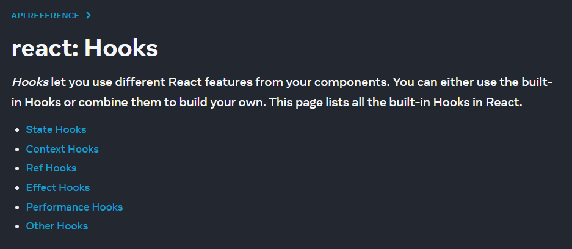
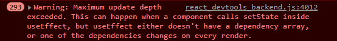
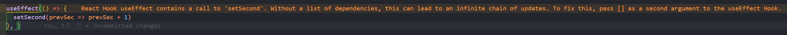
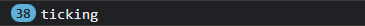

# About React Hook


> Hook은 React 16.8에서 새로 추가된 개념입니다. Hook을 통해 class를 작성하지 않고도 state와 같은 React 기능들을 사용할 수 있습니다.   
> [Introducing Hooks - React 👉](https://reactjs.org/docs/hooks-intro.html)

공식 문서에서는 위와 같이 Hook을 소개하고 있습니다. 말하자면 React가 클래스 형 컴포넌트에서 함수형 컴포넌트 사용을 권장하면서 클래스 형 컴포넌트에서 사용되었던 React의 기능들을 class 없이 함수형 컴포넌트에서 React 기능들을 사용할 수 있도록 도와줍니다.

사용자가 커스텀 훅을 만들어 사용할 수도 있지만 React에는 기본적으로 내장되어 있는 Hook들이 있습니다. 이 훅들은 함수형 컴포넌트 혹은 커스텀 훅의 최상위 레벨(at the top level)에서만 사용되어야 합니다. 콜백 내부나 루프 내부에서 여러 번 혹은 조건부로 호출할 수 없습니다.

[](https://beta.reactjs.org/apis/react)

위 문서에서는 내장된 Hooks API를 다음과 같이 분류하여 설명하고 있습니다. 이미지를 클릭하면 해당 페이지로 이동합니다.

- [State Hooks](https://beta.reactjs.org/apis/react#state-hooks)
    - `useState`는 사용자가 직접 업데이트할 수 있는 상태 변수를 정의합니다. 
    - `useReducer`는 reducer function 내부 업데이트 로직과 함께 상태 변수를 정의합니다.  
- [Context Hooks](https://beta.reactjs.org/apis/react#context-hooks)
    - `useContext`는 context를 읽고 구독합니다.  
- [Ref Hooks](https://beta.reactjs.org/apis/react#ref-hooks)
    - `useRef`는 ref를 정의합니다. 어느 값이든 저장할 수 있지만 주로 DOM 노드를 저장하기 위해 사용합니다.  
    - `useImperativeHandle`를 사용하여 구성 요소별로 노출된 참조를 사용자 정의할 수 있습니다.  
- [Effect Hooks](https://beta.reactjs.org/apis/react#effect-hooks)
    - `useEffect`는 구성 요소를 외부 시스템에 연결합니다.  
    - `useLayoutEffect`는 브라우저가 화면을 다시 칠하기 전에 실행됩니다. 여기서 레이아웃을 측정할 수 있습니다.   
    - `useInsertionEffect`는 React가 DOM을 변경하기 전에 실행됩니다. 라이브러리는 여기에 동적 CSS를 삽입할 수 있습니다.  
- [Performance Hooks](https://beta.reactjs.org/apis/react#performance-hooks)
    - `useMemo`를 사용하면 비용이 많이 드는 계산 결과를 캐시 할 수 있습니다.  
    - `useCallback`을 사용하면 함수 정의를 최적화된 구성 요소로 전달하기 전에 캐시 할 수 있습니다.  
    - `useTransition`을 사용하면 상태 전환을 긴급하지 않음으로 표시하고 다른 업데이트가 이를 중단할 수 있습니다.  
    - `useDeferredValue`를 사용하면 UI의 중요하지 않은 부분 업데이트를 연기하고 다른 부분이 먼저 업데이트되도록 할 수 있습니다.  
- [Other Hooks](https://beta.reactjs.org/apis/react#other-hooks)
    - `useDebugValue`를 사용하면 사용자 정의 hook에 대해 React DevTools가 표시하는 레이블을 사용자 정의할 수 있습니다.  
    - `useId`를 사용하면 구성 요소가 고유 ID를 자신과 연결할 수 있습니다. 일반적으로 접근성 API와 함께 사용됩니다.  
    - `useSyncExternalStore`를 사용하면 컴포넌트가 외부 저장소를 구독할 수 있습니다.  

# Hooks reference

[Hooks API Reference - React 👉](https://reactjs.org/docs/hooks-reference.html)

## Basic Hook

함수형 컴포넌트에서 기본적으로 사용되는 훅들을 먼저 살펴보겠습니다.

### React.useState

useState는 상태 값과 그 상태 값을 업데이트할 수 있는 업데이트 함수를 반환하는데, 타입 정의를 빌려 설명하자면 다음과 같습니다.

- `@types/react/v17`
    
    ```ts {numberLines}
    /**  //L915
     * Returns a stateful value, and a function to update it.
     *
     * @version 16.8.0
     * @see https://reactjs.org/docs/hooks-reference.html#usestate
     */
    function useState<S>(initialState: S | (() => S)): [S, Dispatch<SetStateAction<S>>];
    // convenience overload when first argument is omitted
    ...  //L928
    function useState<S = undefined>(): [S | undefined, Dispatch<SetStateAction<S | undefined>>];
    ```
    

initialState를 인자로 받아 `[state, stateDispatcher]` 형태의 배열을 반환하고, initialState를 받지 않는다면 undefined를 초깃값으로 갖는 state, dispatcher 배열을 반환합니다.

실제로 사용한다면 아래 코드와 같이 사용할 수 있습니다.

```tsx
function Counter() {
	const [count, setCount] = useState(0);
	return (
		<div>
			<p>{count}</p>
			<button onClick={() => setCount(count - 1)}>-</button>
			<button onClick={() => setCount(count + 1)}>+</button>
		</div>
	)
}
```

 

반면 dispatcher는 아래처럼 업데이트해야 할 stateful value뿐만 아니라 prevState를 인자로 받는 콜백을 사용할 수도 있습니다. 

```tsx
type SetStateAction<S> = S | ((prevState: S) => S);
```

두 경우를 비교해 보기 위해 count가 3씩 증가하는 기능을 단순하게 추가해 보겠습니다. 

```tsx {diff}
function Counter() {
	const [count, setCount] = useState(0);
	const decrement = () => setCount(count - 1);
	const increment = () => setCount(count + 1);
	return (
		<div>
			<p>{count}</p>
			<button onClick={decrement}>-1</button>
			<button onClick={increment}>+1</button>
+			<button onClick={() => {
+				increment();
+				increment();
+				increment(); 
+			}}>+3</button>
		</div>
	)
}
```

이 경우에 새로운 버튼을 클릭했을 때 count 값이 1밖에 증가하지 않는 것을 볼 수 있는데, increment 함수가 반복되며 `(count + 1)`에서의 count 변수가 바로 이전에 업데이트된 count 값을 참조하지 않고 있기 때문입니다. `increment();` 대신 `setCount(count + 1)`를 반복해도 결과는 같습니다. 여기에서 `setCount(count + 1)`이 아닌 `setCount(prevCount => prevCount + 1)`를 사용해야만 원하는 대로 +3버튼을 클릭했을 때 count 값이 3 증가하게 됩니다.

```tsx {diff}
function Counter() {
	const [count, setCount] = useState(0);
-	const decrement = () => setCount(count - 1);
+	const decrement = () => setCount(prevCount => prevCount - 1);
-	const increment = () => setCount(count + 1);
+	const increment = () => setCount(prevCount => prevCount + 1);
	return (
		<div>
			<p>{count}</p>
			<button onClick={decrement}>-1</button>
			<button onClick={increment}>+1</button>
			<button onClick={() => {
				increment();
				increment();
				increment(); 
			}}>+3</button>
		</div>
	)
}
```

### React.useEffect

useEffect는 쉽게 말해 컴포넌트가 렌더링 되면서 발생하는 side effect를 지정할 수 있는 hook입니다. 타입 정의를 빌려 설명하자면 다음과 같습니다.

- `@types/react/v17`
    
    ```ts {numberLines}
    /**  //L1074
     * Accepts a function that contains imperative, possibly effectful code.
     *
     * @param effect Imperative function that can return a cleanup function
     * @param deps If present, effect will only activate if the values in the list change.
     *
     * @version 16.8.0
     * @see https://reactjs.org/docs/hooks-reference.html#useeffect
     */
    function useEffect(effect: EffectCallback, deps?: DependencyList): void;
    ```
    

useEffect 훅은 클래스 형 컴포넌트의 생애 주기 API를 사용하듯 EffectCallback을 통해 컴포넌트 생애 주기에 발생하는 변형, 구독, 타이머, 로깅 등의 side effects를 생성하고 발생한 effect를 정리할 수 있도록 합니다. 의존성 배열을 통해 조건부 effect를 발생시킬 수도 있으며 다음과 같은 형태를 가지고 있습니다.

```tsx
useEffect(() => {  // EffectCallback
	// setup code
	return () => {   // EffectCleanUpCallback
		// cleanup code
	}
}, [...dependencies])
```

간단하게 어떻게 활용할지 예시 코드를 보겠습니다.

```tsx
function Stopwatch() {
	const [second, setSecond] = useState(0)
	useEffect(() => {
    const tickInterval = setInterval(() => {
      setSecond(prevSec => prevSec + 1)
    }, 1000)
    return () => {
      clearInterval(tickInterval)
    }
  }, [])
	return <p>{second}</p>
}
```

1초가 지날 때마다 second 값을 1씩 증가시켜 시간 초가 가는 것을 보여주고, Stopwatch가 unmount 될 때 clearInterval가 수행되고 있습니다.

만일 위 코드에서 setInterval을 사용하는 대신 두 번째 인자인 의존성 배열을 전달하지 않은 채로 second를 업데이트한다면, 화면의 second가 빠르게 증가하면서 아래와 같은 오류를 만나게 됩니다.





VS Code에서도 의존성 배열을 추가하기를 권하며 의존성 배열 없이는 무한하게 업데이트 체인이 발생할 수 있다고 알려줍니다.

다시 위 코드로 돌아가 보면 두 번째 인자로 빈 배열을 전달하고 있는데, 사실 빈 배열을 전달하지 않아도 화면의 second는 1초에 1씩 잘 증가하는 것을 볼 수 있습니다. 하지만 tickInterval을 선언하기 전에 console.log를 추가하여 로그를 확인해 보면 두 번째 인자 없이는 로그가 계속 새롭게 찍히는 것을 볼 수 있습니다.



반면, 빈 배열을 전달했을 때는 interval이 시작하기 전 한 번만 로그에 남습니다.

```tsx {diff}
function Stopwatch() {
	const [second, setSecond] = useState(0)
	useEffect(() => {
+		console.log('ticking')
    const tickInterval = setInterval(() => {
      setSecond(prevSec => prevSec + 1)
    }, 1000)
    return () => {
      clearInterval(tickInterval)
    }
-	}, [])
+	})
	return <p>{second}</p>
}
```

마지막으로 한 가지 예시를 더 비교해 보겠습니다. 현재의 Stopwatch는 clearInterval을 위해 useEffect callback 내부에서 tickInterval을 변수에 저장하고 있는데, 언뜻 보면 이 변수를 useEffect 밖으로 꺼내 아래처럼 작성할 수도 있을 것 같아 보입니다. 참고로 의존성 배열에 tickInterval을 추가하지 않으면 1초마다 제대로 second가 증가하지 않습니다.

```tsx {diff}
function Stopwatch() {
	const [second, setSecond] = useState(0)
+	const tickInterval = setInterval(() => {
+		 setSecond(prevSec => prevSec + 1)
+	}, 1000)
	useEffect(() => {
		console.log('ticking')
-
-
-
		return () => {
			clearInterval(tickInterval)
+			console.log('stop ticking')
		}
-	}, [])
+	}, [tickInterval])
	return <p>{second}</p>
}
```

위 코드를 실행시켜보면 second 값도 1초마다 잘 증가합니다. 하지만 tickInterval에 따라 useEffect가 실행되고 있으므로 콘솔에 ‘ticking’과 ‘stop ticking’이 second 값이 증가할 때 함께 찍히는 것을 볼 수 있습니다. 

second 값이 tickInterval에 의해 1씩 증가할 때마다 값을 다시 보여주기 위해 컴포넌트가 업데이트되는데, 이렇게 업데이트될 때마다 컴포넌트가 repaint 되기 때문에 cleanup 코드 내부에서 clearInterval을 실행됩니다. 그렇기 때문에 정확하게는 컴포넌트 첫 렌더링 시 ‘ticking’로그가 콘솔에 찍히고, second 값이 업데이트될 때마다 ‘stop ticking’과 ‘ticking’이 한 번씩 브라우저 콘솔에 남게 됩니다.

useEffect에 대한 더 자세한 설명은 아래 공식 자료들을 참고하시기 바랍니다.

- [https://ko.reactjs.org/docs/hooks-reference.html#useeffect](https://ko.reactjs.org/docs/hooks-reference.html#useeffect)
- [https://beta.reactjs.org/apis/react/useEffect#useeffect](https://beta.reactjs.org/apis/react/useEffect#useeffect)

추가 참고 자료

- [https://velog.io/@superlipbalm/the-closure-trap-of-react-hooks](https://velog.io/@superlipbalm/the-closure-trap-of-react-hooks)

### React.useContext

useContext는 React.createContext에서 반환된 컨텍스트 오브젝트에 따라 컴포넌트 내부에서 현재 값을 사용할 수 있도록 합니다.

타입 정의를 빌려 설명하자면 다음과 같습니다.

- `@types/react/v17`
    
    ```ts {numberLines}
    // This will technically work if you give a Consumer<T> or Provider<T> but it's deprecated and warns  //L906
    /**
     * Accepts a context object (the value returned from `React.createContext`) and returns the current
     * context value, as given by the nearest context provider for the given context.
     *
     * @version 16.8.0
     * @see https://reactjs.org/docs/hooks-reference.html#usecontext
     */
    function useContext<T>(context: Context<T>/*, (not public API) observedBits?: number|boolean */): T;
    ```
    
    ```ts {numberLines}
    // Context via RenderProps  //L329
    interface ProviderProps<T> {
        value: T;
        children?: ReactNode | undefined;
    }
    
    interface ConsumerProps<T> {
        children: (value: T) => ReactNode;
    }
    
    type ContextType<C extends Context<any>> = C extends Context<infer T> ? T : never;  //L365
    
    // NOTE: only the Context object itself can get a displayName
    // https://github.com/facebook/react-devtools/blob/e0b854e4c/backend/attachRendererFiber.js#L310-L325
    type Provider<T> = ProviderExoticComponent<ProviderProps<T>>;
    type Consumer<T> = ExoticComponent<ConsumerProps<T>>;
    interface Context<T> {
        Provider: Provider<T>;
        Consumer: Consumer<T>;
        displayName?: string | undefined;
    }
    function createContext<T>(
        // If you thought this should be optional, see
        // https://github.com/DefinitelyTyped/DefinitelyTyped/pull/24509#issuecomment-382213106
        defaultValue: T,
    ): Context<T>;
    ```
    
- Context docs: [https://ko.reactjs.org/docs/context.html](https://ko.reactjs.org/docs/context.html)

React에서 context를 어떻게 생성하고 사용하는지 간단하게 알아보겠습니다.

우선 `React.createContext`를 사용하여 context 객체를 생성합니다.

```tsx
const ThemeContext = React.createContext(themes.dark);
```

그다음 생성한 context를 사용할 위치에 `Context.Provider`를 추가합니다.

```tsx
const App = () => {
	return (
		<ThemeContext.Provider>
      <div>
        <h1>Theme toggle</h1>
        <p>Try to change theme of content box :)</p>
      </div>
		</ThemeContext.Provider>
	)
}
```

추가한 Provider 내부에서 `Context.Consumer`를 사용하거나 useContext를 사용하여 theme을 사용할 수 있도록 합니다.

```tsx
// use `useContext`
function ContentBox() {
  const theme = useContext(ThemeContext);
  return (
    <div className="themeWindow" style={theme}>
      {theme.color}
    </div>
  );
}

// use `Context.Consumer`
function ToggleButton({ setTheme }) {
  const changeTheme = (theme) => () => setTheme(theme);
  return (
    <ThemeContext.Consumer>
      {(theme) => (
        <div className="themeBtns">
          <button style={theme} onClick={changeTheme(themes.blue)}>
            blue 💙
          </button>
          <button style={theme} onClick={changeTheme(themes.green)}>
            green 💚
          </button>
          <button style={theme} onClick={changeTheme(themes.orange)}>
            orange 🧡
          </button>
        </div>
      )}
    </ThemeContext.Consumer>
  );
}
```

```tsx {diff}
function App() {
  const [theme, setTheme] = useState(themes.blue);
  return (
    <ThemeContext.Provider value={theme}>
      <div>
				<h1>Theme toggle</h1>
				<p>Try to change theme of content box :)</p>
+				<ToggleButton setTheme={setTheme} />
+				<ContentBox />
      </div>
    </ThemeContext.Provider>
  );
}
```

[[Example code: Stackblitz 👉]](https://stackblitz.com/edit/react-ts-azuwsv?file=App.tsx)

## Additional Hooks

위 세 가지 훅 이외에 자주 사용하게 될 훅들에 대해 간단한 사용방법들입니다.

### React.useReducer

```tsx
const [state, dispatch] = useReducer(reducer, initialArg, init?)
```

### React.useCallback

```tsx
const memoizedCallback = useCallback(
  () => {
    doSomething(...dependencies);
  },
  [...dependencies],
);
```

- [@types/react/v17 👉 useCallback](https://github.com/DefinitelyTyped/DefinitelyTyped/blob/master/types/react/v17/index.d.ts#L1097)
   

### React.useMemo

```tsx
const memoizedValue = useMemo(
	() => computeExpensiveValue(...dependencies),
  [...dependencies]
);
```

- [@types/react/v17 👉 useMemo](https://github.com/DefinitelyTyped/DefinitelyTyped/blob/master/types/react/v17/index.d.ts#L1106)
    

### React.useLayoutEffect

```tsx
useLayoutEffect(callback, [...dependencies])
```

- [@types/react/v17 👉 useLayoutEffect](https://github.com/DefinitelyTyped/DefinitelyTyped/blob/master/types/react/v17/index.d.ts#L1060)


### React.useDeferredValue

```tsx
const deferredValue = useDeferredValue(value);
```

### React.useRef

```tsx
const refContainer = useRef(initialValue);
```

- [@types/react/v17 👉 useRef](https://github.com/DefinitelyTyped/DefinitelyTyped/blob/master/types/react/v17/index.d.ts#L1021)
    

### React.useTransition

```tsx
const [isPending, startTransition] = useTransition();
```

# Ref

- [https://ko.reactjs.org/docs/hooks-intro.html#motivation](https://ko.reactjs.org/docs/hooks-intro.html#motivation)
- [https://github.com/DefinitelyTyped/DefinitelyTyped/blob/master/types/react/v17/index.d.ts](https://github.com/DefinitelyTyped/DefinitelyTyped/blob/master/types/react/v17/index.d.ts)
- [https://beta.reactjs.org/learn/state-as-a-snapshot](https://beta.reactjs.org/learn/state-as-a-snapshot)
- [https://velog.io/@superlipbalm/blogged-answers-a-mostly-complete-guide-to-react-rendering-behavior](https://velog.io/@superlipbalm/blogged-answers-a-mostly-complete-guide-to-react-rendering-behavior)
    - 원문: [https://blog.isquaredsoftware.com/2020/05/blogged-answers-a-mostly-complete-guide-to-react-rendering-behavior/](https://blog.isquaredsoftware.com/2020/05/blogged-answers-a-mostly-complete-guide-to-react-rendering-behavior/)
- [https://velog.io/@surim014/react-rerender](https://velog.io/@surim014/react-rerender)
    - 원문: [https://felixgerschau.com/react-rerender-components/](https://felixgerschau.com/react-rerender-components/)
- [https://youtube.com/playlist?list=PLuHgQVnccGMCEfBwnNGsJCQDiqSWI-edj](https://youtube.com/playlist?list=PLuHgQVnccGMCEfBwnNGsJCQDiqSWI-edj)