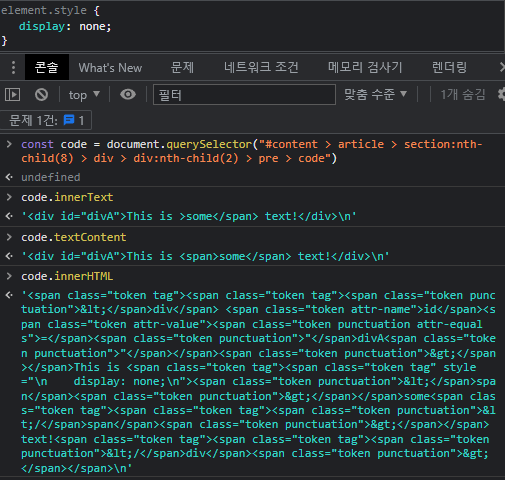

# Intro

이 글은 textContent의 발견에서 시작되었습니다.

# Properties

## 1. Element.innerHTML

- MDN Docs: [https://developer.mozilla.org/ko/docs/Web/API/Element/innerHTML](https://developer.mozilla.org/ko/docs/Web/API/Element/innerHTML)

```js
// get HTML content
const content = element.innerHTML;

// set HTML content
element.innerHTML = '<h1>Hello World!</h1>';
element.innerHTML += '<h2>Hello World!</h2>';
```

innerHTML로 가져온 내용이 `&` `<` `>`를 포함하는 경우 각각 `&amp;`과 `&lt;` `&gt;`로 대체됩니다.

innerHTML을 사용하여 삽입한 태그는 HTML 태그로 파싱 되기 때문에 HTML5에서는 innerHTML로 삽입된 `<script>` 태그가 실행되지 않도록 지정하고 있습니다. 또한, 보안 점검에서 innerHTML이 사용된 경우 거부되기도 합니다.

## 2. HTMLElement.innerText

- MDN Docs: [https://developer.mozilla.org/ko/docs/Web/API/HTMLElement/innerText](https://developer.mozilla.org/ko/docs/Web/API/HTMLElement/innerText)

```js
// get text content
const content = htmlElement.innerText;

// set HTML content
element.innerHTML = 'Hello ';
element.innerHTML += 'World!';
```

innerText는 `<style>`과 `<script>` 같은 태그가 아닌 HTML Element 내부의 `<br>`를 인식하여 안에 있는 텍스트만을 반환하는데, 이때 숨겨진 요소를 무시하고 화면에 보이는 텍스트만을 반환합니다. innerText는 요소와 그 자식 요소의 렌더링 된 텍스트 콘텐츠를 나타내기 때문입니다. 이러한 점이 textContent과 구분되는 innerText의 특성이라고 할 수 있습니다.

## 3. Node.textContent

- MDN Docs: [https://developer.mozilla.org/ko/docs/Web/API/Node/textContent](https://developer.mozilla.org/ko/docs/Web/API/Node/textContent)

- MDN Docs: [https://developer.mozilla.org/ko/docs/Web/API/Node/textContent](https://developer.mozilla.org/ko/docs/Web/API/Node/textContent)

```jsx
// get text content
const content = node.textContent;

// set text content
node.textContent = 'Hello ';
node.textContent += 'World!';
```

textContent는 Node 안에 존재하는 모든 text value를 반환합니다.

아래는 innerText 문서에서 소개하는 예제로, 링크로 이동하여 확인해 볼 수 있습니다.

- [https://developer.mozilla.org/ko/docs/Web/API/HTMLElement/innerText#예제](https://developer.mozilla.org/ko/docs/Web/API/HTMLElement/innerText#%EC%98%88%EC%A0%9C)

위 예제 코드를 로컬이나 CodePen, JSFiddle 같은 코드 에디터에서 실행시켜본다면 더 확실히 ‘모든 텍스트 콘텐츠’를 가져온다는 것을 느낄 수 있습니다. 코드 에디터가 들여 쓰기를 자동으로 만들어주고 있다면 들여 쓰기와 에디터 상의 줄바꿈까지 그대로 가져오고 있다는 것을 확인할 수 있습니다. 더하여 `<style>`과 `<script>` 태그 안에 작성한 텍스트까지 함께 가져옵니다. 그렇기 때문에 innerText는 `<br>`을 이용한 줄바꿈은 인식하지만 코드 상의 줄바꿈은 인식하지 않고, textContent는 `<br>`을 이용한 줄바꿈은 인식하지 못하지만 코드 상의 줄바꿈과 들여 쓰기의 공백(*non*
-*breaking space*)는 그대로 인식하여 값을 반환합니다.

# Comparison

<figure>
  
  <figcaption>css로 일부 태그를 display: none; 시켰을 때의 각 innerText, textContent, innerHTML을 사용한 결과</figcaption>
</figure>

위 이미지에서처럼 css로 일부 태그를 display: none; 시켰을 때, innerText는 눈에 보이는 텍스트만 가져오고 textContent는 보이지 않는 텍스트까지 가져오고 있습니다. 그리고 innerHTML은 내부에 있는 전체 html 코드를 가져오면서 `<`과 `>` (Less-than sign, Greater-than sign) 텍스트를 `&lt;`과 `&gt;`으로 가져오고 있는 것을 확인할 수 있습니다.

이와 관련하여 보다 정확한 설명이 필요하거나 관련 문서를 확인하고자 한다면 아래 MDN 문서 링크로 이동하세요.

- Differences from innerText and textContent (eng): [https://developer.mozilla.org/en-US/docs/Web/API/Node/textContent#differences_from_innertext](https://developer.mozilla.org/en-US/docs/Web/API/Node/textContent#differences_from_innertext)
  - (kor): [https://developer.mozilla.org/ko/docs/Web/API/Node/textContent#innertext%EC%99%80%EC%9D%98_%EC%B0%A8%EC%9D%B4%EC%A0%90](https://developer.mozilla.org/ko/docs/Web/API/Node/textContent#innertext%EC%99%80%EC%9D%98_%EC%B0%A8%EC%9D%B4%EC%A0%90)

물론, 이 글에서는 DOM 요소 안에 있는 텍스트 정보를 가져오는 방법에 대해서만 비교했지만, 가져온 텍스트를 편집하고 삭제하는 방법은 이 세 가지만 존재하지 않습니다. 만들고자 하는 결과에 따라 String 메서드를 사용할 수도 있을 것이고, 또 다른 예로 Node 메서드 중 appendChild를 사용하여 텍스트뿐만 아니라 DOM 요소를 추가할 수도 있을 것입니다.

아래 포스트에서 `<div>` 내용을 가져오고, 변경, 추가, 삭제하는 방법들을 실험하고 정리한 내용을 한 번 읽어보셔도 좋을 것 같습니다.

# Ref

- [https://hianna.tistory.com/479](https://hianna.tistory.com/479)
