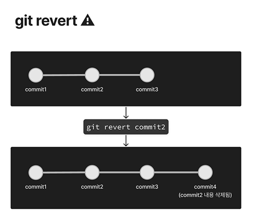
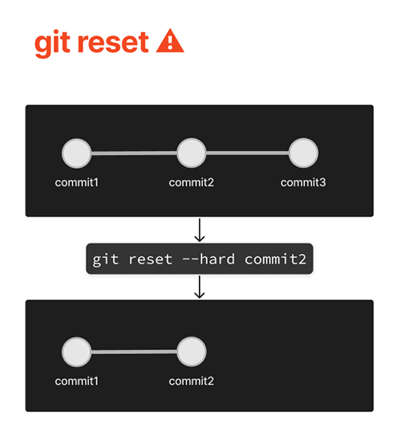
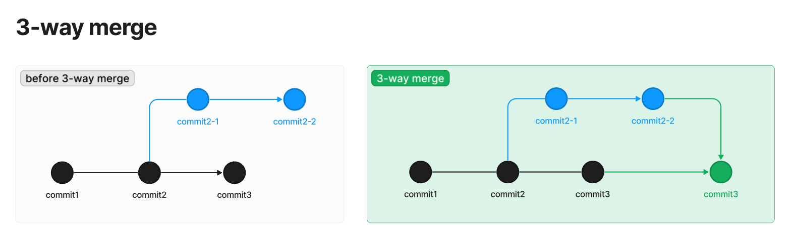
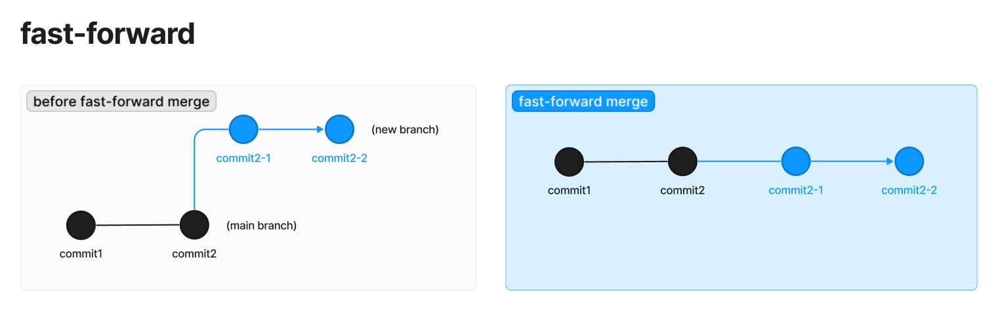
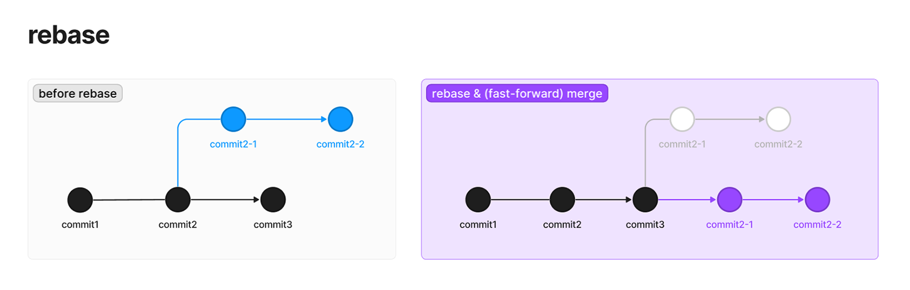
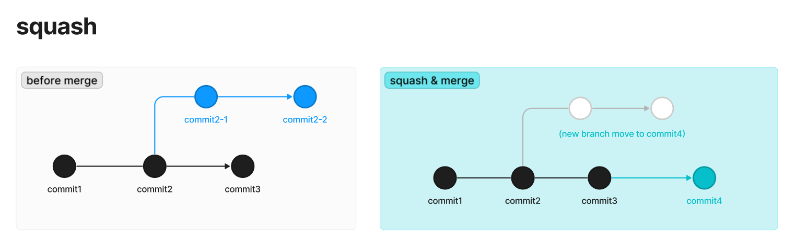
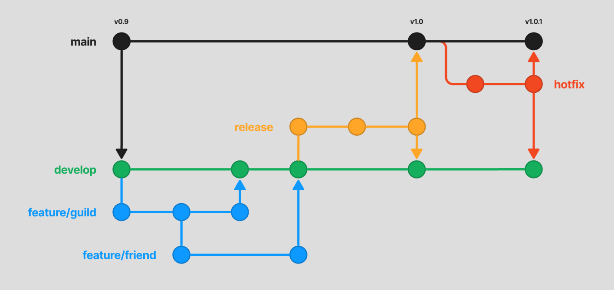
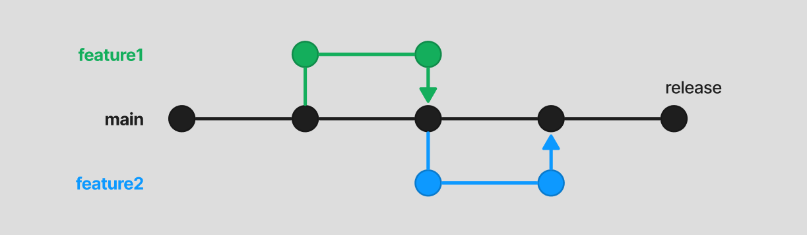

<small><em>last modified: 2024-07-05</em></small>

# 💡 more information

- [https://docs.github.com/ko/github-cli](https://docs.github.com/ko/github-cli)

# Git

: 버전 관리를 위해 사용

_ref :_ [https://git-scm.com/docs/](https://git-scm.com/docs/)

# 0. start

## check version

```bash
# 아래 커멘드로 설치 완료 확인(버전 확인) 가능
git --version
```

## user config

```bash
git config --global user.email "<user@email.com>"
git config --global user.name "<username>"
```

## $ git init

(로컬) 저장소 생성

```bash
# git 저장소 시작
git init

# 기본 브랜치명이 'master'인 경우도 있음
# 브랜치 이름을 'main'으로 변경
git branch -M main
```

# 1. create version (record)

- **staging area**: commit 하기 전에 commit할 파일들을 골라놓는 곳
  - ex. staging modified file to staging area for commit
- **repository**: git이 파일 기록을 저장해두는 **저장소**

## $ git add

```bash
# git add <file_name>
git add new.js

# 모든 파일 스테이징
git add . # 현재 저장소 내 모든 (수정된) 파일
git add --all # 모든 수정된 파일
```

## $ git commit

```bash
git commit -m ":commit message"
```

## $ git log

```bash
git log
git log --all --oneline --graph
# vim 에디터로 파일을 열어 확인
# 키보드 `j/k` 키를 사용하여 스크롤 다운/업
# `q` 키를 입력하여 에디터 종료
```

## $ git diff

가장 최근 커밋과의 코드 차이 확인

```bash
git diff
# vim 에디터로 파일을 열어 확인
```

```bash
# git difftool <commit_id?> <commit_id?>
git difftool
# vim 에디터로 파일을 열어 확인
# `:i`를 입력하여 파일 수정
# `:q` 혹은 `:qa`을 입력하여 에디터 종료
```

- 특정 커밋과의 코드 차이 확인: `git difftool <commit_id>`.
- 두 개의 커밋을 특정하여 코드 차이 확인: `git difftool <commit_id> <another_commit_id>`.
- VSCode의 GUI extension을 사용할 수도 있음 _ex. “Git Graph” in VSCode extension_

## $ git stash

- 커밋 시 사용하지 않는 코드를 커밋에 포함하지 않도록 잠깐 보관하기: stash 사용 혹은 new temporary branch 생성
- 최근 커밋과의 차이점을 전부 보관

```bash
git stash
# 혹은
git stash save 'memo'
# > Saved working directory and index state WIP on main: <commit_id> <commit_message>
```

```bash
# 일부 코드만 stash
git stash -p
```

```bash
# stash 리스트 보기
git stash list

# 가장 최근 stash 다시 불러오기
git stash pop

# stash 삭제
git stash drop {number} # specify one
git stash clear # all

```

## commit revert

### $ git restore

코드를 최근 혹은 특정 커밋으로 되돌리기 위해 사용하거나 특정 파일의 staging을 취소

```bash
# git restore <파일명>
# git restore --source <커밋_아이디> <파일명>
```

```bash
# git resotre --staged <파일명>
```

### $ git revert ⚠

커밋 되돌리기

```bash
# git revert <커밋_아이디> <커밋_아이디?>
# 위 처럼 여러 커밋 아이디를 지정할 수 있음

# 최근 커밋 되돌리기
git revert HEAD
```

<figure>
  
  <figcaption>'git revert commit2_id' 커멘드 실행 시 commit2가 삭제된 새로운 commit4 커밋 생성</figcaption>
</figure>

### $ git reset ⚠

특정 커밋이 생성된 시점으로 되돌아가기

```bash
# git reset --hard <커밋_아이디>

# 리셋 후 변동사항 staging
# git reset --soft <커밋_아이디>

# git reset 커멘드의 기본 옵션
# 리셋 후 변동사항 unstage
# git reset --mixed <커밋_아이디>
```

<figure>
  
  <figcaption>'git reset --hard commit2' 커멘드 실행 시 commit2 위치로 리셋되어 이후의 내용 삭제</figcaption>
</figure>

### $ git clean

모든 변경 내용 취소(추적되지 않은 모든 파일 제거)

# 2. branch

## create and switch branch

```bash
# git branch/switch <브랜치_이름>
git branch new_branch
git switch new_branch

# 현재 브랜치 상태 확인
git status
```

## merge branch

```bash
# 병합하기 위한 베이스 브랜치로 이동
git switch main

# 병합하고자 하는 브랜치 병합
git merge new_branch
```

- 같은 파일, 같은 라인에 수정사항이 겹친다면 충돌이 발생할 수 있음
- 병합 충돌 시, 충돌이 일어난 파일을 열어서 수정 후 재커밋

### 3-way

병합하려고 하는 두 브랜치에 모두 1개 이상의 커밋이 있는 경우 두 브랜치가 병합된 새로운 커밋 생성

_ref._



### fast-forward

베이스 브랜치가 병합하고자 하는 브랜치 이후에 새 커밋이 없는 경우, 새로운 커밋을 만들지 않고 병합하고자 하는 브랜치의 커밋을 베이스 브랜치로 그대로 가져옴

_ref._



```bash
# fast-forward를 수행해도 되는 상황에서 강제로 3-way 방법으로 병합
git merge --no-ff new_branch
```

### rebase

베이스 브랜치가 병합하고자 하는 브랜치 이후에 새 커밋이 없는 경우, 새로운 브랜치의 시작점을 베이스 브랜치의 끝으로 이동시켜 fast-forward 실행

```bash
# 병합하고자하는 브랜치로 이동
git switch new_branch
# main 브랜치에서 시작점 이동
git rebase main

# 브랜치 병합
git switch main
git merge new_branch
```



### squash

```bash
git merge --squash new_new_branch
```



- commit4의 로그에 commit2-1, commit2-2가 남지 않음

## delete branch

병합이 완료된 경우 대체로 브랜치를 삭제

```bash
# 성공적으로 완료된 경우
git branch -d new_branch

# 병합되지 않은 브랜치를 삭제하는 경우
git branch -D new_new_branch
```

# 3. upload

- 원격저장소(online repository)에 저장 ⇒ 협업 시 각자의 로컬 저장소로 복제한 후 개발 진행하게 됨

## $ git push

```bash
# git push -u <원격_저장소_주소> <올릴_로컬_브랜치명>
git push -u https://github.com/<someone>/<some_repository>.git main
```

## $ git remote add &lt;variable&gt;

원격 저장소 설정

```bash
# git remote add <변수명> <값(url)>
git remote add origin https://github.com/<someone>/<some_repository_name>.git

git push -u origin main
# => 'git push -u https://github.com/<someone>/<some_repository>.git main'와 동일
# => `-u`를 사용하여 <origin_url> <origin_branch> 주소 기억
# => 주소를 기억한 이후, 'git push'만 사용해도 동일하게 작동
```

## $ git clone

원격 저장소 로컬로 복제

```bash
# git clone <저장소_주소>
git clone https://github.com/<someone>/<some_repository_name>
```

## $ git pull

원격 변경사항을 로컬 저장소와 통합

_원격에 로컬 작업이 없는 경우, 커밋을 push하기 전에 원격 변경 사항을 로컬 저장소와 통합 먼저 진행_

```bash
git pull
# git pull = git fetch + git merge
```

- **git fetch**: 원격 저장소에서 새 변경사항 가져오기
- **git merge**: 변경사항 병합
- 마찬가지로 병합 시 충돌 발생 가능

### pull request

push한 브랜치가 원격 저장소에 병합할 수 있도록 요청

- 원격 저장소에서 pull request 생성: `https://github.com/<someone>/<some_repository_name>`
- 충돌 해결
- pull request 병합

## branch push

```bash
# 로컬 환경에서,
git branch <new_branch>
git switch <new_branch>
git add .
git commit -m "create new branch"

# 새 브랜치 push
git push origin <new_branch>
```

# 4. additional

## workflow

⇒ GitFlow / Github Flow / Trunk-based / Gitlab Flow

### GitFlow

by Vincent Driessen

1. main
2. develop
3. feature
4. release
5. hotfix

- ci/cd에 적합하지 않음
- 개발 환경 등에 맞도록 변경하여 사용
- 참고: [Gitflow - Atlassian Git Tutorial](https://www.atlassian.com/ko/git/tutorials/comparing-workflows/gitflow-workflow)

<figure>
  
  <figcaption>develop, feature, release, hotfix 브랜치의 역할에 따라 사용. develop 브랜치를 주로 개발을 진행하며 개발하는 기능별 feature 브랜치를 추가, 병합을 반복하고 release 브랜치를 생성하여 배포. 긴급한 오류 수정 시 hotfix 브랜치를 생성하여 main과 develop 브랜치에 병합</figcaption>
</figure>

### Trunk-based

main 브랜치만을 사용 `≒ Github Flow`

- 지속적이고 많은 테스트 필요
- ci/cd에 적합함

<figure>
  
  <figcaption>main 브랜치를 기준으로 개발하는 기능에 따라 브랜치 생성 후 main 브랜치에 병합 반복</figcaption>
</figure>

## .gitignore

push되지 않는 파일 혹은 경로 정의 파일

- docs: [Git - gitignore Documentation](https://git-scm.com/docs/gitignore)

### how to write

`gitignore` 파일의 각 라인으로 구분하여 파일 혹은 경로 패턴 정의

```
# this is a comment
\#dir_start_with_hash

!this_is_negative_pattern
\!file_start_with_exclamation_mark!.txt

/directory/separate

*.anything
without/?.something

**/match/all/dir
all/**
all/**/between
```

- 혹은 gitignore 생성: [gitignore.io](https://www.toptal.com/developers/gitignore)

## another commands

- [20 Git Commands you (probably) didn't know about 🧙‍♂️](https://dev.to/lissy93/20-git-commands-you-probably-didnt-know-about-4j4o), _[Alicia Sykes](https://dev.to/lissy93)_ - blog post
- [Git - git Documentation](https://git-scm.com/docs/git#_git_commands)

# Documents

- [Reference](https://git-scm.com/docs/)
- [GitHub Training Kit](https://training.github.com/)

# Etc. Ref

- [https://youtu.be/XFm2qNs30BE](https://youtu.be/XFm2qNs30BE)
- [https://youtu.be/EV3FZ3cWBp8](https://youtu.be/EV3FZ3cWBp8)
- about git cancel: [https://gmlwjd9405.github.io/2018/05/25/git-add-cancle.html](https://gmlwjd9405.github.io/2018/05/25/git-add-cancle.html)
