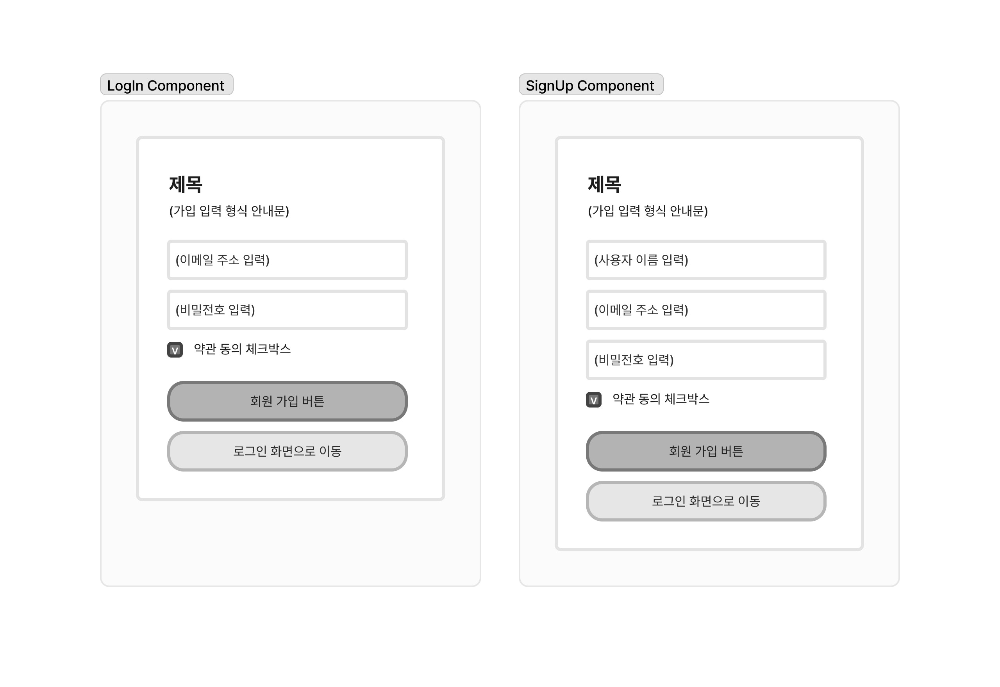

<small><em>last modified: 2024-06-02</em></small>


# 1주차


## What I Liked?

이전에 독학으로 React를 공부해서 코드를 짜본 적이 있긴 하지만 말 그대로 혼자 공부하고 혼자만 리뷰하던 상황에서 함께 코드를 작성해 보고 다른 실제 현장에서는 주로 어떻게 사용할지에 대한 공부가 된다. 이런 환경에서 프론트엔드 코드를 작성하는 능력과 내가 작성하거나 혹은 다른 사람이 작성한 코드를 읽고 어떻게 동작할지 예측하고 충분히 해석할 수 있는 능력이 향상된다고 느끼고 있다.

## This week I Learned?

첫 주 동안에는 자바스크립트와 타입스크립트의 기본적인 문법과 리액트를 활용하여 어떻게 웹 문서에 인터페이스를 만들어내고 사용자와의 상호작용으로 어떻게 인터페이스를 조작할 수 있는지에 대하여 학습한다.

### 자바스트립트

자바스크립트의 경우 기본적인 개념 혹은 문법 학습/복습 내용을 모두 정리하기엔 내용이 너무 길어지게 되고 이 글은 자바스크립트에 대한 전체적인 내용을 정리하는 것이 아니기 때문에 자바스크립트에 대해 학습한 내용 중 다시 한번 기억해야 할 것, 정확히 이해하지 못했던 개념들에 대해서만 정리하였다.

- 자바스크립트는 초기 HTML/XML 웹 문서를 읽고 스타일링을 하는 것에서 그치지 않고 웹 콘텐츠를 동적으로 상호작용할 수 있도록 하는 작업을 수행할 수 있도록 하는 언어이다.
  - 초기 브라우저들은 각각의 표준으로 자바스크립트 언어를 해석할 수 있는 엔진을 가지고 있었는데, 이렇게 제각각인 자바스크립트 엔진에 보다 쉽게 jQuery를 사용하기 시작했다.
  - 2008년 이후 웹 브라우저들이 공통으로 표준을 다시 지정하기 시작하고(ECMAScript) 이를 따라 각자의 브라우저 속 자바스크립트 엔진들이 표준화가 이루어지면서 순수한 자바스크립트와 HTML, CSS를 사용하여 웹 서비스를 개발하는 것이 가능해진다. 그럼에도 불구하고 모든 브라우저, 특히 모바일 브라우저 같은 경우 최신 자바스크립트 문법을 지원하지 못하는 상황을 위해 Babel과 같은 transcompiler를 사용하여 최신 자바스크립트 문법을 사용하여 크로스 브라우징 개발이 가능하다.
  - 최근에는 웹상에서 SaaS, PWA와 같이 서비스가 커지게 되면서 SPA 웹 개발 기술을 이용한 웹 서비스가 보편화되기도 했다.
- 브라우저는 HTML 문서를 읽다가 `<script src="some.js">` 태그를 만나면 src의 자바스크립트 파일을 다운로드하고, 이후 문서를 해석한다.
  - 이런 해석 방법은 크기가 큰 자바스크립트 파일일 때 화면 요소가 렌더링 되기까지 시간이 지연되는 문제가 발생하고, 이를 해결하기 위해 HTML 문서의 `<body>` 태그 아래 가장 마지막에 스크립트 태그를 작성하는 방법을 선택했다.
  - 하지만 이 역시도 HTML 문서 객체들이 많은 HTML 경우 문서 객체를 모두 렌더링 한 이후 자바스크립트 파일을 다운로드하기까지 자바스크립트 내부에 작성된 상호작용이 불가능한 문제 상황이 발생한다.
  - 이런 점을 보완하기 위해 스크립트 태그에 `async`와 `defer` 속성을 추가할 수 있게 되었다. 이 속성들은 스크립트 태그 이후의 문서 객체들을 파싱(parsing) 하는 작업을 자바스크립트 파일 다운로드와 병렬 처리하게 되는데, `async` 속성이 true인 경우 다운로드 완료 시점에 따른 실행 순서가 보장되지 않지만 `defer` 속성이 true인 경우 다운로드까지만 병렬 처리 후 HTML 문서를 끝까지 해석한 후 자바스크립트를 순서에 맞게 실행한다.
- 자바스크립트의 동작은 FILO(First In Last Out) 형태의 스택 구조로 실행된다. 엔진은 콜 스택에 가장 먼저 전역 실행 컨텍스트(Global Context)를 집어넣고 이 컨텍스트 안에서 코드를 실행한다.
  - 이 실행 컨텍스트는 내부적으로 렉시컬 스코프라고 불리는 레코드와 아우터라는 객체를 가지고 있고 레코드는 생성과 실행 두 가지 단계를 거친다. 레코드의 생성 단계에서 선언문들을 환경 레코드에 기록하고 이렇게 기록된 선언문들을 실행 단계에서 실행한다.
  - 이때 레코드의 생성 단계에서 저장된 함수가 실행되었을 때 함수 실행 컨텍스트를 콜 스택에 추가한다. 이 함수의 실행 컨텍스트는 마찬가지로 레코드의 생성과 실행 단계를 거쳐 내부에 있는 선언문을 기록하고 실행한다. 콜 스택에서 이 함수 컨텍스트가 종료된 후에 전역 실행 컨텍스트를 마저 실행하게 된다.
  - 이렇게 콜 스택에 실행 컨텍스트가 쌓였을 때, 렉시컬 스코프의 아우터 객체는 바깥 렉시컬 스코프를 참조할 수 있도록 단방향으로 연결하고(Scope Chaining), 이런 이유로 함수 외부에서 선언된 변수를 함수 내부에서 접근할 수 있게 된다.
  - 하지만 만약 A라는 함수 내부 변수 b를 참조하는 또 다른 함수를 반환하고 이 함수를 A 함수 바깥에서 사용한다면 A 함수는 종료된 것처럼 보이지만 A 함수의 실행 컨텍스트가 삭제되어 완전히 종료된다면 자바스크립트는 변수 b를 참조할 수 없으므로 이러한 경우마다 오류가 발생하지 않도록 자바스크립트 엔진은 참조되는 값을 메모리에 임시로 저장하고 이를 참조한다. 이럴 때 함수 A는 결국 완전히 종료되지 않은 상태로 아래의 실행 컨텍스트를 마저 실행하게 되는데 이러한 현상의 임시로 저장된 변수에 대한 참조와 이 변수가 포함된 함수의 조합을 클로저(Closures)라고 한다. 이 클로저는 함수가 생성될 때마다 함께 생성된다.
- 자바스크립트는 `var`, `let`, `const` 키워드들과 변수명으로 변수를 선언하고, 등호의 좌변에 값 혹은 표현식으로 해당 결과를 할당한다.
  - 이러한 키워드와 함수, 클래스 또는 import의 선언문은 해당 영역(스코프)의 상위로 끌어올려진 것 같은 호이스팅 현상이 일어나는데, `var` 키워드는 초기값을 undefined로 초기화하기 때문에 언뜻 보면 변수가 선언되기 전에 변수를 사용해도 오류가 나지 않는 것으로 보인다. 자바스크립트는 아무런 변수 정의 키워드를 사용하지 않고 변수가 최초로 표현되어 정의될 때 자동으로 `var` 키워드를 사용하기 때문에 엄격하지 않은 문법을 가지고 있었다.
  - ES6 이후로 너무 유연한 `var` 키워드로 인한 예측하지 못하는 오류 발생을 미리 예측하여 막기 위해 `let`, `const` 키워드가 추가되었다. `let`, `const`는 호이스팅 현상이 발생하는 순간 초기화되지 않기 때문에 선언 이전에 변수를 사용한다면 브라우저는 참조 오류를 보여준다. 또 `let`과 `const` 키워드로 선언한 변수는 키워드를 사용하여 재선언은 불가능하지만 `let` 키워드를 사용하면 재할당만이 가능하고 `const` 키워드는 재할당이 불가능하기 때문에 선언 시 초기값을 할당해야만 한다.
- 생성자함수(constructor function)를 이용하여 생성한 객체를 인스턴스라고 하고, 생성자함수에서 정의한 속성을 인스턴스에게 그대로 상속한다. 생성자함수에서는 let, const가 아닌 this 키워드를 사용하여 속성을 정의한다. 함수이기 때문에 마찬가지로 매개변수를 전달받아 개별 객체를 생성할 수 있다.
  - 모든 함수 자료형은 각자의 프로토타입 객체를 가지며 생성자함수도 마찬가지로 각자의 프로토타입을 가지고 있는데, 이 생성자함수로 생성한 인스턴스는 함수가 아니므로 프로토타입을 물려받을 수 없어 대신 `__proto__` 속성을 물려받아 생성자함수의 프로토타입에 접근할 수 있게 된다. 그래서 이 `__proto__`는 항상 누군가의 프로토타입 객체를 가리키는데 결국 최종적으로 최상위 내장 객체 Object의 프로토타입 객체를 가리키고 있는 것을 확인할 수 있다. (Prototype Chaining)
  - 생성자함수의 프로토타입에 접근하여 메서드를 정의할 수도 있는데, 이 생성자 함수 자체에는 이 메서드가 존재하지 않지만 프로토타입에서 정의된 메서드를 참조하기 때문에 메서드를 정상적으로 사용할 수 있는 것을 볼 수 있다. 이때 원칙적으로는 `__proto__`를 체이닝하여 메서드를 호출해야겠지만 이럴 때 메서드 안에서 this는 인스턴스 자체가 아닌 `__proto__` 히든 속성을 가리키기 때문에 자바스크립트에서는 이를 생략하고 메서드를 호출하면 `__proto__`를 통해 프로토타입에 정의된 메서드를 참조하여 메서드를 정상적으로 호출한다.
  - 이렇게 같은 생성자함수로 생성된 각 인스턴스는 같지 않지만 (!=, !==), 각 인스턴스가 가리키는 프로토타입 객체는 같다.(==, ===) 그렇기 때문에 인스턴스의 프로토타입을 통해 메서드를 정의해도 같은 프로토타입 객체를 가진 인스턴스는 이 메서드를 공유한다. 프로토타입이 아닌 하나의 인스턴스에 메서드를 정의했을 때에는 역시나 공유하지 않는다.
  - 자바스크립트의 표준 내장 객체도 마찬가지로 프로토타입 객체를 가지고 있으며 이 프로토타입 객체 역시 최종적으로 최상위 내장 객체 Object의 프로토타입 객체를 가리킨다. 이런 표준 내장 객체는 인스턴스 메서드와 인스턴스 속성을 가지고 있어 이러한 내장 객체로 생성된 인스턴스는 자바스크립트에서 기본적으로 제공하는 메서드를 활용하여 값을 제어할 수 있다. 기본 자료형 데이터에서도 각각의 객체 인스턴스 메서드와 속성을 사용할 수 있는데, 메서드와 속성을 사용할 때 각각의 자료형의 표준 내장 객체로 래핑되어 결과를 반환하고 메서드들을 연결(chaining)하여 사용할 수 있게 된다.
  - ES6 이후로는 생성자 함수가 아닌 클래스 키워드(`class`)를 사용하여 객체를 생성할 수 있다.
- 자바스크립트에서 장기 실행되는 작업이 존재할 때 기본적으로 해당 작업을 완료할 때까지 그 이후 작업을 아무것도 못하게 되는 문제가 발생한다. 이러한 문제로 비동기 작업을 할 수밖에 없는 상황이 발생하는데 이때 다수의 비동기 작업을 수행해야 할 때 순서가 보장되지 않고 제어에 어려움이 발생한다.
  - 프로미스(Promise)는 비동기 작업의 상태를 알려주는 객체로, 이 객체를 통해 이전 작업이 끝나기 전까지 다음 작업을 연기하거나 작업 실패에 대응하는 새로운 기능을 사용할 수 있다.
  - `new Promise(executor)`로 프로미스 객체를 생성하고 이 프로미스는 콜백 함수를 반환한다. 내부적으로 `resolve와 reject`(executor)를 매개변수로 사용한다. 콜백과 기능적인 부분에서 개선된 방법이라고 할 수는 없지만 비동기 작업의 순서를 조작하고 이 순서를 보다 명확히 읽을 수 있다는 이점으로 콜백 함수 중첩보다 프로미스 사용이 주로 사용된다.
  - 이 프로미스는 대기(pending), 이행 (fulfilled), 거부 (rejected) 상태를 갖고 프로미스 객체를 생성하면 자동으로 대기 상태를 표시한다. resolve 함수를 실행하면 이행 상태가 되고 reject 함수를 사용하면 거부 상태가 된다. 프로미스가 이행 상태가 되면 `then` 메서드가 자동으로 실행되고, 거부 상태가 되면 `catch` 메서드가 자동으로 호출된다. 프로미스에서 resolve 함수의 매개변수는 `then` 메서드의 콜백 함수 매개변수로 전달하고 reject 함수의 매개변수는 catch 메서드 콜백의 매개변수로 전달한다. 프로미스는 resolve 혹은 reject가 호출되면 `finally` 메서드의 함수가 실행된다.
  - 여러개의 프로미스를 차례대로 실행할 때, `then` 내부에서 프로미스는 이행되면 콜백 함수와 같아 보이지만 `then` 함수를 자동으로 반환하는 특징 때문에 이행함수(onfulfilled)에서 프로미스를 반환하면 `then`을 그대로 체이닝하여 순서에 따라 실행할 수 있다. 이렇게 `then`을 실행 순서대로 체이닝하여 목표로 하는 순서를 명시적으로 보여준다. 체이닝된 프로미스들에서 오류가 발생했을 때 에러를 `catch`할 때에도 오류가 발생한 메서드의 아래에서 `.catch((error) => )`를 사용하여 명시적으로 처리할 수 있다.
  - `async function` 키워드를 이용한 비동기 함수는 내부적으로 프로미스를 반환하는 것과 같은 역할을 한다. `await` 키워드를 사용하면 키워드를 사용한 함수가 끝나기 전까지 다음 코드를 실행하지 않도록 한다.
  - 이렇게 프로미스들을 순차적으로만 처리하려면 웹 문서를 처음 로딩할 때처럼 여러 API에서 많은 데이터를 가져오는 경우에 자바스크립트 코드 완료까지 너무 오랜 시간이 걸린다. 이를 방지하기 위해 `Promise.all([...promises])`을 사용하여 프로미스 실행을 동시에 시작하여 마지막까지 대기 상태였던 프로미스가 종료되는 순간 종료되도록 병렬로 동작하게 할 수 있다.
  - 하지만 이렇게 다수의 API를 동시에 병렬로 호출하는 케이스는 많은 처리를 병렬로 진행하기 때문에 메모리를 크게 사용하기 때문에 주의가 필요하기도 하고, 동시에 작업하는 프로미스 중 하나가 오류가 발생하는 모든 처리가 중단되고 오류가 발생한다는 특징이 있기 때문에 이런 경우에 성공적으로 이행한 결과가 필요한 경우에 `Promise.allSettled` 메서드를 사용할 수 있다.

### 타입스크립트

- 타입스크립트는 자바스크립트에 값의 유형(type)이 추가된 언어이다. 자바스크립트는 어떠한 값의 유형을 실행될 때 동적으로 판단하기 때문에 코드를 작성할 때는 기본적으로 any type으로만 추론된다. 이러한 상황에서 오는 불확실성과 과한 유동성을 타입스크립트는 타입을 정의하지 않더라도 어떠한 값이 할당되어 선언될 때 타입을 자동으로 추론하여 선언한다. 때문에 타입 정의를 추가로 하지 않는다면 초기화 값의 타입으로 해당 변수의 타입이 정의되어 다른 타입의 값이 올 수 없게 한다.
  - 타입스크립트에서 가장 기본적인 타입 정의는 `[변수명]: [타입]`으로 이루어진다. 어떠한 값이 아니라 이 값을 나타내는 변수의 타입을 정의하고 해당 값의 유형을 미리 선언하게 된다.
  - 객체는 기본적으로 : object와 같이 정의할 수 있지만 타입스크립트가 정의한 타입을 확인해 보면 { name : string }처럼 초기화 값이 어떠한 타입을 가진 속성을 포함하는지 정의한다. 객체도 정의한 타입 속성이 값에 존재하지 않는다면 할당 오류를 표시한다.
  - 함수 타입을 정의할 때는 선언식과 표현식, 화살표 함수 모두 매개변수와 리턴 값을 화살표 함수의 형태로 정의하거나 매개변수가 있다면 각 매개변수의 타입을 정의하고 리턴되는 값을 소괄호 다음에 정의하여 어떤 값이 반환될 것인지 타입을 정의할 수 있다.
  - 배열과 객체, 함수의 매개변수에 일반적으로 정의한 속성은 반드시 존재해야만 하는데, 반드시 존재하지 않아도 되는(optional) 속성은 속성의 변수명 혹은 키값 다음에 `?`를 추가하여 표시한다.
  - `any` 타입은 모든 타입을 허용하는 타입으로, 타입 검사가 무의미해지기 때문에 타입스크립트 개발 시 최종 타입에 `: any`로 정의되어 있다면 자바스크립트를 사용한 것과 마찬가지로 타입스크립트가 개발자가 의도했던 비정상적인 작동을 감지하지 못하고 예상치 못한 오류가 발생하기 쉬워진다.
  - `type` 키워드를 사용하여 변수를 정의하듯이 타입을 정의한 후 타입명을 변수 정의 시 사용할 수 있다. `type` 키워드를 사용하여 타입을 정의할 때에는 기본적으로 타입을 정의할 때와 마찬가지로 우변에 타입명을 지정하고 등호 좌변에 타입을 정의한다. 이렇게 정의된 타입은 객체 혹은 배열 안에서 중첩될 수 있다. 그리고 마찬가지로 이렇게 정의된 타입들은 타입 연산자를 이용해 정의할 수 있고 이렇게 정의된 타입을 하나의 개별 타입으로 다시 또 `type` 키워드를 사용해 정의할 수 있다.
  - `interface` 키워드를 사용하여 마찬가지로 타입을 정의할 수 있는데, `interface`는 객체를 지정하듯이 선언하여 객체만 정의할 수 있다. `type`으로 정의된 타입은 중복 타입 정의 오류를 표시하지만, 같은 이름의 인터페이스가 다시 정의된다면 자동으로 객체를 병합한다. 이때 같은 이름의 인터페이스는 코드의 위치가 어디에 있는지와 관계없이 병합된 타입이 적용되는 것을 주의한다.
- 정의된 타입은 `|` 연산자와 `&` 연산자를 이용하여 각각 유니언 타입(Union Type)과 인터섹션 타입(Intersection Type)으로 작성할 수도 있다. `|` 연산자는 자바스크립트에서 `|| (OR)`와 같이 연산된 타입 중 하나를 만족한다는 의미의 타입을 만들어 내고, `&` 연산자는 자바스크립트에서 `&& (AND)`와 같이 연산된 타입을 모두 만족하는 병합된/확장된 하나의 타입을 의미한다.
  - 타입스크립트는 타입 변환을 위해 정의되어 있는 전역에서 사용 가능한 유틸리티 타입이 있어 이 유틸리티 타입을 이용하여 타입 연산을 할 수도 있다.
  - 객체 타입에서 한 속성을 선택하고자 할 때에는 유틸리티 타입을 사용할 수도 있겠지만 자바스크립트 객체에서 대괄호로 속성에 접근하는 것처럼 `[객체타입][키값]`으로 접근할 수도 있다.
- 다양한 타입을 허용하는 배열을 매개변수로 갖는 함수가 있을 때, 매개변수의 타입을 허용하는 범위 내의 타입을 `|` 연산자로 표현한다면 타입이 너무 길고 복잡해진다. 이렇게 타입을 유동적으로 전달받아 사용할 수 있도록 제네릭 타입을 사용할 수 있다.
  - 함수에서 이 제네릭 타입을 사용할 매개변수의 묶음(소괄호) 앞에 `<[식별자]>` 형태로 제네릭 함수를 사용한다. 제네릭은 `any` 타입과 언뜻 비슷해 보이지만 제네릭을 사용할 때 요구되는 타입을 지정하여 사용하게 되므로 해당 함수 호출 코드에서 필요한 타입의 값을 명시된 타입에 따라 사용할 수 있다.
  - 객체 타입 또는 인터페이스를 정의할 때도 제네릭 타입을 지정할 수 있는데, 이때에는 각 이름 뒤에 `<[식별자]>` 와 함께 사용하여 제네릭 타입을 전달하여 사용할 수 있도록 한다. 타입 정의와 인터페이스 정의 모두 동일하게 제네릭 타입을 활용할 수 있다.

### 리액트

- 리액트는 화면 구성 요소를 **컴포넌트** 기능을 통해 화면 요소를 작성하고, **Virtual DOM(가상 돔)**으로 DOM Tree를 관리, 변경, 업데이트하는 **CSR(Client Side Rendering)** 프레임워크이다.
  - 리액트는 화면 요소를 컴포넌트 단위로 작성하고, 각 컴포넌트는 JSX를 반환한다. JSX(JavaScriptXML)은 HTML 마크업을 자바스크립트에서 더 편하게 사용하기 위해 개발된 언어로, 기본적으로 HTML 태그들을 거의 그대로 사용할 수 있고 다른 컴포넌트를 가져와 포함시킬 수도 있다.
  - 각 컴포넌트는 클래스형과 함수형으로 작성할 수 있으며 어느 형식의 컴포넌트인지와 상관없이 리턴되는 JSX는 가장 상위의 요소가 하나여야만 한다.
- 리액트는 JSX 태그 혹은 컴포넌트에 이벤트 핸들러 속성으로 함수를 등록할 수 있다. 이 핸들러 속성은 HTML에서 모두 소문자로 사용하는 이름을 가지고 있지만 리액트에서는 카멜 케이스 형식으로 이름 지어져 있다.
- 리액트 컴포넌트는 어떠한 값을 하위 컴포넌트(자식 컴포넌트)에게 전달할 수 있는데, 하위 컴포넌트에 태그 속성을 작성하듯이 전달하고자 하는 속성을 추가한다. 하위 컴포넌트는 컴포넌트 함수의 매개변수로 이 속성들의 집합을 객체 형태로 전달받아 컴포넌트 내부에서 마침표 연산자 혹은 대괄호 연산자로 사용하거나 또 다른 컴포넌트로 전달할 수 있다. 함수 역시 이렇게 Props로 전달하여 사용할 수 있다. 또, 이 Props는 객체 형태이기 때문에 구조 분해 할당으로 속성의 이름만을 변수로 사용할 수도 있고 여러 개의 일부 속성 객체를 하나의 변수로 받아 스프레드 연산자를 통해 JSX 태그에 한 번에 전달할 수도 있다.
  - 리액트의 컴포넌트는 `children`이라는 속성을 갖는데, 컴포넌트 태그 안(돔 트리 하위) 자식 요소들을 포함한다. 이 `children` 속성을 통해 부모 컴포넌트는 자식 컴포넌트를 동적으로 조작할 수 있게 된다.
  - 컴포넌트에 콜백 함수를 전달하는 경우 정의한 함수명을 전달하거나 매개변수를 부모 컴포넌트에서 전달할 수 있다. 전자의 경우는 함수명 그대로 전달할 수 있지만 후자의 경우 함수 실행식만 전달하는 순간 컴포넌트가 렌더링 될 때 함수가 계속해서 실행되기 때문에 콜백 함수의 형태로 전달한다.
- 리액트 컴포넌트는 다양한 방식으로 스타일링을 지정할 수 있다.
  - HTML과 같이 태그에 style 속성으로 css 값을 지정하거나 외부 css 파일을 만들어 컴포넌트 파일에서 css 파일을 import 하여 사용할 수도 있다. 인라인 형식으로 스타일을 작성할 때는 css 속성을 객체 형식으로 입력하는데, 마찬가지로 카멜 케이스 형식으로 css 속성명을 키값으로 작성한다.
  - 혹은 css 모듈 파일에 적용하고자 하는 스타일을 클래스명으로 지정하여 작성하고 이 모듈 스타일을 import 하여 JSX에서 className에 지정한 클래스를 하나의 속성처럼 추가한다. 이러한 방식은 실제 렌더링 후 적용될 때 클래스를 해시 된 고유 클래스로 지정하고 있는 것을 확인할 수 있다.
  - css를 직접 작성하지 않고 TailwindCSS와 같은 프레임워크를 사용하여 스타일을 적용할 수도 있다. TailwindCSS는 HTML 문서의 body 태그, 즉 화면의 가장 상위 문서 객체의 스타일에 `--tw-*`로 시작하는 속성 값들을 미리 설정하고 이 값들을 이용하여 스타일을 지정할 수 있는 클래스들을 가지고 있다.
  - CSS-in-JS는 자바스크립트에서 css를 작성하고 관리하는 방법이다. 대표적으로 사용되는 CSS-in-JS 라이브러리는 'Styled Components'와 'emotion', 'Vanila Extract' 등이 있다. 'Styled Components'와 'emotion'는 컴포넌트가 렌더링 될 때 스타일을 생성하여 적용하기 때문에 프로그램이 실행되는 동안 추가적인 연산이나 자원 소비가 일어날 수 있다는 단점이 존재하는데, 이러한 점을 보완할 수 있는 'Vanila Extract'와 같은 제로 런 타임의 특징을 갖는 CSS-in-JS 라이브러리를 사용할 수도 있다.
- 리액트를 사용하여 화면을 조작할 때에는 HTML 문서 객체 자체가 아닌 JSX로 태그를 화면 구성 요소를 작성하고 조작해야 하기 때문에 기본적인 JavaScript를 이용한 문서 객체 조작 방법을 그대로 사용하기는 어렵다. 또, 리액트로 컴포넌트 기반으로 화면 요소들을 제작할 때에는 만들어 놓은 컴포넌트를 재사용하여 각기 다른 곳에서 사용할 수도 있기 때문에 정확히 원하는 요소에 접근하고 조작하기 위해서 리액트는 `use~`로 시작하는 이름의 리액트 훅을 사용할 수 있다.
  - `useState` : 화면에서 클릭할 때마다 어떠한 값을 변경하고자 할 때, 일반 변수에 값을 넣고 이를 변경하는 함수를 작성한다면 값 자체는 변화하지만 리액트는 이 값이 변경되었음을 감지하지 못해 화면을 업데이트하지 못한다. 이러한 값을 리액트에게 알려주기 위해 함수형 컴포넌트에서 `useState` 훅을 사용한다. `useState([초기_상태])` 메서드는 `[상태, 업데이트 _함수]`를 반환한다. 업데이트 함수는 인자로 받은 값을 저장된 변수에 업데이트한다.
  - `useId` : 체크박스 입력 태그는 고유한 id 값을 가지고 있고 이 값으로 라벨 태그와 연결할 수 있다. 이 태그들을 이용하여 체크박스 컴포넌트를 만들었을 때, 입력 태그는 컴포넌트를 사용할 때마다 고유한 id 값을 가져야만 하는데, Math.random과 같은 내장 메서드를 사용할 수도 있겠지만 리액트는 18 버전부터 `useId()` 훅을 사용할 수 있다.
  - `useRef` : 입력창에 포커스가 갈 수 있도록 하는 경우, `useRef(initialValue)`를 이용하여 만든 래퍼런스를 원하는 원하는 요소에 접근하도록 한다. 어떤 형식 입력창에서 `<input />`의 autofocus 속성을 이용하여 화면이 렌더링 되었을 때 자동으로 커서가 첫 입력창에 존재하도록 할 수도 있지만 이러한 방법으로는 재입력을 권고하며 빈 입력창으로 커서를 옮기거나 할 수 있다.

### 과제 수행

마지막으로 배운 것들을 토대로 **리액트+타입스크립트**를 활용하여 버튼(`<Button>`)과 입력창(`<Input>`) 컴포넌트를 제작하고 이를 사용한 다음과 같은 로그인 화면과 회원가입 입력 형식 컴포넌트를 만들어 본다.

와이어프레임 예시



> 아래 코드에서는 화살표 함수 형태로 함수형 컴포넌트를 작성하여 export 하고, 컴포넌트의 스타일은 `*.module.css`에 작성하여 `styels`의 이름으로 스타일 모듈을 불러와 기본 스타일을 적용시키도록 했다. 코드 블럭들에서 css와 `styles`의 import 문은 생략되어 있다.

**Button 컴포넌트**

```ts
type TButtonProps = React.ComponentProps<"button"> & {
	children: ReactNode;
};

const Button = (props: TButtonProps) => {
	const { children, ...restButtonProps } = props;
	return <button className={styles.button}>{children}</button>;
};

export default Button;
```

**Input 컴포넌트**

```ts
type TInputProps = React.ComponentProps<"input">;

const Input = (props: TInputProps) => {
	return <input className={styles.input} />;
};
```

먼저 HTML의 버튼과 입력창 요소에 기본 스타일 값을 적용하고 사용할 수 있는 속성을 받아 각각의 태그에 전달한다. 각 버튼과 입력창의 타입 혹은 스타일은 컴포넌트를 사용하면서 지정 가능하도록 `React.ComponentProps<[태그명]>`의 형태로 속성의 타입을 명시해 준다. 버튼은 입력창과 달리 내부 텍스트 혹은 요소를 추가해야만 하도록 `ReactNode` 타입의 `children` 속성이 옵셔널 하지 않도록 명시한다.

**Checkbox 컴포넌트**

```ts
type TCheckboxProps = React.ComponentProps<"input"> & {
	children: ReactNode;
};

const Checkbox = (props: TCheckboxProps) => {
	const { children, ...restCheckboxProps } = props;
	const checkboxId = useId();
	return (
		<div>
			<input
				id={checkboxId}
				type="checkbox"
				className={styles.invisible}
				{...restCheckboxProps}
			/>
			<label htmlFor={checkboxId}>
				<div
					style={{
						display: "flex",
						flexDirection: "row",
						gap: "8px",
					}}
				>
					<div className={styles.checksign}>
						<svg
							width="13"
							height="9"
							viewBox="0 0 13 9"
							fill="none"
							xmlns="http://www.w3.org/2000/svg"
						>
							<path
								d="M11.799 0.76665C11.7246 0.691685 11.6362 0.632184 11.5387 0.591578C11.4413 0.550973 11.3367 0.530067 11.2311 0.530067C11.1255 0.530067 11.021 0.550973 10.9235 0.591578C10.8261 0.632184 10.7376 0.691685 10.6633 0.76665L4.70466 6.73325L2.20125 4.22184C2.12405 4.14726 2.03292 4.08863 1.93306 4.04927C1.8332 4.00992 1.72657 3.99062 1.61925 3.99248C1.51193 3.99433 1.40603 4.01731 1.30759 4.06009C1.20915 4.10288 1.1201 4.16463 1.04552 4.24183C0.970951 4.31903 0.912313 4.41016 0.872959 4.51002C0.833605 4.60989 0.814306 4.71652 0.816162 4.82384C0.818019 4.93116 0.840996 5.03706 0.883781 5.1355C0.926565 5.23394 0.98832 5.32299 1.06552 5.39756L4.1368 8.46884C4.21115 8.54381 4.29961 8.60331 4.39708 8.64391C4.49454 8.68452 4.59908 8.70542 4.70466 8.70542C4.81025 8.70542 4.91479 8.68452 5.01225 8.64391C5.10972 8.60331 5.19818 8.54381 5.27253 8.46884L11.799 1.94237C11.8802 1.86748 11.945 1.77658 11.9893 1.6754C12.0336 1.57423 12.0565 1.46497 12.0565 1.35451C12.0565 1.24406 12.0336 1.1348 11.9893 1.03362C11.945 0.932447 11.8802 0.841547 11.799 0.76665V0.76665Z"
								fill="white"
							/>
						</svg>
					</div>
					<div>{children}</div>
				</div>
			</label>
		</div>
	);
};

export default Checkbox;
```

`<input type="checkbox" />` 요소는 type을 text, email, password를 값으로 가질 때와 달리 텍스트 등의 `<label>` 요소와 함께 사용되기 때문에 `ReactNode` 타입의 `children`을 반드시 받아 `<label>` 요소 아래에 표시하도록 한다.

`<label>` 요소를 JSX로 사용하기 위해서는 본래의 for 속성을 htmlFor라는 이름의 속성으로 연결되는 input의 id 값을 전달한다. 이 id 값을 컴포넌트가 생성될 때마다 유일한 값으로 사용하기 위해 `<input type="checkbox" />`에 `useId()`를 사용한 checkboxId를 전달한다.

브라우저에 따른 체크박스 요소의 인터페이스 디자인을 통일시키기 위해 `children` 보다 앞에 svg 아이콘을 추가하여 `styles.checksign` 스타일을 적용시켜 `checked 속성 상태를 화면에 표시한다.

**LogIn&SignUp 컴포넌트**

```ts
// SingUp.tsx
type TSignUpForm = {
	name: string;
	email: string;
	password: string;
};

const SignUp = () => {
	// 1️⃣
	const [userInput, setUserInput] = useState<TSignUpForm>({
		name: "",
		email: "",
		password: "",
	});
	const inputChangeHandler = (e: ChangeEvent<HTMLInputElement>) =>
		setUserInput(prevInput => ({
			...prevInput,
			[e.target.name]: e.target.value,
		}));

	const pwInputRef = useRef(null);

	// 2️⃣
	const [agreeChecked, setAgreeChecked] = useState(false);

	// 3️⃣
	const signupHandler = () => {
		// sign up logic ...
		if (userInput.password.length < 4) {
			alert("비밀번호를 4자리 이상으로 입력하세요.");

			if (nameInputRef.current) {
				nameInputRef.current.focus();
				return;
			}
		}
		console.log("회원가입 완료");
	};

	return (
		<div className={styles.outerbox}>
			<h2>회원 가입</h2>
			<p>
				이름과 이메일, 비밀번호를 입력한 후 약관에 동의해야 가입할 수 있습니다.
			</p>
			<div style={{ display: "flex", flexDirection: "column", gap: "16px" }}>
				{/* 1️⃣ */}
				<Input
					name="name"
					type="text"
					placeholder="Enter Your Name"
					required={true}
					value={userInput.name}
					onChange={inputChangeHandler}
				/>
				<Input
					name="email"
					type="email"
					placeholder="someone@example.com"
					required={true}
					value={userInput.email}
					onChange={inputChangeHandler}
				/>
				<Input
					ref={pwInputRef}
					name="password"
					type="password"
					placeholder="Enter Password"
					required={true}
					value={userInput.password}
					onChange={inputChangeHandler}
				/>
				{/* 2️⃣ */}
				<Checkbox
					checked={agreeChecked}
					onChange={() => setAgreeChecked(checked => !checked)}
				>
					<b>약관</b>에 동의합니다.
				</Checkbox>
			</div>
			<div style={{ diaply: "flex", flexDirection: "column", gap: "16px" }}>
				{/* 3️⃣ */}
				<Button
					type="submit"
					style={{
						width: "100%",
						backgroundColor: "#4f4f4f",
						color: "#fff",
					}}
					disabled={!agreeChecked}
					onClick={signupHandler}
				>
					회원 가입
				</Button>
				<Button
					type="button"
					style={{
						width: "100%",
						backgroundColor: "#fff",
						color: "#4f4f4f",
						border: "1px solid #4f4f4f",
					}}
					onClick={() => {
						location.hash = "login";
					}}
				>
					로그인 페이지로 이동
				</Button>
			</div>
		</div>
	);
};

export default SignUp;
```

처음 와이어 프레임 예시에서 로그인 컴포넌트와 회원 가입 컴포넌트는 이름을 입력하는 입력창이 없고 제목이나 안내문, 버튼의 텍스트들 정도의 차이만 있기 때문에 회원 가입 컴포넌트만을 예시로 위에 작성하였다.

특정 이벤트를 등록하기 위해 HTML 요소는 인라인으로 `on[이벤트명]`의 전체가 소문자로 이름 지어진 속성을 가질 수 있는데, JSX에서 인라인으로 이벤트를 등록하기 위해서 `onClick`, `onChange`와 같이 카멜 케이스 형태로 지정된 속성명에 등록하고자 하는 이벤트 함수를 전달한다.

1️⃣ 우선 세 개의 입력창을 하나의 객체 형태로 저장하고 `TSignUpForm`을 타입으로 갖는다. 세 항목에 대해 입력값을 리액트에서 저장하고 사용하기 위해 `useState`로 `userInput` 상태 값을 만든다. 각각의 입력창의 `name` 속성 값을 `userInput`의 키값으로 설정하고 `inputChangeHandler` 함수에서 `{ ...prev, [e.target.name]: e.target.value }`로 `name` 속성 값을 이용하여 입력 시 `userInput` 데이터를 업데이트하도록 한다.

2️⃣ 약관 동의 체크 여부를 저장하기 위해 `agreeChecked` 상태 값을 만들어 이 논리 데이터(boolean)를 `checked` 속성에 전달한다. 또, `<Checkbox />` 컴포넌트는 `children`으로 `ReactNode` 형식을 받기 때문에 `<b>약관</b>에 동의합니다.`처럼 문자열만이 아닌 html 태그 혹은 또 다른 컴포넌트를 추가할 수 있다.

3️⃣ `signupHandler` 함수에서 입력 형식을 정상적으로 완성하고 회원 가입 버튼을 클릭했을 때 회원 가입 처리 로직을 작성하고 회원 가입 버튼의 `onClick` 속성으로 전달한다. 이 약관 동의 체크박스를 체크하지 않으면 회원 가입을 완료할 수 없도록 하기 위해 3️⃣ 회원 가입 버튼의 `disabled` 속성에 `!agreeChecked`로 값을 전달한다. 또, 입력한 비밀번호가 4자리 이하일 때 비밀번호가 4자리 이상이어야만 한다는 점을 알리고 비밀번호 입력창으로 포커스를 옮기도록 한다.

`LogIn` 컴포넌트는 위 `SignUp` 컴포넌트와 마찬가지로 작성한다.

## What I Lacked?

독학으로 공부해 작성했던 코드들은 스타일링을 위해 사용한 라이브러리조차도 하나하나 비교해 보고 충분히 사용해 보지는 못하다 보니 공부하면서 작성한 예제 코드만을 따라 라이브러리를 사용하게 되는 경우도 있었는데, 새롭게 더 학습하고 난 후에 본 코드가 가독성이 좋지 않았다는 것을 느끼고 이 코드를 봤을 이전의 동료들과 앞으로 봐야 할지 모르는 스스로에게 반성하게 된다.

그리고 자바스크립트가 유동적인 특징이 있어 특히 숫자를 입력받고 출력할 때 정확한 데이터 타입에 맞춰 코드를 작성한 경우도 종종 있었는데, 타입스크립트를 적극적으로 활용해서 이러한 부분들을 개선하고 보다 더 정확한 타입에 맞는 코드 작성이 필요하다고 느낀다.

## Longed for

앞으로 남은 2주간의 사전 직무 교육 동안 데이터 통신과 실제 웹 서비스의 형태를 코딩해 보고 Next.js 학습까지 진행하게 된다. 리액트를 이용하여 데이터 통신을 하는 방법뿐이 아니라 Next.js를 통한 데이터 통신과 SSR 방법에 대한 학습도 기대된다.

---

본 후기는 본 후기는 [유데미x스나이퍼팩토리] 프로젝트 캠프 : Next.js 1기 과정(B-log) 리뷰로 작성 되었습니다.

#유데미 #udemy #웅진씽크빅 #스나이퍼팩토리 #인사이드아웃 #미래내일일경험 #프로젝트캠프 #부트캠프 #Next.js #프론트엔드개발자양성과정 #개발자교육과정
