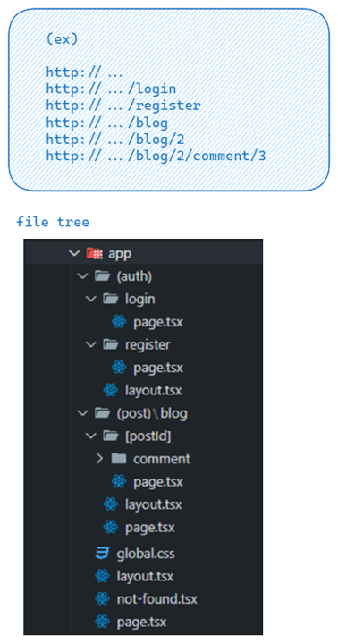
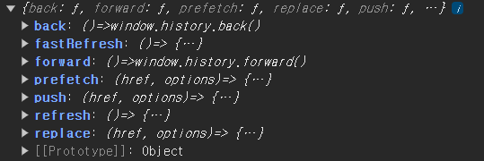
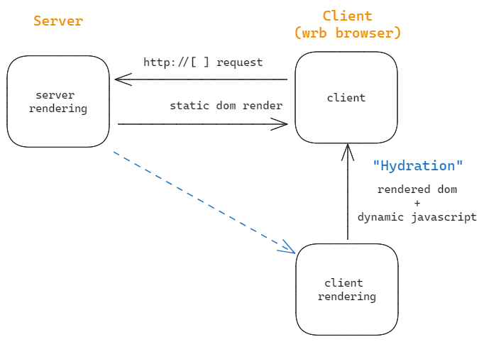
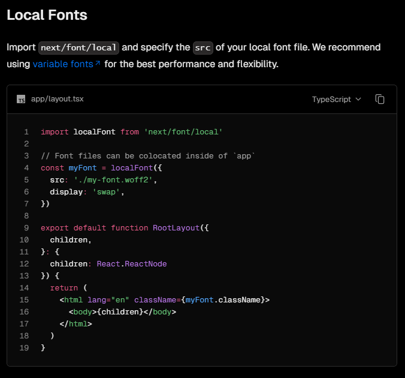

# 2주차

## What I Learned this week

2주차에 배운 내용을 크게 나누자면 아래와 같다.

- React
  - 메모이제이션을 통한 최적화
  - 상태 관리
  - React Router DOM
  - 데이터 통신
- Next.js
  - 앱 라우터
  - 서버 컴포넌트와 클라이언트 컴포넌트
  - 폰트 최적화

### React

**메모이제이션**

- 리액트 컴포넌트는 자신이 관리하는 상태값이 변경될 때만 리렌더링된다. 하지만 상위에서 상태값을 관리하고 props로 전달하여 하위 컴포넌트에서 값을 사용하는 경우 모든 하위 컴포넌트들이 각자에게 실제 변경이 존재하는지와 관계없이 리렌더링되기 때문에 불필요한 리렌더링을 피하기 위해 컴포넌트 트리에서 가지 끝에 가깝게 두고, 리액트에서 제공하는 메모이제이션 훅을 사용하여 최적화를 진행하여 의미없는 리렌더링에 사용되는 자원이 낭비되는 것을 대비할 수 있다.
- 메모이제이션 자체도 메모리에 상태를 저장하고 비교하며 실제 변경되었을 떄만 리렌더링되도록 작업하기 때문에 메모리 자원을 사용하게 된다. 때문에 최적화가 필요한 부분의 우선순위에 따라 필요한 만큼만 최적화한다. 계속 상태값이 변화하는 컴포넌트 역시 메모이제이션을 하는 것 역시 불필요해진다.
- 리액트는 함수, 값, 컴포넌트를 메모이제이션하기 위해 사용하는 훅이 따로 존재한다.
  - `useCallback(callbackFn, deps)` : 최적화된 컴포넌트에 함수를 전달하기 전 함수 정의를 저장. 의존성 배열(deps)에 재참조해야 할 변술르 추가하지 않으면 여러번 호출되어도 재참조하지 않아 한 번만 실행하고 상태값이 최신화되지 않는다.
  - `useMemo(calculateValue, deps)` : 자원 소모가 큰(expensive) 계산의 결과를 저장. 의존성 배열(deps) 내 값에 추가한 값이 변경되기 전까지 값을 메모이제이션 한다. 의존성 배열이 빈 배열일 때 컴포넌트 생성 당시 값을 기억한다.
  - `React.memo(Component)` : 최적화된 컴포넌트를 만들 수 있는 전역 메서드. 컴포넌트를 감싸서 사용. 최초의 컴포넌트 상태를 메모리에 기억하고 상태값이 변경되지 않으면 리렌더링하지 않는다.
- 주로 리스트 아이템을 메모이제이션 하게 되는데, 예를 들어 컴포넌트와 리스트 아이템이서 사용되는 고정된 속성, onClick 핸들링 함수와 같은 속성을 메모이제이션하여 하나의 리스트 아이템이 변동 속성이 변경되었을 때, 변경되지 않은 다른 리스트 아이템의 의미 없는 리렌더링을 막는다.

**상태 관리+**

- `useReducer(reducerFn, initialState)` 훅은 필수적으로 로직을 처리항 리듀서 함수와 초기값을 매개변수로 받아 상태값과 입력받은 리듀서 함수를 사용할 수 있는 디스패치 함수를 반환한다.

  - 디스패치 함수는 리듀서 함수 내에서 사용할 수 있는 하나의 인자가 필요하고, 리듀서 함수는 두 매개변수(`state`와 `action`)로 최신 상태값과 디스패치 함수의 인자를 전달받아야 한다.
  - 리듀서 함수는 컴포넌트의 렌더링과 관계 없이 정의되도록 컴포넌트 바깥 영역에서 정의하고 컴포넌트가 이를 가져와 사용한다.
  - `useReducer`는 상태값을 초기 마운트 이후 상태값을 참조하지 않는다. 때문에 `useReducer`를 이용하여 각 동작이 필요한 컴포넌트에서 관련 작업을 관리할 때보다 값을 업데이트하는 함수를 개별로 메모이제이션할 필요가 없어진다.

  ```ts
  type ReducerFn<S, A> = (state: S, action: A) => S;
  type Dispatcher<A> = React.Dispatch<A>;
  const [state: S, dispatch: Dispatcher] = useReducer<(S, A) => S>(reducerFn, initialState: S);
  ```

- `useState`와 `useReducer` 훅을 이용하여 리액트에서는 기본적으로 상태값 또는 함수를 props로만 전달하여 사용하는데, 이런 방법은 컴포넌트 트리가 커지만 커질수록 Props Drilling이 흔하게 발생한다. Props Drilling이 계속되면 상태값의 관리가 어렵고 개발 경험이 나빠질 수밖에 없는데, 이를 개선하기 위해 `useContext(ProvidedContext)`와 `createContext(defaultValue)`를 이용하여 전역으로 상태 관리하는 방법을 사용한다.

  - `useContext` 훅은 `createContext`로 컴포넌트 바깥에서 생성한 컴텍스트를 `Context.Provider`로 필요한 컴포넌트들 상위에 감싸 그 아래 컴포넌트 어느 곳에서든 사용할 수 있게 한다.
    이렇게 context 값 변경 시 아래 컴포넌트가 모두 리렌더링된다. 이러한 현상을 방지하기 위해 상태값을 관리하는 `Context.Provider`를 분리하여 별도 컴포넌트의 `children`으로 전달하여 사용한다. 이렇게 되면 각각 아래에 있는 컴포넌트가 개별 래핑되는 것과 같이 해석되기 때문에 모든 컴포넌트을 리렌더링하는 것을 방지할 수 있다. _(상태 끌어올리기)_

    ```ts
    const NewContext = createContext(defaultValue: C);

    const Comp = () => {
      const context: C = useContext<C>(NewContext: React.Context<C>);
      return (
        <NewContext.Provider value={context}>
          {/* */}
        </NewContext.Provider>
      )
    }
    ```

- zustand

  - `create(initializeFn)` 메서드를 사용하여 초기값을 가지는 스토어에 접근하는 커스텀 훅을 생성한다. 스토어는 상태값과 액션 함수를 포함한다.

  ```ts
  const useCountStore = create<T>((set) => ({
    count: 0,
    increament: () => {},
    decreament: () => {},
  });
  ```

  - 컴포넌트 내에서 생성했던 훅을 불러와 사용한다. 이 메서드는 콜백함수를 인자로 전달받는데, 이 콜백함수는 초기화 객체를 반환하고 콜백함수 내부에서 사용할 수 있는 설정 함수(set)를 매개변수로 갖는다. 초기화 객체에는 이름과 초기값을 지정하고, 상태값을 변경할 수 있는 액션 함수 내부에서 설정 함수(set)를 사용하여 상태값을 변경한다. 이 설정 함수는 스토어 객체를 인자로 받아 스토어 객체를 반환해야 한다. 이 액션 함수는 동기 함수여야만 하는 등의 제약 없이 함수 내에서 api 호출 등의 로직을 처리할 수 있다.

  ```ts
  const useCount = create<>((set) => ({
    count: 0,
    increament: () => set(state => ({ count: state.count + 1 }),
    decreament: () => set(state => ({ count: state.count - 1 }),
    decreamentBy: (by) => {
      set((state) => ({
        count: state.count + by
      })
    },
  });
  ```

  - 이 훅은 기본적으로 스토어 객체를 반환한다. 혹은 스토어 객체를 인자로 받는 콜백 함수에서 필요한 상태 혹은 함수를 선택하여 반환하여 사용한다. 스토어에 저장된 상태 혹은 함수는 아래처럼 선택자 방식으로 가져와 사용하거나 훅에 아무것도 전달하지 않고 비구조화 할당을 사용하여 가져올 수 있는데, Zustand에서는 선택자를 사용하여 렌더링 최적화를 수동으로 적용시킬 것을 권장하고 있다.

  ```ts
  const Counter = () => {
    const count = useCount(state => state.count);
    const increament = useCount(state => state.increament);
    ...
  }
  ```

**React Router DOM**

- v6.4 이전의 방법

  - “react-router-dom” 패키지에서 제공되는 `<Routes />` 컴포넌트 내부에 라우팅 하고자 하는 경로에 따라 `<Route />` 컴포넌트에 path와 element 속성에 연결하려는 경로와 컴포넌트를 전달한다.
  - 동적 라우팅과 같은 방법으로 하위 페이지를 연결할 때도 마찬가지로 `<Route />` 컴포넌트 아래에 또 다른 `<Route />` 컴포넌트를 넣는다.
  - 이렇게 하위에 추가한 자식 컴포넌트를 부모 라우트 컴포넌트에서 사용하려면 마찬가지로 “react-router-dom” 패키지에서 제공되는 `<Outlet />` 컴포넌트를 사용한다.
  - 이렇게 설정한 라우팅 컴포넌트들을 `<BrowserRouter />`와 같은 “react-router-dom”에서 제공되는 라우터 컴포넌트로 감싸서 사용한다.

    ```ts
    const DefaultLayout = () => {
      return (
        <>
          <Header />
          <Outlet />
          <Footer />
        </>
      )
    }

    function App() {
      return (
        <BrowserRouter>
          <Routes>
            <Route element={<DefaultLayout />}>
              <Route path="/" element={<Home />} />
              <Route path="/login" element={<Login />} />
              <Route path="/register" element={<Register />} />
            </Route>
            <Route element={<BlogLayout />}>
              <Route path="/blog" element={<Blog />} />
              <Route path="/blog/:id" element={<BlogDetail />} />
            </Route>
          </Routes>
        </BrowserRouter>
      )
    }
    ```

- v6.4 부터 도입된 문법

  - “react-router-dom”에서 제공하는 `createBrowserRouter([])`와 같은 메서드에 라우트 객체 배열을 사용하여 라우터를 만들고, 마찬가지로 “react-router-dom”에서 제공하는 `<RouterProvider />` 컴포넌트에 라우터를 전달하여 사용한다.
  - 이 때 라우터를 만들기 위한 라우트 객체 배열은 이전과 마찬가지로 path와 element 속성을 지정하여 라우팅 경로와 컴포넌트를 연결하고 children 속성에 하위 라우트 객체 배열을 추가하여 공통 레이아웃을 적용시키는 등 라우트를 중첩할 수 있다.

  ```ts
  const reouter = createBrowserRouter([
    {
      element: <DefaultLayout />,
      children: [
        {
          path: '/',
          element: <Home />,
        },
        {
          path: '/login',
          element: <Login />,
        },
        {
          path: '/register',
          element: <Register />,
        },
      ],
    },
    {
      element: <BlogLayout />,
      children: [
        {
          path: '/blog',
          element: <Blog />,
        },
        {
          path: '/blog/:id',
          element: <BlogDetail />,
        },
      ],
    },
  ])

  function App() {
    return <BrowserRouter router={router} />
  }
  ```

**데이터 통신**

- 웹 API는 `fetch` 전역함수를 가지고 있어 이를 이용하여 브라우저와 서버 간의 통신이 가능한데, 주소 문자열 하나만을 전달하는 경우 GET 메서드를 사용하여 해당 주소로 요청을 보낸다. 객체 형태의 요청 정보를 전달하거나, 주소 문자열과 정보 객체를 보내 통신 정보를 설정하여 데이터 정보 혹은 수정/추가를 요청할 수 있다.
- `axios` 라이브러리 역시 브라우저와 서버 간의 통신을 위해 사용되지만 `fetch API` 같은 경우 과거 인터넷 익스플로러가 지원하지 않았기 때문에 브라우저 호환성이 더 좋았던 `axios`를 사용했지만 현재는 상황에 맞게 두 방법을 선택하여 사용한다.
  - `axios.create`를 사용하여 axios 인스턴스를 생성한 후 사용자 설정(config object)으로 `baseURL`을 지정하여 필요한 위치에서 해당 인스턴스를 가져와 http 메서드와 같은 이름의 인스턴스 메서드를 통해 api를 호출할 수 있다. 이렇게 `baseURL`을 지정한 인스턴스를 사용한다면 api 호출 시 매번 전체 url을 작성할 필요 없이 호출할 api 경로만 작성하여 필요한 api를 호출할 수 있다.
- `useEffect(effectCallback, deps)` : 빈 종속성 배열을 가진 `useEffect`는 컴포넌트가 최초 렌더링 시에만 콜백함수가 실행된다. 이 콜백함수는 비동기 함수일 수 없고 clean-up 함수를 반환한다. 이 clean-up 함수는 해당 컴포넌트가 사라지기 전에 _(before unmount)_ 실행된다. 의존성 배열에 추가된 변수의 값이 변경되지 않는 이상 `useEffect`의 콜백은 컴포넌트 생애주기에 한 번만 실행된다.

### Next.js

**앱 라우터**

- Next.JS 13부터 앱 라우터(App Router) 방식이 추가되었고 현재는 앱 라우터 방식이 권장되고 있다. 설명은 앱 라우터 방식을 기반으로 정리되었다.


- 앱 라우터 방식의 라우팅은 app 디렉토리 아래의 폴더를 기반으로 `page.tsx`에서 내보내는 default 컴포넌트를 읽어 페이지를 출력한다. 앱 라우터는 폴더를 생성하는 즉시 라우팅에 반영되고, 이 페이지를 구분하는 폴더명은 바로 경로명이 되기 때문에 url에 사용되는 관습대로 kebab-case 형식으로 이름 짓는다. 이때 경로는 기본적으로 `page.tsx`를 필수로 가져 경로가 컴포넌트를 가리키게 되고 그렇지 않으면 Not Found 에러를 보여준다.
- **루트 경로**에는 애플리케이션의 전체적인 구조를 담당하는 `layout.tsx` 파일을 필수적으로 가져야하기 때문에 없는 상태로 빌드한다면 Next.js가 자동으로 생성하여 html head 내부의 메타데이터를 설정할 수 있다.
- 이 `layout.tsx`는 가장 가까운 `layout.tsx`를 찾아 `children`으로 포함되어 화면의 렌더링되어 루트 레이아웃까지 이어지고, 각 라우트 별로 작성하여 중첩할 수 있다. 때문에 루트 경로의 `layout.tsx`에서는 공통 레이아웃을 위해 마크업을 추가해야하는 경우가 거의 없다.
- 메타데이터는 가장 가까운 `layout.tsx`의 exported `metadata` 값이 적용된다. 템플릿을 설정하여 공통 메타데이터를 작성할 수도 있다. 이 `template` 속성만 작성한다면 루트 경로의 해당 메타데이터는 비어있게 되고, `default` 속성으로 기본 값을 설정한다.
- **중첩 라우팅**을 하기 위해서는 경로 폴더 아래에 마찬가지로 원하는 경로명의 폴더 아래 `page.tsx` 파일을 생성하여 화면을 작성한다. 중첩은 같은 레벨에서 여러개 만들 수 있고 이 역시도 경로명의 폴더 아래 `page.tsx` 컴포넌트에서 작성한다.
- **동적 라우팅**을 위해 경로 폴더의 이름을 대괄호`[]`로 감싼 후 세그먼트(segment, dynamic name)을 지정한다. 동적 라우팅 역시 중첩하여 만들 수 있는데, 같은 중첩 경로 내에 같은 세그먼트를 사용할 수 없다.
- **포괄적 경로 (Catch All Segments)** 지정을 위해서는 대괄호 안에 `...`를 앞에 붙여 폴더명을 작성한다. 이렇게 포괄적으로 경로를 지정하면 아래 하위 경로를 일괄적으로 처리한다.
- 경로 앞에 언더바`_`를 추가하여 해당 라우트를 **private route**로 처리할 수 있다. 이 private route는 라우팅을 통해 접근할 수 없게 되고 개발 과정에서 마이그레이션 과정 등에서 활용되게 된다.
- 앱 라우팅에서 하나의 경로는 일반적으로 `page.tsx`를 반드시 갖게 되는데, 이렇게 하위 경로 없이 라우트를 그룹으로 만들기 위해서는 해당 그룹의 이름을 소괄호`()`로 감싸 폴더를 생성하고 그 아래 별도의 `page.tsx` 없이 라우트 폴더와 내부 `page.tsx`만 생성하여 라우팅하도록 한다. 이렇게 설정된 그룹 폴더는 경로에 포함되지 않는다.
- Not-Found 페이지는 루트 경로의 `layout.tsx`와 같은 레벨(최상위 경로)에서 `not-found.tsx` 파일을 만들어 에러 페이지를 표시할 수 있다. Not-Found 페이지는 최상위 경로의 `not-found.tsx` 컴포넌트만으로 연결되기 때문에 특정 경로 아래의 not-found 화면을 보여주기 위해서는 포괄적 경로를 통해 별도의 존재하지 않는 경로 외에 특정 Not-Found 페이지를 보여줄 수도 있다.



- 컴포넌트에서 쿼리 스트링을 받아 사용하기 위해서는 (1) 클라이언트 컴포넌트에서 `useSearchParams` 훅을 사용하거나, (2) 컴포넌트 인자로 받는 `{ params, searchParams }` 안의 `searchParams`에서 선택자로 선택하여 값을 사용한다. 동적 라우트의 세그먼트 역시 인자로 받는 `params`를 받아 세그먼트명을 키(key)로 접근한다.
- `usePathname` 훅은 클라이언트 컴포넌트에서 사용하여 현재 위치를 알 수도 있는데, 이 위치를 통해 네비게이션 리스트에서 현재 위치를 표시 하는 등, 페이지에 까라 서로 다른 스타일을 적용할 수도 있다.
- 해당 애플리케이션 내 라우팅을 위해 "next/link" 패키지에서 제공하는 `<Link href="/" />` 컴포넌트를 사용하여 페이지 라우팅을 이동한다. React Router와 다르게 `href` 속성에 이동하고자 하는 경로를 입력하여 사용한다.
- 혹은 "next/navigation" 패키지가 제공하는 `useRouter` 훅을 사용하여 프로그래밍 방식으로 이동할 수 있다.

  - `push` 메서드는 사용자의 기록에 남지만 `replace`는 결제 이후 결제 페이지처럼 기록을 남기지 않고 이동하게 한다.
  - `back`/`forward`는 현재 페이지를 기준으로 이전 히스토리/다음 히스토리로 이동하게 한다.
  - `prefetch`는 로딩이 많이 걸릴 것으로 예상되는 페이지의 로딩 시간을 조금 더 줄이기 위해 프로덕션 상태에서 사용된다.
  - `refresh`는 현재 페이지를 다시 로드한다.
  - 세션 만료된 사용자와 같은 경우에는 클라이언트 사이드가 아닌, “next/navigation”에서 제공하는 `redirect` 함수를 사용하여 서버 렌더링된 결과도 접근하지 않고 이동할 수 있도록 한다.

  

**서버 컴포넌트와 클라이언트 컴포넌트**

- Next.js에서는 SSR 방식이 기본으로 동작하고 컴파일되기 때문에 기본적으로 작성하는 컴포넌트는 서버 컴포넌트이고, `.tsx` 파일 상단에 `"use client"`를 추가하여 클라이언트 컴포넌트임을 명시하고 사용한다.
  - 서버 컴포넌트 : 서버에서 미리 컴파일하여 브라우저에 전당, 전달받은 문서를 화면에 출력
  - 클라이언트 컴포넌트 : 코드가 브라우저에서 실행되어 동적으로 인터렉션 관련 자바스크립트를 DOM에 연결
- 서버 렌더링과 클라이언트 렌더링 두 번의 렌더링을 진행되어 자바스크립트가 필요하지 않은 문서를 _(뼈대를)_ 만들어 브라우저(클라이언트)에게 전달하고 클라이언트는 전달받은 문서를 1차적으로 화면에 출력하고 이후 자바스크립트가 필요한 부분을 클라이언트 렌더링, DOM 이벤트 등록을 수행하여 다시 전달 받은 클라이언트 렌더링 결과를 더하여 화면을 출력한다. _(Hydration)_



- 클라이언트 상호작용을 위한 코드는 클라이언트 컴포넌트에서만 사용할 수 있다. 때문에 React 또는 Next.js에서 제공하는 `useState`와 같은 인터랙션으로 상태값이 변경되는 인터랙션 훅 사용과 `on*`과 같은 이벤트 등록을 통한 상호작용 코드는 클라이언트 컴포넌트에서만 사용할 수 있다.
  - 서버 컴포넌트와 클라이언트를 구분하지만, 클라이언트 수행이 필요한 부분만 클라이언트에서 처리하고 서버 컴포넌트는 서버에서만 혹은 클라이언트 컴포넌트 전체를 클라이언트에서만 렌더링을 수행하는 것이 아니다.
  - 서버 렌더링으로 클라이언트 컴포넌트 전체를 서버 렌더링의 대상으로 하지 않는다면 클라이언트 컴포넌트로 작성되는 부분은 클라이언트 렌더링이 끝날 때까지 화면에 보이지 않을 것이다.

**폰트 최적화**

- Next.js는 자체적으로 폰트를 최적화하는 방법을 제공한다.
- 구글 폰트를 사용할 때, 구글 폰트 공식 페이지에서 제공하는 embeded 방법에 따라 import하여 사용하는 경우, 높은 확률로 FOUT _(Flash of Unstyled Text)_ 현상이 발생한다. 이를 방지하기 위해 "next/font/google" 패키지에서 제공하는 최적화된 폰트를 가져와 적용시킬 수 있다. 이렇게 하면 서버 렌더링 시 최적화된 폰트를 적용시켜 캐시에 영향받지 않고 화면을 출력한다.
  - _로컬 폰트 사용 시 Next.js 공식 문서에서 아래와 같이 방법을 제공한다._

<figure>
  
  <figcaption><a href="https://nextjs.org/docs/app/building-your-application/optimizing/fonts#local-fonts">https://nextjs.org/docs/app/building-your-application/optimizing/fonts#local-fonts</a></figcaption>
</figure>

---

본 후기는 본 후기는 [유데미x스나이퍼팩토리] 프로젝트 캠프 : Next.js 1기 과정(B-log) 리뷰로 작성 되었습니다.

#유데미 #udemy #웅진씽크빅 #스나이퍼팩토리 #인사이드아웃 #미래내일일경험 #프로젝트캠프 #부트캠프 #Next.js #프론트엔드개발자양성과정 #개발자교육과정
