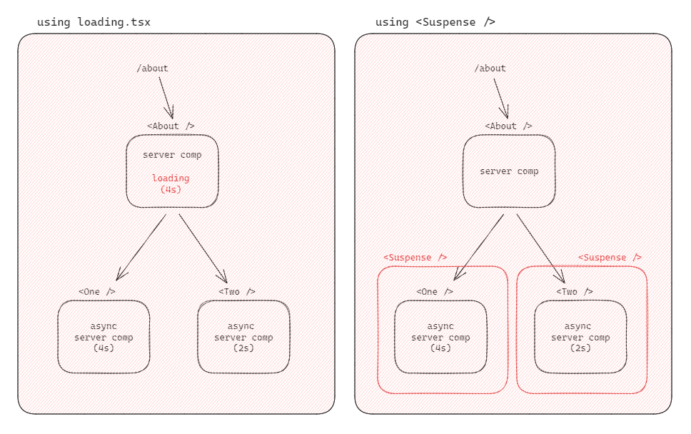
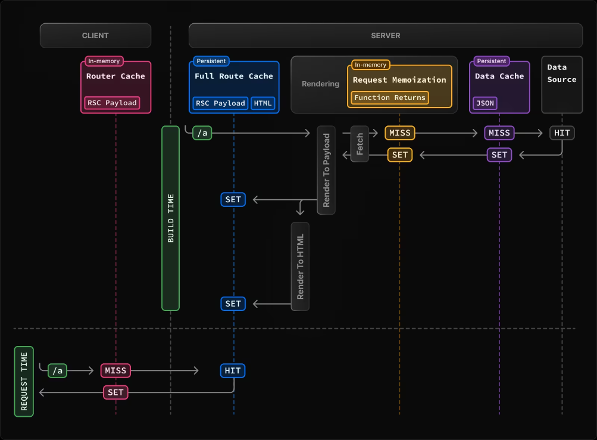
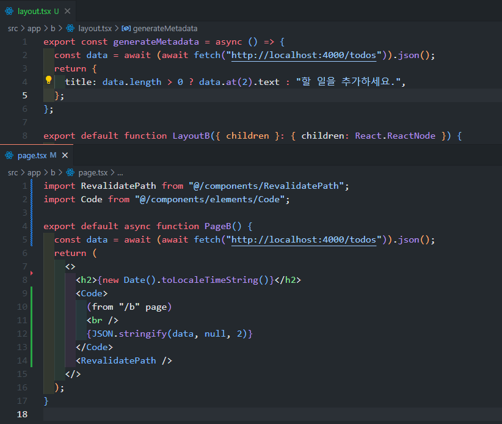
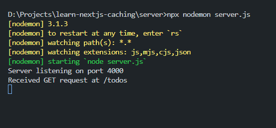
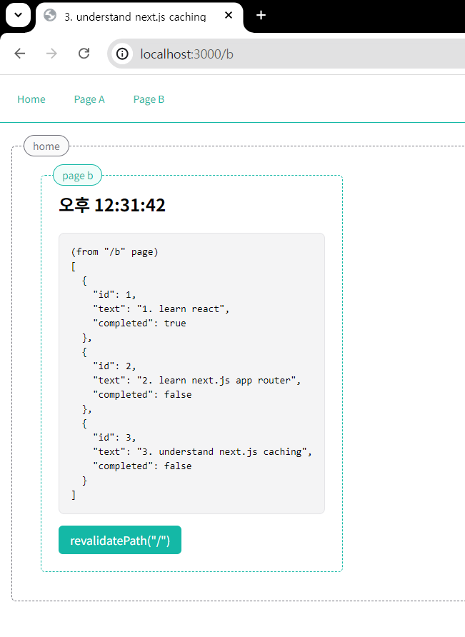
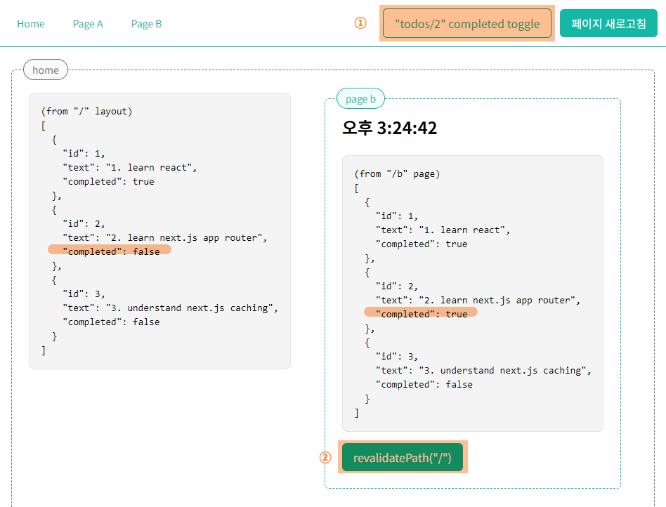
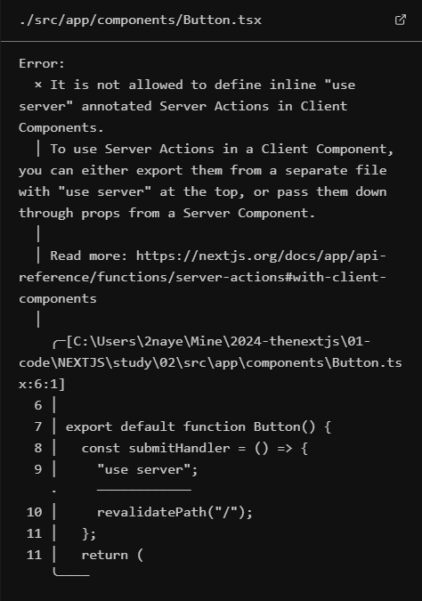
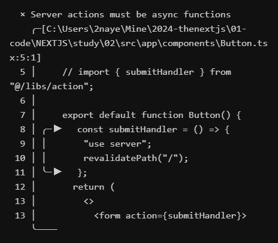

# 3주차

## What I Learned this week

- 앱 라우터
  - 시스템 파일
  - 라우트 핸들러
- 데이터 패칭
- 캐싱
- MongoDB 연결
  - CRUD
  - Auth

### 시스템 파일

- `layout.tsx` 파일에서 메타데이터를 동적으로 런타임 정보를 사용하여 정의하는 경우, 메타데이터 객체를 반환하는 `generateMetadata` 함수를 내보내기 한다. 이 `generateMetadata`는 비동기 함수일 수도 있기 때문에 페이지 로딩 시 현재 페이지의 상품 정보를 title 속성에 적용하는 등의 fetched data를 이용하여 메타데이터를 설정하는 것이 가능하다. 또는 페이지 컴포넌트와 동일하게 `{ params }`를 props로 받아와 이 params를 이용하여 동적 세그먼트에 따라 메타데이터를 동적으로 설정할 수 있다.
  - 이 `generateMetadata`는 static `metadata`와 마찬가지로 서버 컴포넌트에서만 지원한다.
- 세그먼트들은 각각 **로딩 컴포넌트**와 **에러 컴포넌트**를 가질 수 있다. 페이지는 자신의 라우트 경로와 가장 인접한 `loading.tsx`와 `error.tsx`를 보여준다.
  - 페이지 컴포넌트의 로딩이 오래 걸리는 경우 서버 컴폰너트는 화면은 아무 반응이 없는 상태에서 화면을 볼 수 없고, 이때 로딩 컴포넌트를 추가하여 로딩되는 시간 동안 이 로딩 컴포넌트를 화면에 보여준다. 이 페이지에 각자 다른 렌더링 시간을 가진 하위 컴포넌트가 있을 때, 이 하위 컴포넌트들의 렌더링은 병렬 처리되기 때문에 가장 오래 걸리는 하위 컴포넌트의 로딩 시간만큼 `loading.tsx`가 보여지게 된다. _[(= 스트리밍: 문서#what-is-streaming)](https://nextjs.org/docs/app/building-your-application/routing/loading-ui-and-streaming#what-is-streaming)_
  - 이 로딩 컴포넌트로 전체 화면에 대한 로딩을 표시할 수도 있지만 react의 `<Suspense fallback={}></Suspense>`를 사용하여 이 suspense 컴포넌트로 감싼 각각의 비동기 컴포넌트에 대한 멀티 로딩 처리를 보여줄 수 있다. `fallback` 속성에 로딩 처리 중 보여줄 요소(예: 스켈레톤)를 전달한다.
    
  - 에러 컴포넌트는 `"use client"`를 사용해야 하는 유저 컴포넌트(클라이언트 컴포넌트)이며 `{ error: object, reset: () => void }` 객체를 props로 받아와 사용할 수 있어 `props.error.message`로 에러 메세지에 접근하여 화면에 출력할 수 있다. reset 함수를 실행시키면 이전에 실행했던 컴포넌트를 다시 시도하는데, 정상적으로 다시 시도하여 컴포넌트를 렌더링 하기 위해선 이전에 실행했던 컴포넌트 역시 클라이언트 컴포넌트여야 한다.

### 데이터 패칭

- 클라이언트 컴포넌트(React)에서 데이터를 불러올 때,
  - `useEffect`에서 데이터 패칭 함수를 실행하는 중에 loading state를 추가하여 로딩 중엔 데이터 로딩 중임을 알려주고 데이터 패칭이 완료된 후에야 데이터를 사용할 수 있었지만,
- 서버 컴포넌트에서는,

  - 컴포넌트 함수가 비동기일 수 있기 때문에 async fucntion 컴포넌트 내부에 데이터 패칭 함수를 실행하여 결과을 가져와 사용한다. 이 작업은 서버 사이드에서 수행하고 완료된 화면을 브라우저로 전달해 렌더링 하기 때문에 사용자와의 상호작용에 따라 계속 변화하는 화면이 아니라면 서버 컴포넌트에서 데이터를 가져와 완성된 화면을 별도의 로딩 시간 없이 사용한다.

    ```tsx
    // (예시)
    // In Client Component,
    'use client'
    import { useEffect, useState } from 'react'

    type TPost = {
      userId: number
      id: number
      title: string
      body: string
    }
    export default function ClientComp() {
      const [isLoading, setLoading] = useState(true)
      const [posts, setPosts] = useState<TPost[]>([])
      const getPosts = async () => {
        setLoading(true)
        try {
          const res = await fetch('https://jsonplaceholder.typicode.com/posts')
          const data = await res.json()
          setPosts(data)
        } catch (error) {
          console.error(error)
        }
        setLoading(false)
      }
      useEffect(() => {
        getPosts()
      }, [])

      return (
        <>
          <h1 className="text-xl font-bold">Client Component</h1>
          {isLoading ? (
            'Loading...'
          ) : (
            <pre>{JSON.stringify(posts, null, 2)}</pre>
          )}
        </>
      )
    }

    // In Server Component,
    const getPosts = async () =>
      await (await fetch('https://jsonplaceholder.typicode.com/posts')).json()

    export default async function ServerComp() {
      const posts = await getPosts()
      return (
        <>
          <h1 className="text-xl font-bold">Server Component</h1>
          <pre>{JSON.stringify(posts, null, 2)}</pre>
        </>
      )
    }
    ```

**라우트 핸들러 방식 (Route Handler)**

- 앱 라우팅 방식에서 `app/` 아래에 api 디렉토리를 만들고 `route.ts` 파일을 추가하여 기본적인 api 호출을 대체할 수 있다. 아래와 같이 GET, POST, PUT, PATCH, DELETE 메서드를 내보내면 `api/` 경로로 api를 호출하여 사용할 수 있다.
- 페이지들의 라우팅 방식 그대로 추가 경로 폴더를 생성하고 `route.ts`에서 메서드 함수를 내보내 해당 경로로 api를 호출한다. 예를 들어 `app/api/movies/route.ts`에서 작성한 GET 호출 함수를 컴포넌트에서 `/api/movies`를 통해 데이터 패칭할 수 있다.

```ts
// app/api/route.ts
import { NextRequest } from 'next/server'

export async function GET(request: NextRequest) {
  // 쿼리 스트링에 접근
  // (1) request: Request
  // const { searchParams } = new URL(request.url);
  // (2) request: NextRequest
  const searchParams = request.nextUrl.searchParams
  return Response.json('GET METHOD : ' + searchParams.get('lang'))
}
export async function POST(request: Request) {
  // body data 사용
  const data = await request.json()
  return Response.json(data)
}
export async function PUT(request: Request) {
  return Response.json('PUT METHOD')
}
export async function PATCH(request: Request) {
  return Response.json('PATCH METHOD')
}
export async function DELETE(request: Request) {
  return Response.json('DELETE METHOD')
}
```

### 캐싱

- 🖇️
  - [DOCS - Next.js Caching](https://nextjs.org/docs/app/building-your-application/caching)
  - [예시 코드 (repo): learn-nextjs-caching](https://github.com/callmebyneon/learn-nextjs-caching)

Next.js에서는 아래 그림과 같이 페이지 렌더링과 데이터 패칭 요청을 캐싱 하여 최적화하여 사용한다.



Next.js를 이용하여 만든 페이지에 `new Date().toLocaleTimeString()`과 같은 데이터를 출력했을 때, 페이지를 새로고침하지 않고 다른 라우트로 이동하더라도 기본적으로 처음 화면에 보여준 데이터가 유지되는 것을 확인할 수 있다.

1. 사용자가 특정 정적 세그먼트에 접근했을 때, 페이지를 서버 사이드에서 파싱한 결과(html 문서)를 캐싱하여 보여주기 때문에 사용자가 다른 경로로 이동했다가 다시 돌아와도 처음 캐시에 저장해뒀던 페이지를 화면에 보여준다. (동적 라우트는 캐시되지 않는다.)  
   이때 브라우저(클라이언트 사이드)는 [라우터 캐시, Router Cache]에서 1️⃣캐싱 된 데이터를 찾아 반환하고, 2️⃣캐싱 된 데이터가 없는 경우 서버 사이드의 [전체 라우터 캐시, Full Router Cache]에서 캐싱 된 데이터를 찾는다.


2. [라우터 캐시]는 브라우저가 새로고침되면 초기화되기 때문에 페이지가 새로고침되었을 때, [라우터 캐시]가 초기화된 상태에서 [전체 라우터 캐시]에 저장되어 있는 세그먼트를 가져온다. [전체 라우터 캐시]에 저장된 개별 세그먼트의 캐시는 특정 시간이 지나면 자동으로 무효화되는데, 예를 들어 정적 세그먼트는 5분이 지나면 자동으로 무효화되어 업데이트되고, 동적 세그먼트는 30초마다 무효화되어 갱신된다.

3. 만일 같은 경로에 대한 GET 메서드 요청에 대해 [요청 메모이제이션, Request Memoization]을 통해 응답을 기억하고 이미 기억하고 있는 응답은 서버에 요청을 전달하지 않고 캐싱 된 데이터를 반환한다. 이 요청 메모이제이션은 Next.js에서 추가된 기능이 아니라 React 기능이기 때문에 리액트 컴포넌트 트리인 page.tsx와 layout.tsx 등 서버 컴포넌트에서의 fetch 요청에 적용된다. 라우트 핸들러는 리액트 컴포넌트 트리의 일부가 아니기 때문에 라우트 핸들러에서의 fetch 요청에는 적용되지 않는다.


이러한 메커니즘으로 RootLayout의 generateMetadat와 루트 페이지에서 같은 경로로 GET api 요청을 하는 경우 [요청 메모이제이션]되어 실제 서버는 한 번의 요청만이 기록되는 것을 확인할 수 있다.

<figure>
  
  <figcaption>layout.tsx와 page.tsx에서 같은 경로의 GET api를 요청하고 있는 코드</figcaption>
</figure>

<figure>
  
  <figcaption>server.js에서 한 번만 실행된 걸 확인할 수 있는 GET 요청에 대한 콘솔 로그</figcaption>
</figure>

<figure>
  
  <figcaption>제대로 적용된 title 메타데이터와 페이지에서 출력된 데이터</figcaption>
</figure>

4. Next.js 앱이 빌드 되어 각 세그먼트에 대한 파싱 된 html는 기본적으로 [데이터 캐시, Data Cache]에 영구적으로 저장되는 데이터로, 때문에 실시간으로 값을 업데이트하여 화면을 갱신하기 위해서는 이를 무력화시켜야 한다. [데이터 캐시]를 무력화하기 위해서 목적에 따라 네 가지 방법 중 선택하여 사용한다.

ⅰ. 첫 번째로, fetch API를 사용할 때 첫 번째 url 값 다음 두 번째 인자로 `{ cache: 옵션 }`을 전달하여 무력화하고 `"no-store"` 옵션을 전달하면 해당 요청에 대한 캐시를 언제나 회피할 수 있다. _[MDN 문서 (fetch#cache)](https://developer.mozilla.org/ko/docs/Web/API/fetch#cache)_


ⅱ. 두 번째는 마찬가지로 fetch API를 사용할 때 두 번째 인자로 `{ next: { revalidate: 재검증_시간 } }`을 전달하여 몇 초마다 요청에 대한 응답을 재검증할 것인지 설정한다. `revalidate`를 사용하여 캐시를 무력화하는 방법은 설정한 시간이 지나고 새로운 요청이 발생하면 재검증을 하는 한 번의 요청에 대해 캐시 되어 있던 데이터를 반환하고 다시 새로운 데이터를 캐시에 저장하여 다음 요청에서 다시 캐시 된 데이터를 반환한다. 이 방법은 이벤트를 기반으로 데이터를 재검증하는 방식보다 자주 변경되지 않는, 최신성이 중요하지 않는 데이터에 유용하게 사용할 수 있다.


ⅲ. "next/cache" 패키지에서 제공하는 `revalidatePath(경로)` 함수를 사용하여 무력화가 필요한 URL을 직접 지정하여 [데이터 캐시]를 재검증하여 최신 상태의 데이터를 가져온다. 이 함수의 경우 지정한 경로에서 발생하는 요청 결과에 대해 모두 무력화한다.

RootLayout에서 캐싱 된 데이터는 요청 메모이제이션으로 인해 "/a", "/b"로 이동하더라도 같은 API 경로로 데이터를 요청하기 때문에 서버에 GET 요청이 한 번만 전달된 것을 터미널에서 확인할 수 있는데, 때문에 RootLayout과 page b에서 사용하는 fetch API가 같을 때, page b에서 `revalidatePath`를 이용하여 루트 경로의 데이터 캐시 재검증을 요청하면 page b의 json도 함께 변하는 것을 확인할 수 있다.


하지만 page b에서 fetch API 사용 시 `next.revalidate` 옵션을 추가했을 때에는 RootLayout의 json만 업데이트되는 것을 볼 수 있는데, 사실 RootLayout의 json 역시 새로고침을 하면 다시 되돌아가게 되고 Home에서 새로고침하여 [라우트 캐시]를 초기화해야만 page b에서도 갱신된 데이터를 표시한다. 이런 현상을 방지하기 위해 `revalidatePath("/", "layout")`과 같이 두 번째 type에 선택적으로 재검증할 경로 유형을 명시할 수 있다. 경로에 동적 세그먼트가 포함된 경우 두 번째 인자로 "layout" 값을 전달하여 재검증을 통해 실시간으로 데이터 출력을 갱신한다. [(예시)](https://nextjs.org/docs/app/api-reference/functions/revalidatePath#examples)

ⅳ. fetch API의 두 번째 인자로 `{ next: { tags: [...태그(들)] } }`을 전달하고 마찬가지로 "next/cache" 패키지에서 제공하는 `revalidateTags(태그)` 함수를 사용하여 원하는 태그를 가진 요청에 대한 데이터 캐시를 무력화할 수 있다.


`next.tags` 옵션은 배열 형태로 두 개 이상의 태그를 지정할 수 있지만 `revalidateTag` 함수는 string type의 하나의 매개 변수만을 받는다.

```ts
revalidateTag(tag: string): void;
```

아래 이미지와 같이 데이터를 갱신하고 revalidateTag를 이용하여 무력화한 경우 RootLayout에서 사용하고 있는 데이터와 같은 API의 결과를 가지고 오지만 page a에서의 데이터만 갱신되는 것을 확인할 수 있다.



> `revalidateTag`와 `revalidatePath`는 모두 서버 액션으로, 정적으로 생성되는 스토어가 필요하기 때문에 `“use server”` 키워드가 필요하다. 때문에 두 함수를 button을 클릭했을 때 핸들러 함수 내에서 실행하려고 하면 `“use server”` 선언이 클라이언트 컴포넌트 내에서 사용될 수 없는 특성으로 인해 src/libs/action.ts 파일에서 내부에 `“use server”` 선언을 한 후 액션 함수를 정의 후 내보내기 하여 `<form action={액션함수}></form>`에 해당 함수를 사용하는 방법을 쓴다. 이때 서버 액션은 비동기 함수여야 한다.





```tsx
//(예시)
// app/**/page.tsx
export default function page() {
  return (
    <form action={onDemandRevalidate}>
      <button>click</button>
    </form>
  )
}

// libs/action.ts
export async function onDemandRevalidate() {
  revalidatePath('/')
  // OR
  //revalidateTag('realtime')
}
```

### MongoDB 연결 (w/ mongoose)

**스키마 CRUD**

- 먼저, `mongoose.connect`를 이용하여 MongoDB에 연결하기 위한 함수를 작성한다. 이미 연결된 경우 또다시 연결하지 않도록 `mongoose.connection.readyState` 값을 확인하여 return 한다.

```ts
// @/libs/db.ts
import mongoose from 'mongoose'
const connectDB = async () => {
  try {
    if (mongoose.connection.readyState >= 1) {
      console.log('Already conencted to MongoDB')
      return
    }
    await mongoose.connect(process.env.MONGODB_URL as string)
    console.log('MongoDB connected')
  } catch (e) {
    // error handling
    process.exit(1)
  }
}
export default connectDB
```

- 스키마를 생성하여 내보낸다. 이미 생성된 스키마가 다시 생성되지 않도록 `mongoose.models`에서 해당 스키마를 찾아 사용하거나 없는 경우에만 `mongoose.model(이름, 스키마)`로 생성한 스키마를 사용할 수 있도록 한다.

```ts
// @/libs/schema.ts
import mongoose from 'mongoose'
const option = {}
const userSchema = new mongoose.Schema(
  {
    name: {
      type: String,
      required: true,
    },
    email: {
      type: String,
      required: true,
      match: /.+\@.+\..+/,
    },
    role: {
      type: String,
      enum: ['admin', 'user'],
    },
  },
  option,
)
export const User = mongoose.models?.User || mongoose.model('User', userSchema)
```

- 이렇게 생성한 스키마의 쿼리 메서드를 이용하여 데이터를 가져오거나 수정하는 등 CRUD 기능을 구현할 수 있다. [(참고)](https://mongoosejs.com/docs/api/query.html)

```ts
// Create
await new User({
  name,
  email,
  role: 'user',
}).save()

// Read
await User.find()
await User.findOne({ email }).select('+password +role')

// Update
await User.findByIdAndUpdate(id)

// Delete
await User.findByIdAndDelete(id)
```

**사용자 인증**

- _(참고) Authentication verifies your identity. Authorization determines what you can access._

  - 인증(Authentication; 인증, 입증; ≒verification)은 사용자의 신원을 확인하고,
  - 인증 이후 인가(Authorization; 허가, 인가; ≒permission) 된 범위에 따라 접근할 수 있는 항목을 결정한다.

- 🖇️

  - [Installation of Auth.js(NextAuth.js v5)](https://authjs.dev/getting-started/installation)
  - [예시 코드 (repo): next-auth](https://github.com/callmebyneon/next-auth)

- Next.js 공식 홈페이지에서 [NextAuth.js](https://authjs.dev/reference/nextjs)를 사용하여 애플리케이션에 인증을 추가하는 방법을 소개하고 있다.

📜 [nextjs - adding authentication using NextAuth.js](https://nextjs.org/learn/dashboard-app/adding-authentication#nextauthjs)

- (설정)

1. `next-auth@beta` 패키지를 설치하고 `npx auth secret` 혹은 openssl 명령어를 이용하여 애플리케이션에 대한 비밀 키를 생성한다. 생성된 키를 `.env` 파일에 추가한다. _[(openssl 윈도우 설치 참고)](https://blog.kesuskim.com/archives/install-openssl-by-os/)_
2. `src` 루트 위치에 `auth.ts`을 추가하고 `app/api/auth/[...nextauth]/route.ts` 라우트 핸들러를 만들어 NextAuth.js의 라우트 핸들러를 앱 라우터에서 사용할 수 있도록 만든다.
3. 호출될 때마다 세션 만료를 업데이트하기 위해서는 `src` 루트 경로에 미들웨어 파일을 추가한다.

```ts
// @/auth.ts
import NextAuth from 'next-auth'

export const { handlers, signIn, signOut, auth } = NextAuth({
  providers: [...],
  callbacks: {...},
})

//@/app/api/auth/[...nextauth]/route.ts
import { handlers } from '@/auth'
export const { GET, POST } = handlers

// @/middleware.ts
import { auth as middleware } from '@/auth';
```

- 회원가입

1. **회원가입**을 위해서 1️⃣우선 있는 회원인지 조회하고, 2️⃣없는 회원이면 DB에 저장 후 완료 페이지 혹은 로그인 페이지로 이동시킨다.

```ts
// @/libs/action.ts
'use server'
import { redirect } from 'next/navigation'
import connectDB from './db'
import { User } from './schema'
import { hash } from 'bcryptjs'

export async function register(formData: FormData) {
  const name = formData.get('name')
  const email = formData.get('email')
  const password = formData.get('password')

  if (name === '' || email === '' || password === '') {
    // 예외처리
    return
  }

  connectDB()

  // 있는 회원인지 조회
  const existingUser = await User.findOne({ email })
  if (existingUser) {
    // 예외처리
  }

  // 없는 회원인 경우 DB에 저장
  const hashedPassword = await hash(String(password), 10) // bcryptjs hash 함수를 사용하여 비밀번호 해시값 저장
  const newUser = new User({
    name,
    email,
    password: hashedPassword,
  })
  await newUser.save()

  redirect('/login')
}
```

- 로그인 세션

1. **NextAuthConfig**: 로그인 credentials 프로바이더와 signIn 콜백 함수를 설정한다.

```ts
// @/auth.ts
export const { handlers, signIn, signOut, auth }: Partial<NextAuthResult> = NextAuth({
  providers: [
    Credentials({
      name: "Credentials",
      credentials: {
        email: { label: "Email" },
        password: { label: "Password", type: "password" },
      },
      async authorize(credentials) {
        const { email, password } = credentials;
        ...
        connectDB();

        // 유효한 사용자 정보 탐색
        const user = await User.findOne({ email }).select("+password +role");

        if (!user) {
          throw new CredentialSignin("존재하지 않는 회원입니다.")
        }

        // 사용자가 입력한 비밀번호와 DB hash 값이 일치하는지 확인
        const isMatched = await compare(String(password), user.password);
        if (!isMatched) {
          throw new CredentialsSignin("비밀번호가 일치하지 않습니다.")
        }

        // 유효한 사용자 정보 반환
        return {
          name: user.name,
          email: user.email,
          role: user.role,
          id: user._id,
        }
      }
    })
  ],
  callbacks: {
    signIn: async ({ user, account }) => {
      // 로직+
      // credential 통과
      return true;
    },
  }
})
```

2. **로그인 액션**을 작성하고 로그인 form action에 사용한다. sns 로그인의 경우도 마찬가지로 NextAuth 설정에서 providers에 추가하고 추가한 provider를 사용하는 signIn을 이용하여 액션을 추가해 사용한다. _[(예: Github Provider)](https://authjs.dev/getting-started/providers/github)_

```ts
// @/libs/action.ts
import { signIn } from '@/auth'
export async function login(formData: FormData) {
  const email = formData.get('email')
  const password = formData.get('password')

  if (email === '' || password === '') {
    return
  }

  try {
    // authorize로 email, password를 전달
    await signIn('credentials', {
      redirect: false,
      callbackUrl: '/',
      email,
      password,
    })
  } catch (e) {
    // 오류 처리
  }

  redirect('/')
}
```

```tsx
// @/components/LoginForm.tsx
import { githubLogin, login } from '@/libs/action'
import Link from 'next/link'

export default function LoginForm() {
  return (
    <>
      <form
        action={login}
        className="flex flex-col gap-2 justify-start w-80 mt-4"
      >
        <input type="email" name="email" placeholder="YourEmail@example.com" />
        <input
          type="password"
          name="password"
          placeholder="Enter Your Password"
        />
        <button>Log In</button>
      </form>
      ...
    </>
  )
}
```

3. **세션 값 확장 설정**: `@/auth.ts`에서 NextAuth에서 내보냈던 `auth`를 사용하여 세션을 가져오는 비동기 함수를 작성하고 필요한 위치에서 사용한다.

```ts
// @/libs/getSession.ts
import { auth } from '@/auth'

export const getSession = async () => {
  const session = await auth()
  return session
}
```

NextAuth config 객체 콜백에서 사용자 유형(role)을 세션에 저장하여 admin role 사용자만 dashboard에 접근하도록 지정할 수도 있다.

_[(참고) Auth.js/guides - Extending the session](https://authjs.dev/guides/extending-the-session)_

```ts
// @/auth.ts
export const { ..., auth } = NextAuth({
  ...
  callbacks: {
    signIn: async ({ user, account }) => {...},
    jwt: async ({ token, user }) => {
      if (user) {
        token.role = user.role; // JWT 토큰에 사용자 권한 추가
        token.id = user.id; // JWT 토큰에 사용자 ID 추가
      }
      return token;
    },
    session: async ({ session, token }) => {
      if (token?.role) {
        session.user.role = token.role;
        session.user.id = token.id;
      }
      return session;
    },
  }
})
```

_[(참고) Auth.js/guides - Using the role](https://authjs.dev/guides/extending-the-session)_

```tsx
// @/(admin)/layout.tsx
import { getSession } from '@/libs/getSession'
import { redirect } from 'next/navigation'

export default async function AdminLayout({
  children,
}: {
  children: React.ReactNode
}) {
  const session: Session | null = await getSession()
  if (!session) redirect('/login')
  else if (session.user?.role !== 'admin') redirect('/dashboard')
  return <>{children}</>
}
```

4. `@/auth.ts`에서 NextAuth에서 내보냈던 `signOut`을 사용하여 로그아웃 액션을 작성하여 로그아웃 버튼을 클릭하면 세션을 삭제하도록 한다.

```ts
// @/libs/action.ts
...
import { signIn, signOut } from '@/auth'

export async function logout() {
  await signOut({
    redirectTo: '/login',
  })
}
...
```

```tsx
export default async function RootLayout() {
  return (
    ...
    <form action={logout}>
      <button className="px-4">Log out</button>
    </form>
    ...
  )
}
```

> 회원 탈퇴 같은 경우 `User.findByIdAndDelete`를 사용하여 데이터를 삭제할 수 있다. 하지만 개인정보보호 차원에서는 탈퇴한 사용자의 모든 정보가 DB에서 삭제되어야 한다고 볼 수 있는 반면, 탈퇴한 회원의 정보 역시 바로 테이블에서 삭제하는 것이 아니라 설계에 따라 각 회원들이 설정한 회원 정보 보관 정책 기간 동안 비활성화가 필요하거나 일정 기간 관리자의 실수로 인해 데이터 백업이 필요한 경우 등에 따라 일부 데이터 백업 로직이 필요할 수 있다.

---

본 후기는 본 후기는 [유데미x스나이퍼팩토리] 프로젝트 캠프 : Next.js 1기 과정(B-log) 리뷰로 작성 되었습니다.

#유데미 #udemy #웅진씽크빅 #스나이퍼팩토리 #인사이드아웃 #미래내일일경험 #프로젝트캠프 #부트캠프 #Next.js #프론트엔드개발자양성과정 #개발자교육과정
