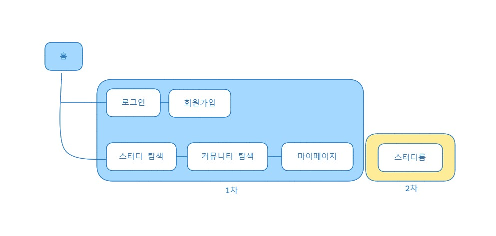
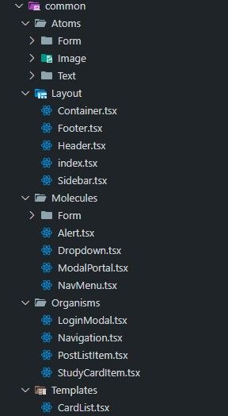

# 5주차

**이번 주 to-do**

- [x] 앞으로의 개발 범위 정하기
- [x] 역할 분담
- [x] 마일스톤 점검
- [x] 공통 컴포넌트 구분하기(아토믹 디자인) & 라우트 정리
- [ ] ~~기능 정의~~
  - (유저 플로우 작성 내용에서 정리±, 부족한 부분 개발하며 추가 진행)
- [ ] 페이지 마크업+스타일 작성 1차 (\~)

## What we did

### 개발 범위 정하기

지난주에 작성한 글을 봐도 팀원들과 어떻게 해야 하는지 논의가 필요한 부분이 여전히 많이 보여 팀원 모두가 고민이었다. 이 기획안 대로만 개발해야 할지 아니면 기획안에서 추가로 시간을 들여서 기획안을 재정비를 해야 할지 우왕좌왕하는 느낌이 많이 들었다.

하지만 기획안 내에서 개발 범위를 나누기로 했다. 결정적으로 기획안에서 명확히 할 수 없이 애매모호한 부분은 제외하고 모든 기능을 개발하기보다 세 명의 팀원이 기간 내에 할 수 있는 범위 안에서 개발하는 것이 상황에 맞을 것이란 멘토님의 말을 듣게 되었다. 그래서 팀원들과 한 번 더 논의 후 1차적으로 코어 기능인 회원가입/로그인 기능부터 GNB 메뉴로 이동할 수 있는 페이지, 마이페이지 안의 CRUD 개발을 진행한 후 그 외 불명확한 페이지나 반복되는 기능들은 1차 개발 범위의 진행도를 확인 후 2차로 개발을 진행하기로 정리되었다.



### 개발 마일스톤 점검

개발 범위를 설정했으니 팀원들과 아래와 같이 앞으로의 마일스톤을 점검했다.

- 2주 차 (이번주): 디자인 시스템 설계, 라우트 및 공통 컴포넌트 정리
- 3주 차: 공통 컴포넌트 개발, 페이지 마크업&스타일링, merge 충돌 해결 및 리팩토링
- 4주 차: MongoDB 구성 및 연결, Auth.js 적용, 기능 로직 구현
- 5주 차: 기능 로직 구현, 1차 배포, 리뷰 및 추가 (2순위 페이지 구현) 개발
- 6주 차: 배포, QA

### 공통 컴포넌트와 라우트 정리

**공통 컴포넌트 정리**

우선 공통 컴포넌트를 아토믹 디자인 시스템을 참고하여 분류했다. 그냥 components 아래에 재사용되는 컴포넌트들을 모두 작성한다면 어떤 상황에 어떤 컴포넌트를 가져와 사용해야 할지 제각각이 될 수 있기 때문에 팀 프로젝트 특성상 필요한 공통 컴포넌트를 분류하고 분류 기준을 공유하기로 했다. [(참고한 글)](https://fe-developers.kakaoent.com/2022/220505-how-page-part-use-atomic-design-system/)

아토믹 디자인 시스템 자체에서 분류법을 명확하게 정해놓는 것은 아니기 때문에 이 디자인 시스템을 바탕으로 분류하게 되었는데, 각 컴포넌트가 어떤 기능을 가지고 있는지와 얼마나 반복되어 재사용되는지에 따라 구분했다.



**Atoms(원자)**

가장 많이 재사용되는 input, button, label, p(paragraph), a(anchor) image, 요소와 같이 더 이상 분해할 수 없는 화면 요소를 atoms에 분류했다. 하지만 디자인에 따라 가상 요소 혹은 다른 atoms 요소로 이루어진 기본 컴포넌트가 되기도 하기 때문에 atoms로 분류된 모든 컴포넌트가 단일 HTML Element(요소)로만 만들어지지 않는다.

예를 들어 checkbox input 같은 경우 브라우저 간 디자인 차이를 줄이기 위해서는 `<input type="checkbox" />`는 숨김 처리하고 체크박스의 디자인을 가지는 가상 요소를 추가하여 통일시키는 작업이 필요하기 때문에 Checkbox 컴포넌트는 단일 input 요소만을 가질 수는 없게 된다.

atoms 레벨 컴포넌트의 기능은 HTML 요소가 가진 기능을 사용하고 컴포넌트는 서비스 내에서 주로 사용되는 방식을 정의하여 공통되는 부분을 가진 HTML 요소와 스타일링하는 JSX를 리턴한다. 이미지는 프로필 이미지, 썸네일과 같이 컴포넌트를 만들 수 있고, 텍스트에는 페이지 제목과 안내 메시지 컴포넌트를 추가할 수 있다.

또, atoms에는 HTML 요소 이외에 폰트나 `<head>` 내부의 메타데이터 태그와 같이 단일 컴포넌트로 사용하기 힘든 추상적인 요소들도 포함하여 분류하기도 한다.

**Molecules(분자)**

Molecules에는 기본 atoms로 분해될 수 있지만 단일 기능 혹은 특징을 가지는 컴포넌트를 분류한다. 단독으로 사용하기 어려운 atom의 경우 molecule 컴포넌트로 자주 재사용된다.

Form에서 입력을 받기 위해서는 `<input />`만을 단독으로 사용하는 경우는 거의 없고 label text와 함께 사용되거나 혹은 다른 input 요소와 함께 상호작용을 추가하여 사용하게 되기 때문에 molecules로 분류된 컴포넌트를 기본 요소와 함께 사용한다.

모달의 구조 역시 dimmed 바탕과 그 위 레이어에서 모달 컨텐츠를 보여줄 영역 상자의 구조를 가지게 되어 molecules 아래에 분류했다. 이 모달 구조를 가지고 ConfirmModal 컴포넌트를 만들게 된다면 다음 단계에 포함되게 한다.

**Organisms(유기체)**

Organisms는 하나의 영역과 하나 혹은 하나 이상의 특정한 목적을 가진다. Organisms을 분류하며 molecules의 경계를 명확히 하기 어려울 때가 많지만, 역시 컴포넌트가 가진 기능의 수와 재사용 빈도를 기준으로 분류했다. 하나 이상의 molecule이나 atom이 결합되어 만들어져 하나 이상의 기능을 가질 수 있고 여러 페이지에서 사용하고 접근할 수 있다.

예를 들어 위에서 언급한 대로 ConfirmModal은 화면 레이어의 가장 상위에 나타나 컨텐츠를 보여주는 기본 구조의 특징을 가지면서 cancel(deny) 액션과 confirm(ok) 액션을 선택함에 따라 서비스가 취할 액션이 달라지며 구조 레이어에서 일어나는 변화와 액션 레이어에서 일어나는 변화가 동시에 나타날 수 있다. 다시 말하자면 구조 레이어 변화인 모달 닫기와 confirm 액션으로 인한 데이터 통신이 순서의 차이는 있을 수 있지만 사용자가 일으킨 한 번의 인터랙션으로 발생하게 만들 필요가 생긴다. 때문에 모달 구조 컴포넌트와 분리하여 organisms로 분류했다.

위 파일 트리 이미지에서 StudyCardItem과 PostListItem 컴포넌트의 경우, 리스트 아이템 특성상 분자와 같은 특징을 보이기도 하지만 각각의 아이템이 보여주는 정보와 기능들(상세 페이지로 이동, 찜 등)이 합쳐져 독립적이지만 유기적인 컨텍스트(목적)를 가진다.

**Layout**

헤더와 푸터, 사이드바 레이아웃들은 재사용되는 템플릿이지만 주변과 아주 독립적이라고 보기엔 살짝 어렵다고 생각했다. Organisms로 분류하기엔 templates의 성격이 있고 template로 분류하기엔 메인 레이아웃의 경우 거의 모든 페이지에서 재사용되기도 하기 때문에 레이아웃 레벨을 추가하여 분류했다.

기본 레이아웃을 이루는 헤더와 푸터, 헤더와 푸터를 가지는 페이지에서 사이드바와 컨텐츠 영역을 구분 짓게 만드는 사이드바 레이아웃은 Next.js에서 특성상 `layout.tsx`에서만 활용되며 각각이 단독으로 사용되지 않는다.

**Templates**

Molecules와 organisms의 경계가 모호할 수 있는 것처럼 tamplates와 pages의 경계 역시 모호한 면이 있는데, 이 프로젝트에서 둘을 구분할 때 pages 컴포넌트를 이루는 독립적인 영역의 구성을 결정짓는 컴포넌트를 templates로 분류했다. 기획안을 보면 페이지를 넘어서 재사용되는 template은 거의 없어서 각 페이지에서만 사용되는 template은 라우트 디렉토리 내부에서 `_components` 폴더에서 작성하여 사용할 예정이다.

**Pages**

Layout과 Tamplate, Organism을 사용하여 실제 데이터를 표현한다. 다른 곳에서 반복되지 않는다. Next.js는 라우트 내에서 `page.tsx`를 통해 각 페이지를 구분하고 함께 개발하는 팀원들의 역할이 프론트와 백엔드로 명확히 나누어진 것이 아니기 때문에 이 프로젝트에서 굳이 한 번더 분류 폴더를 만들어 페이지 컴포넌트를 작성하도록 하지 않았다.

만약 프론트엔드와 백엔드 개발자의 역할이 분명하고 참여하는 개발자의 수가 많아진다면, 백엔드 개발자는 src 내부의 app 디렉토리 바깥 영역에서만 개발하고 프론트엔드 개발자는 앱 라우터 바깥의 자원들을 사용하여 앱 라우터 내에서 라우팅과 각 페이지들의 개발하고 연결하는 작업만을 신경 쓸 수 있도록 작업 영역 분리의 개념으로 common component 디렉토리 내에서 page 컴포넌트를 따로 개발할 수 있도록 할 수도 있을 것으로 생각된다. 혹은 [storybook](https://storybook.js.org/)을 이용하여 UI 컴포넌트를 구조화하고 문서화하며 페이지 분류가 필요하다면 Pages 디렉토리 내에서 페이지 컴포넌트를 생성하여 관리하는 방법을 선택했을 듯하다.

**라우트 정리**

라우트도 팀원분이 정리하여 공유해 주었다. 개발하며 변경될 수는 있겠지만 짧게 설명하자면, 개발 마일스톤에서 페이지를 1차와 2차 개발로 나누었기 때문에 2차 개발 페이지인 studyroom 라우트 그룹을 기본 라우트 그룹에서 분리해놓았다. 로그인, 회원가입 페이지를 (auth) 그룹으로 묶고 로그인 후의 모든 기본 라우트를 (route) 그룹으로 묶었다. 마이페이지와 같은 경우 `my/:username/` 경로에서 마이페이지 메뉴들을 이동하며 각 페이지로 접근할 수 있도록 했다. username를 다이나믹 라우트로 받기 때문에 이후 경로들에서는 pathname에서 username 값에 접근할 수 있게 된다.

```json
📦src
 ┣ 📂app // 1차 개발
 ┃ ┣ 📂(auth)
 ┃ ┃ ┣ 로그인, 회원 가입 관련 페이지 그룹
 ┃ ┣ 📂(route)
 ┃ ┃ ┣ 기본 라우트 그룹
 ┃ ┃ ┣ 📂my
 ┃ ┃ ┃ ┣ 📂[username]
 ┃ ┃ ┃ ┃ ┣ 마이페이지에서 이어지는 페이지들 ...
 ┃ ┃ ┣ 📂post
 ┃ ┃ ┃ ┣ 커뮤니티 글 목록들에서 이어지는 페이지들 ...
 ┃ ┃ ┣ 📂study
 ┃ ┃ ┃ ┣ 스터디룸 탐색에서 이어지는 페이지들 ...
 ┃ ┣ 📂(studyroom) // 2차 개발
 ┃ ┣ 📜공통 페이지/레이아웃/NotFound/CSS ...
```

**그 외...**

- **역할 분담** : 아래와 같이 페이지를 중심으로 1차적으로 역할을 분담하여 컴포넌트 개발을 시작했다.
  - 역할 1 : main layout(header, footer, container)
  - 역할 2 : 커뮤니티, 404 not-found
  - 역할 3 : 로그인, 회원가입
  - 이번주까지의 팀원들 각자의 진행도를 확인하고 나머지 메인페이지, 마이페이지 개발하고 공통 컴포넌트 개발을 마저 진행하게 될 예정이다.
- **Next.js 함수 코드 컨벤션/스니펫 추가**
  - page component export default
  - layout component
  - route hanlder (async)
  - function declaration
  - 컴포넌트 props 타입과 데이터 리소스 타입 선언을 구분하여 타입 정의
- **스타일 설정**
  - 반응형 breakpoint 정리하고 margin 값을 점검했다. (big-desktop size first)
  - tailwind.config.ts에 figma에서 정리한 디자인 토큰을 추가했다.
- **PR rule 추가**
  - 스스로 시도했다가 다른 팀원의 도움을 받아 드디어 Pull Request에 approve rule을 추가했다.

---

## What we have done and have to do

|       | 목표                                                                                     | 완료도     |
| ----- | ---------------------------------------------------------------------------------------- | ---------- |
| 1주차 | 기획안&프로토타입 보충, 개발환경 세팅                                                    | ✅✅✅🔲🔲 |
| 2주차 | **과업 범위 정하기, 역할 분담, 마일스톤 추가, 공통 컴포넌트&라우트 정리, 페이지 마크업** | ✅✅✅✅🔲 |
| 3주차 | 공통 컴포넌트 개발, 페이지 마크업&스타일링, merge 충돌 해결 및 리팩토링                  |            |
| 4주차 | MongoDB 구성 및 연결, Auth.js 적용, 기능 로직 구현                                       |            |
| 5주차 | 기능 로직 구현, 1차 배포, 리뷰 및 추가 (2순위 페이지 구현) 개발                          |            |
| 6주차 | 배포, QA/리팩토링                                                                        |            |
| 7주차 | QA 마무리, 프로젝트 회고, 발표 준비&성과발표                                             |            |

### 앞으로 진행할 부분

- 공통 컴포넌트를 개발하기 전, 혹은 개발하기 위해 Next.js 14 앱 라우터의 더 많은 활용에 대한 공부가 필요해 보인다.
  - Intercapting Routes: 모달창(Dialog Interface)
- Next.js에서의 스토리북 탐색도 고려 대상이다. 스스로 체감하는 개발 진행 속도라면 스토리북에 공통 컴포넌트를 정리하여 팀원들과 함께 확인하며 개발하는 것도 괜찮을 것 같은 느낌이 든다. 개발 현황을 정확히 정리해 봐야겠다.
- 그리고.. Prettier나 Lint를 파일로 만들어 공유할 필요를 조금 느끼기 시작했다. 역시 팀원들과 더 논의가 필요한 부분이다.
- Git-flow 워크플로우에 아직 익숙하지 않은 느낌이라 더 익숙해질 필요를 느낀다.

---

본 후기는 본 후기는 [유데미x스나이퍼팩토리] 프로젝트 캠프 : Next.js 1기 과정(B-log) 리뷰로 작성 되었습니다.

#유데미 #udemy #웅진씽크빅 #스나이퍼팩토리 #인사이드아웃 #미래내일일경험 #프로젝트캠프 #부트캠프 #Next.js #프론트엔드개발자양성과정 #개발자교육과정
