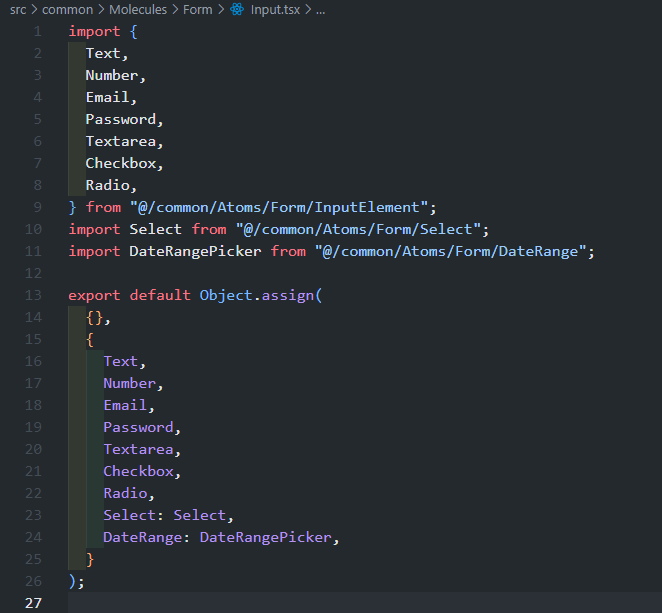
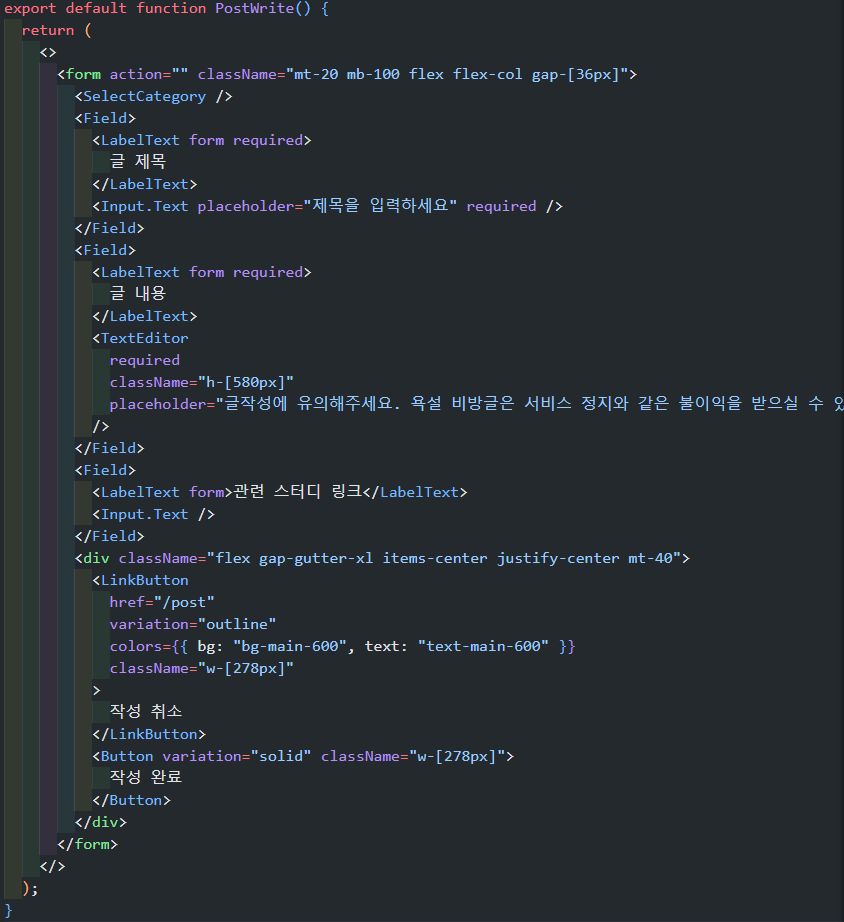
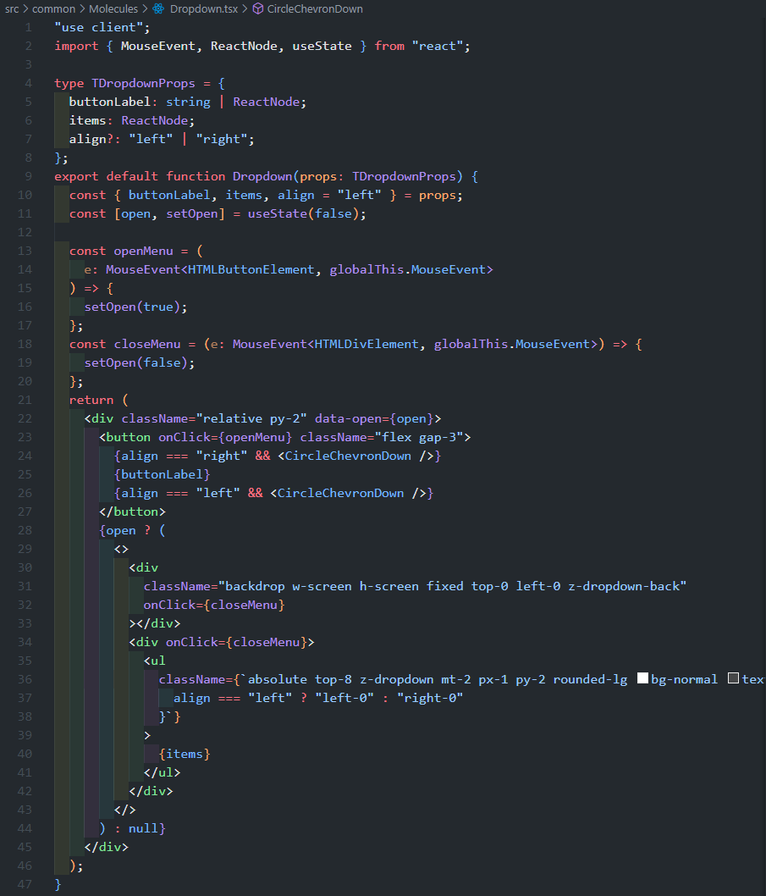
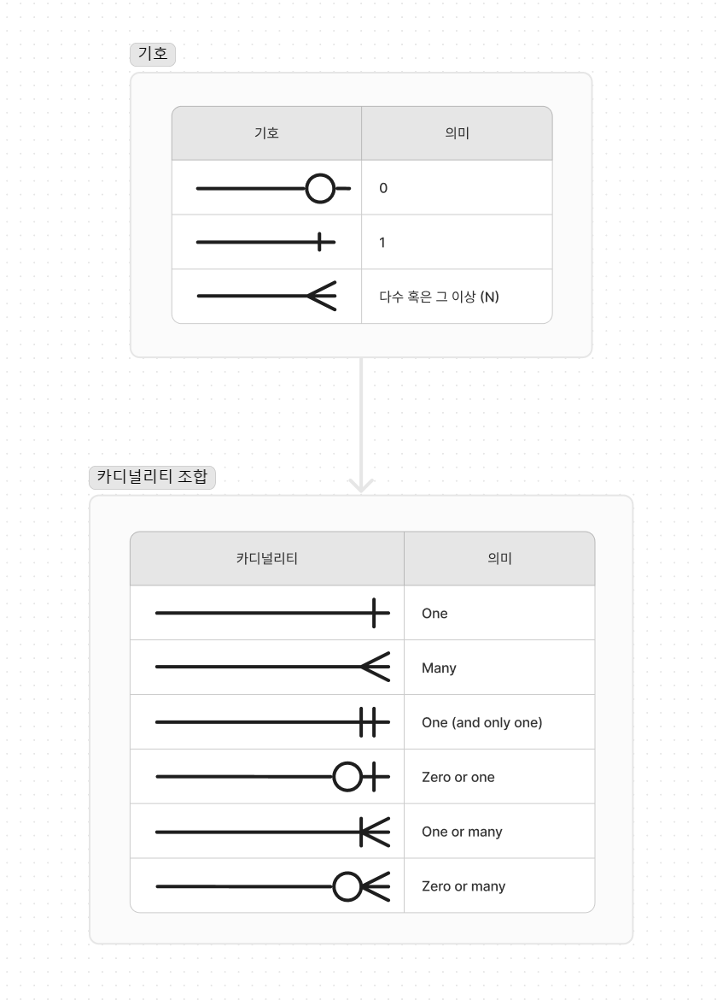
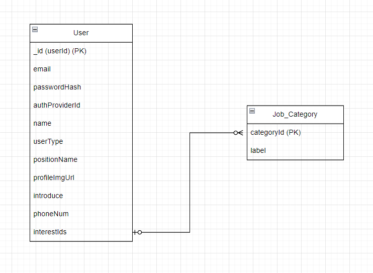

# 6주차

**이번 주 to-do**

- [x] 페이지 마크업+스타일 작성
- [x] 공통 컴포넌트 개발
- [x] 데이터 스키마 타입과 ERD 이해
- [x] merge 충돌 해결 및 리팩토링

네 가지 항목 모두 현재 진행형으로 다음주에도 코드 리팩토링과 이어서 진행될 예정이다.

## What we mainly did

### 필수 페이지 및 공통 컴포넌트 개발

[지난주](https://callmebyneon.github.io/2024-06-30/thenextjs-week-5/#%EA%B3%B5%ED%86%B5-%EC%BB%B4%ED%8F%AC%EB%84%8C%ED%8A%B8%EC%99%80-%EB%9D%BC%EC%9A%B0%ED%8A%B8-%EC%A0%95%EB%A6%AC) 아토믹 디자인 시스템을 기반으로 공통 컴포넌트를 분류했다.

일단 필수 기능 페이지를 기준으로 개발 범위를 나눠 역할을 분담했고 각 페이지를 개발하며 필요한 공통 컴포넌트를 함께 개발하며 진행했다.

그중 Input 컴포넌트는 `Input.[type]`과 같은 형태로 사용할 수 있도록 Compound Component 형태로 Molecules 레벨에서 만들어 내보냈다.



커뮤니티 글 작성 페이지와 같이 사용할 때에는 입력 요소 grid 스타일을 적용하기 위해 Field로 각 입력 요소를 묶어 사용하고 있다.



또 다른 예로 드롭다운(Dropdown)의 경우 트리거 버튼을 클릭하면 드롭다운 메뉴가 상위 레이어에 나타나고 드롭다운 메뉴 중 하나를 클릭하거나 메뉴 상자 바깥 화면을 클릭하면 드롭다운 메뉴가 닫혀야 하기 때문에 onClick 속성을 사용하기 위해 클라이언트 컴포넌트로 만들어 사용하게 했다. 이 드롭다운 컴포넌트는 트리거 버튼, 백드롭 레이어, 드롭다운 메뉴 세 가지 요소가 필요하다.



간단하게 트리거 버튼과 드롭다운 메뉴 레이어를 감싸는 div 요소에 `position: relative;` 속성을 주고 백드롭 레이어에 `position: fixed;` 속성을, 드롭다운 메뉴에 `position: absolute;` 속성을 줘서 fixed된 백드롭 레이어는 스크롤의 위치가 움직이더라도 화면 전체를 채우고 있도록 하고 드롭다운 메뉴는 상위의 relative div 요소와 상대적인 위치를 유지할 수 있도록 했다. 만약 Portal을 이용하여 가장 바깥 영역에서 상위 레이어에 드롭다운 메뉴가 나타나도록 한다면 트리거 버튼을 감싸는 div와의 위치 관계가 없어지기 때문에 openMenu가 동작할 때 드롭 다운 메뉴의 위치를 정할 수 있도록 위치값을 저장하고 이용하는 코드가 필요했을 것이다.

### 데이터 스키마 타입과 ERD 이해

페이지들을 만들다 보니 필요에 의해 만들어 쓴 데이터들의 타입들이 어느 정도 모였다. 이제 미리 정해진 API 문서가 존재하지 않기 때문에 중구난방으로 작성된 데이터 타입들을 모으고 겹치는 부분들의 스키마를 분리하여 전체 데이터 스키마들의 타입을 정리해야 한다.

사실 반드시 풀스택 개발자가 아니더라도 프론트엔드 개발자 역시 화면에 표현할 데이터를 잘 가져와 사용하기 위해서는 API 문서를 만들지는 않더라도 충분히 이해할 필요가 있다. [이 글 _(프론트엔드 개발자가 API를 설계하는 이유)_](https://blog.gangnamunni.com/post/saas-why-do-frontend-developers-design-api/)에서도 프론트엔드 개발자의 인터페이스 관리와 활용에 대해 이야기하고 있는데, 많은 부분 공감하게 된다. 실제로 백엔드 개발자(혹은 한 명)에게만 API 설계를 전적으로 맡겨놓는다면 API 설계 문서를 공유 받기까지 관련 부분을 더 진행하기까지 시간이 지연되기도 하고 프론트엔드 개발자가 분석한 화면 설계 내용이 반영되지 않을 가능성도 함께 높아지는 것이다. 혹은 백엔드 개발자가 화면 설계 내용을 충분히 소화하고 API를 설계해야만 하는데 이 방안 역시 프론트엔드 개발과 백엔드 개발 영역의 합의가 별도로 필요하게 될 상황을 예상할 수 있다. 이러한 경험을 한 번 겪고 나면 프로젝트를 설계하는 과정은 어느 한 포지션 혹은 개발자의 일이라는 생각을 할 수 없게 된다. 코드들만 종속성과 결합도 조절이 필요한 것이 아니다.

특히 우리는 지금(CHEMEET) 프로젝트를 NoSQL DB인 MongoDB(&mongoose)를 활용하여 소수의 인원으로 프론트엔드/백엔드 포지션의 구분 없이 진행하고 있기 때문에 팀원 전체의 데이터 스키마 타입들을 이해하고 ERD를 합의하여 정의하는 작업이 가능하다는 특징이 있다고 할 수 있다.

**데이터 스키마 타입들 정리**

먼저 TypeScript로 데이터 타입들을 정의해 본다. 프로젝트를 진행하며 여러 가지의 데이터 타입을 정의하게 됐지만, 예를 하나 들자면 회원가입 시 입력하는 정보와 프로필 페이지에서 설정할 수 있는 사용자 정보를 토대로 생각해 본다면 아래와 같이 필요한 데이터들을 하나의 타입으로 정리할 수 있을 것이다.

```ts
type User = {
  userId: string // or _id: MongoDB ObjectId
  email: string
  passwordHash: string
  authProviderId?: string
  userType: 'user' | 'pro' // default: 'user'
  positionName?: string
  profileUrl?: string
  introduce?: string
  phone?: string
  interest: JobCategory[]
}
type JobCategory = {
  categoryId: string
  label: string
}
```

하지만 사용자 정보가 필요한 모든 페이지에서 `User`의 모든 데이터가 필요하지 않기 때문에 `User`를 필요에 따라 분리할 필요도 있어 보인다. 또, 명백히 다른 유형의 데이터인 `JobCategory`를 관심 직무들을 저장하기 위해 Array type으로 사용하기 위해 분리했지만 고정된 `JabCategory` 데이터가 있다면 `interest`가 아닌 `interestIds`로 id 값들만을 배열로 가지고 있어도 될 것 같다.

```ts
// 정리 후
type UserLoginInfo = {
  userId: string // or _id: MongoDB ObjectId
  email: string
  passwordHash: string
  authProviderId?: string
}
type UserOptionalInfo = {
  name: string
  userType: 'user' | 'pro' // default: 'user'
  positionName: string | null
  profileImgUrl: string // 기본 프로필 이미지 경로 저장
  introduce: string // 빈 string data 저장
  phoneNum: string | null
  interestIds: Pick<JobCategory, 'categoryId'>[]
}
type User = UserLoginInfo & UserOptionalInfo
type JobCategory = {
  categoryId: string
  label: string
}
```

정답이라고 할 수는 없겠지만, 위와 같이 타입들을 정리한다면 예를 들어 프로필 카드에 필요한 데이터 타입은 아래와 같이 이해할 수 있게 된다.

```ts
// [예] 사용자 프로필 카드 컴포넌트를 사용할 때 필요한 데이터 타입
type UserProfileCardData = Pick<UserLoginInfo, 'userId'> &
  Omit<UserOptionalInfo, 'phone' | 'interestIds'>
```

이렇게 컴포넌트에 필요한 데이터들을 분리하고 결합하며 스키마를 정리할 수 있다.

**ERD**

- _ERD?_
  - [Lucidchart에서 엔터티 관계 다이어그램 만들기 – Lucid](https://help.lucid.co/hc/ko/articles/16471565238292-Lucidchart%EC%97%90%EC%84%9C-%EC%97%94%ED%84%B0%ED%8B%B0-%EA%B4%80%EA%B3%84-%EB%8B%A4%EC%9D%B4%EC%96%B4%EA%B7%B8%EB%9E%A8-%EB%A7%8C%EB%93%A4%EA%B8%B0)
  - [위키 문서 - 개체-관계 모델 (크로우즈핏)](<https://ko.wikipedia.org/wiki/%EA%B0%9C%EC%B2%B4-%EA%B4%80%EA%B3%84_%EB%AA%A8%EB%8D%B8#%ED%81%AC%EB%A1%9C%EC%9A%B0%EC%A6%88_%ED%95%8F_(%EA%B9%8C%EB%A7%88%EA%B7%80_%EB%B0%9C)>)

물론 프로젝트는 NoSQL인 MongoDB(w/mongoose)를 이용할 예정이지만 RDB(관계형 데이터베이스)에서처럼 엔티티(개체) 사이의 관계를 이해하기 위해 ERD로 그려볼 수 있다. ERD(Entity-Relationship Diagram)는 데이터베이스 내 데이터 요소가 어떻게 관련되어 있는지 관계를 보여 주는 다이어그램을 말하며, 데이터베이스 설계 단계에서 시각적으로 엔티티들의 관계를 이해할 수 있도록 한다.

이론 내용을 공부하고 자격증 시험을 보면서 몇 번을 봤는데도 관계도가 어떤 의미인지 외우지도 읽지도 못하다가 이번 기회에 먼저 주로 사용하게 될 기호들을 조금씩 이해하게 됐다. (드디어!)

<details>
  <summary><em>카디널리티 (Cardinality)?</em></summary>

> SQL문에서의 **카디널리티(Cardinality)**는 데이터베이스 테이블의 단일 열(속성; column, attribute) 또는 필드의 값이 가지는 고유성을 나타낸다. 카디널리티가 높을수록 열에 중복된 요소가 적어 매우 흔하지 않거나 고유한 값을 갖는 열을 말하고, 낮은 카디널리티를 가진 열은 중복된 요소가 많아 가장 낮은 카디널리티를 가진 열은 거의 모든 행(row)에 대해 동일한 값을 가진다.

- _참고_
  - [위키피디아](<https://en.wikipedia.org/wiki/Cardinality_(SQL_statements)>)
  - [카디널리티 및 참조 무결성](https://help.tableau.com/current/pro/desktop/ko-kr/cardinality_and_ri.htm)
  </details>



이렇게 기호들을 조합하여 데이터들의 관계를 정의할 수 있고 이해할 수 있는데, 예를 들어 한 명의 사용자는 0 혹은 다수의 Job_Category의 categoryId 값을 가질 수 있고 하나의 Job_Category의 id 값은 User의 interestIds에 0 혹은 하나의 값이 존재할 것이기 때문에 아래와 같이 관계를 설명할 수 있을 것으로 보인다.



물론 하나의 예시로 그린 관계도이고, 각 데이터 타입과 같은 정의를 모두 설명하고 있는 예시는 아니지만 확실히 이렇게 관계도를 다이어그램으로 시각화하여 보니 이해가 잘 되는 기분이다. 기존의 관계 설정이 된 RDB 구조에 좀 더 익숙하다 보니 NoSQL 사용에 어색함이 있었는데 결국 같은 데이터를 다루기 위해서는 NoSQL 인지 RDB 인지와 상관없이 각 데이터 간의 속성들과 관계를 이해하는 것이 필요한 과정임을 느낀다.

---

## What we have done and have to do

|       | 목표                                                                                                                   | 완료도     |
| ----- | ---------------------------------------------------------------------------------------------------------------------- | ---------- |
| 1주차 | 기획안&프로토타입 보충, 개발환경 세팅                                                                                  | ✅✅✅🔲🔲 |
| 2주차 | 과업 범위 정하기, 역할 분담, 마일스톤 추가, 공통 컴포넌트&라우트 정리, 페이지 마크업                                   | ✅✅✅✅🔲 |
| 3주차 | 공**통 컴포넌트 개발, 페이지 마크업&스타일링, 데이터 스키마 타입과 ERD 이해, 리팩토링 및 merge 충돌 해결**             | ✅✅✅✅   |
| 4주차 | 공통 컴포넌트 개발 및 리팩토링, 반응형 추가, 메타데이터 설정 정리, MongoDB 구성 및 연결(+Auth.js 적용), 기능 로직 구현 |            |
| 5주차 | 기능 로직 구현, 1차 배포, 리뷰 및 추가 (가능하면 2순위 페이지까지 구현) 개발                                           |            |
| 6주차 | 배포, QA/리팩토링                                                                                                      |            |
| 7주차 | QA 마무리, 프로젝트 회고, 발표 준비&성과발표                                                                           |            |

### 기능 개발 외 다음 주 진행 예상 내용

- 벌써 프로젝트 진행 기간의 절반 정도가 지나가고 있다.
- 공통 컴포넌트 개발과 주요 기능 페이지 중 하나를 마저 개발해야 한다. 데이터 패칭과 함께 하는 인터랙션, confirm 단계들을 제외하고 페이지를 먼저 개발하다 보니 Notification(Alert component), Modal Portal과 같은 공통 컴포넌트들은 파일이 비어있는 상태다. Thumbnail(Image usage)이나 사이드바 레이아웃과 같은 페이지에서 사용되고 있지만 리팩토링이 필요한 컴포넌트들도 있어 함께 진행한다.
- PC-first(min-width: 1280px) 디자인을 기반으로 화면을 먼저 개발하다 보니 디자인이 존재하지 않는 작은 화면에서의 반응형을 거의 적용하지 못한 상태다. 다음 주 사용자 인터랙션을 추가하며 반응형 스타일도 추가가 필요하다.
- 현재까지 메타데이터는 템플릿 타이틀과 기본 description, favicon 설정만 되어 있기 때문에 화면 변화에 따라 메타데이터 점검이 필요할 것으로 예상된다.

---

본 후기는 본 후기는 [유데미x스나이퍼팩토리] 프로젝트 캠프 : Next.js 1기 과정(B-log) 리뷰로 작성 되었습니다.

#유데미 #udemy #웅진씽크빅 #스나이퍼팩토리 #인사이드아웃 #미래내일일경험 #프로젝트캠프 #부트캠프 #Next.js #프론트엔드개발자양성과정 #개발자교육과정
