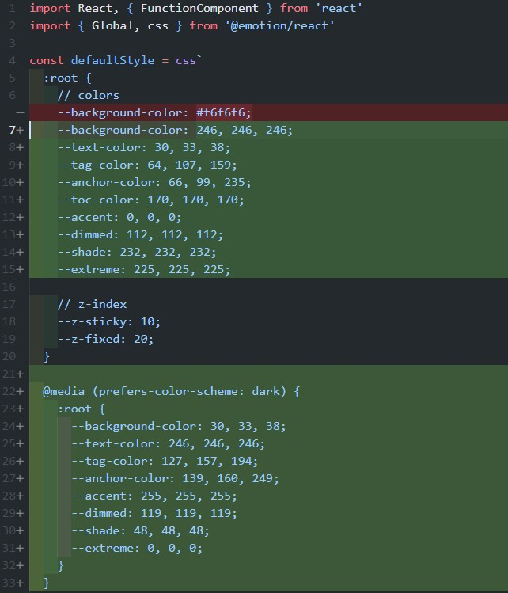
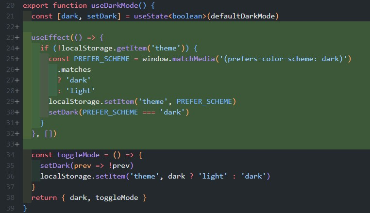

# Start to dark mode blog

## design test

어느 날, 드디어 블로그에 다크 모드를 적용할 수 있도록 토글 버튼을 추가해야겠다는 생각이 들었다. 그래서 상단 Navigator에 아이콘 버튼을 클릭했을 때 테마가 바뀌도록 할 수 있게 계획했다.

<figure>
  
  <figcaption>테마 토글 버튼을 추가한 Navigation 디자인 테스트</figcaption>
</figure>

# Make dark mode toggle button

## css (prefers-color-scheme: dark)

가장 먼저 GlobalStyle 컴포넌트에서 css variable을 추가하여 각 컬러들을 variable로 대체하고 화면을 보며 `@media (prefers-color-scheme: dark)`에 다크 모드 색상 값을 지정해 줬다.



## DarkModeContext with React.Context

블로그에 설정한 다크 모드 테마를 변경하기 위해 가장 먼저 다크 모드 상태 값을 관리할 수 있는 훅을 만들었다. `localStorage`에 theme 아이템으로 테마 값을 저장하여 세션이 종료되어도 테마를 기억하도록 했다.

```tsx
const PREFERS = window.matchMedia('(prefers-color-scheme: dark)').matches
const DEFAULT_THEME = localStorage.getItem('theme') || PREFERS
const defaultDarkMode = DEFAULT_THEME === 'dark'

export function useDarkMode() {
  const [dark, setDark] = useState<boolean>(defaultDarkMode)

  const toggleMode = () => {
    setDark(prev => !prev)
    localStorage.setItem('theme', dark ? 'light' : 'dark')
  }
  return { dark, toggleMode }
}
```

그다음 이 훅을 공유하며 테마를 관리할 수 있도록 컨텍스트를 만들어 컨텍스트 프로바이더 래퍼(wrapper) 컴포넌트를 만들었다.

```tsx
export function ThemeModeProvider({ children }: { children: ReactNode }) {
  const value = useDarkMode()
  return (
    <DarkModeContext.Provider value={value}>
      {children}
    </DarkModeContext.Provider>
  )
}
```

이렇게 만든 wrapper 컴포넌트를 Template 컴포넌트에서 HTMLBase를 감싸도록 하여 HTMLBase와 ThemeToggleButton에서 컨텍스트 값을 사용할 수 있도록 만들었다.

```tsx
const Template: FunctionComponent<TemplateProps> = function ({...}) {
  return (
    <ThemeModeProvider>
      <HTMLBase data={{ title, description, url, image }}>
        <Navigator />
        {children}
        <Footer />
      </HTMLBase>
    </ThemeModeProvider>
  )
}

export default Template
```

그리고 토글 버튼을 만들어 모드가 변경될 때 아이콘이 뜨고 지는 것처럼 느껴지도록 스타일을 적용하고 버튼을 클릭할 때 컨텍스트에서 가져온 `toggleMode`을 실행하도록 핸들러 함수를 추가했다.

```tsx
const ThemingButtonIcons = styled.div`
  width: 26px;
  height: 52px;
  display: flex;
  flex-direction: column;
  transform: rotate(360deg);
  transition: transform ease-out 200ms;

  [data-theme='dark'] & {
    transform: rotate(180deg);
  }
`

const ThemeToggleButton = function () {
  const { toggleMode } = useContext(DarkModeContext)
  return (
    <ThemingButton onClick={toggleMode}>
      <ThemingButtonIcons>
        <SunIcon />
        <MoonIcon />
      </ThemingButtonIcons>
    </ThemingButton>
  )
}

export default ThemeToggleButton
```

# trouble shooting

## SSR cannot find `window`

끝이라고 느꼈지만 위에서 작성한 코드를 그대로 빌드 한다면 아래 오류를 마주치며 빌드를 완료할 수 없다.


[참고한 글](https://www.sungikchoi.com/blog/window-is-not-available/)을 보면 원인과 해결 방법을 좀 더 자세히 설명해 주고 있는데, 간단히 요약하자면 Server-Side Render가 발생할 때, 전역에 window가 존재하지 않기 때문에`(in ssr, globalThis !== window)` 빌드 시 window를 사용할 수 없다는 빌드 에러가 발생하게 된다. localStorage는 결국 `window.localStorage`이기 때문에 마찬가지로 전역으로 사용했을 때 같은 빌드 오류가 발생한다.

이를 해결하기 위해 `useDarkMode` 내부에서 useEffect를 통해 최초 렌더 시 로컬 스토리지와 사용자 설정을 확인하여 최초 테마 값을 저장하여 사용할 수 있도록 변경했다.



## utterances comment widget theme

댓글 영역인 CommentWidget 역시 theme을 지정하여 사용하고 있는데, 마찬가지로 컨텍스트에서 `dark` 값을 가져와 상태가 바뀔 때마다 utterances의 테마도 바뀌도록 했다. 다만 `element.current.appendChild(utterances)`으로 utterances를 화면에 보여주기 때문에 `dark`의 값이 변경될 때 댓글 영역도 복사가 되는 것처럼 보이게 되므로 댓글 영역 `div`에 child가 존재할 때 이전 댓글 영역을 삭제하고 새로 바뀐 테마의 utteranses만 보일 수 있도록 추가했다.

```tsx
const CommentWidget: FunctionComponent = function () {
  ...
  const { dark } = useContext(DarkModeContext)

  useEffect(() => {
    if (element.current === null) return
    console.log(element.current)
    const utterances: HTMLScriptElement = document.createElement('script')

    const attributes: UtterancesAttributesType = {
      ...
      theme: dark ? 'github-dark' : 'github-light',
      ...
    }

    ...

    if (element.current.childElementCount === 1) {
      const child = element.current.firstChild
      element.current.removeChild(child!)
    }
    element.current.appendChild(utterances)
  }, [dark])
  ...
}
```

## 404 page theme

그리고 마지막으로 404 페이지는 Template을 사용하지 않는다는 점을 잊어 테마가 적용되지 않는 것을 발견했다. 404 페이지에서 테마를 토글 할 필요는 없을 것 같아 HTMLBase에서 메타데이터를 위해 받아와야 하는 값들을 옵셔널 객체 형태로 받도록 하고 NotFoundPageWrapper를 아무런 값을 전달하지 않는 HTMLBase로 감싸주기만 했다.

```tsx
const NotFoundPage: FunctionComponent = function () {
  return (
    <HTMLBase>
      <NotFoundPageWrapper>...</NotFoundPageWrapper>
    </HTMLBase>
  )
}

export default NotFoundPage
```

# optimize?

일단 다크 모드 적용을 무사히 완료했고 테스트까지 마친 후 배포 코드에 적용까지 시켰지만 살짝 걱정되는 점이 있다면 최적화인데, 결국 최초 테마를 브라우저에서 HTML이 파싱 되며 지정하기 때문에 최초 접속 시 최적화가 안되어 보이지 않을까 걱정되긴 한다. 혹시나 번쩍임이 느껴질 경우를 대비해 화면이 갑자기 밝아졌다가 바뀌지 않도록 기본 값을 dark 테마로 지정해놨지만 추후에 문제가 보인다면 다시 보완을 해야 하지 않을까, 일단 생각만 해놓기로 했다.

일단 끝!
