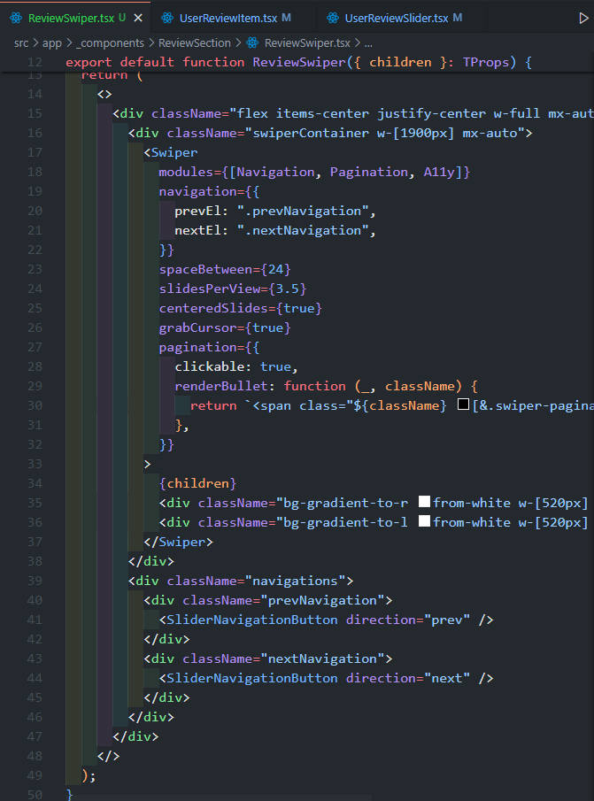

# 7주차

**이번 주 to-do**

- [x] 컴포넌트 설계 점검 & 리팩토링 (~)
- [x] 반응형 추가 (~)
- [x] MongoDB 연결 확인 (~)
- [x] 기능 구현 시작 (Auth.js+) (~)

## This week summarize

### Keep

- 컴포넌트 리팩토링
- 반응형 스타일+ 추가
- 기능 구현

### Problem

- 기능 개발에 예상보다 시간이 많이 걸리는 느낌이다. 결국 기능을 크게 나눠서 보면 회원관리(회원가입, 로그인 w/ Auth.js)와 글/댓글 CRUD일 텐데 컴포넌트 리팩토링을 위해 개념에 익숙해지는데 시간이 생각보다 많이 걸리면서 기능 개발이 더 늘어진 기분이다. 이번주는 이상하게 집중이 안돼서 더 그런 기분이다.

### Try

- 반응형을 위해 [tailwindcss-container-quries](https://github.com/tailwindlabs/tailwindcss-container-queries)를 시도해봤지만 MainLayout과 사이드바 레이아웃을 위한 div가 nested 되다 보니 예상한대로 화면에 보이지 않았다. [@container](https://developer.mozilla.org/en-US/docs/Web/CSS/@container) 쿼리 자체가 익숙하게 사용하던 css rule이 아니었다보니 더 어렵게 느껴지는 듯 하다. 좀 더 시도해보고 프로젝트에 적용할지를 결정해야할 것 같다.

## What we mainly did

### 컴포넌트 설계 점검

현재까지의 컴포넌트는 디자인에 따라 레이아웃을 만들며 앱 라우터 내 페이지 컴포넌트에서 작성하고 입력창 혹은 모달 액션이 필요한 경우, 섹션 태 콘텐츠 분리 등을 위해서만 단순하게 하위 컴포넌트를 분리하기만 했다. 하지만 디자인적으로 구분되는 화면 요소 구조만이 아니라 데이터를 사용하는 컴포넌트와 화면 스타일을 보여주는 컴포넌트, 외부 라이브러리를 사용하는 경우 라이브러리를 사용하는 컴포넌트를 정확하게 구분하여 각각의 관심사를 분리하여 코드를 해석하기에도, 디버깅을 하기에도 좀 더 용이하게 리팩토링이 필요하다는 피드백을 받았다. 이를 따라 컴포넌트들을 리팩토링하기로 했다.

\*참고: [관심사 분리 (Separation of Concerns, SoC)](https://ko.wikipedia.org/wiki/%EA%B4%80%EC%8B%AC%EC%82%AC_%EB%B6%84%EB%A6%AC)

아래 코드에서 현재 프로젝트의 컴포넌트들을 크게 비즈니스 로직/데이터 계층과 표현 계층으로 나눠본다. 예를 들어 메인 페이지에서의 스터디 리뷰 카드 슬라이드를 컴포넌트를 나눌 때, Swiper.js를 사용해 만든 전체 코드를 Swiper(`swiper/react`) 컴포넌트를 이용하여 기본적인 컴포넌트 디자인과 구조를 만드는 컴포넌트, 데이터를 보여줄 각 슬라이드 요소의 디자인 표현 컴포넌트(presentaional), 데이터를 사용하여 실제 페이지 컴포넌트에서 바로 사용하게 될 슬라이드 섹션 컨텐츠 컴포넌트로 각각의 관심사별로 레이어를 구분하여 이해할 수 있다.

```jsx
// ReviewSwiper.tsx
...
<div className="flex items-center justify-center w-full mx-auto overflow-hidden relative">
  <div className="swiperContainer w-[1900px] mx-auto">
    <Swiper
      modules={[Navigation, Pagination, A11y]}
      navigation={{
        prevEl: '.prevNavigation',
        nextEl: '.nextNavigation',
      }}
      spaceBetween={24}
      slidesPerView={3.5}
      centeredSlides={true}
      grabCursor={true}
      pagination={...}
    >
      {children}
      <div className="bg-gradient-to-r from-white w-[520px] h-full absolute top-0 left-0 z-10"></div>
      <div className="bg-gradient-to-l from-white w-[520px] h-full absolute top-0 right-0 z-10"></div>
    </Swiper>
  </div>
  <div className="navigations">
    <div className="prevNavigation">
      <SliderNavigationButton direction="prev" />
    </div>
    <div className="nextNavigation">
      <SliderNavigationButton direction="next" />
    </div>
  </div>
</div>
```

```tsx
// UserReviewItem.tsx
...
<div
  className={
    clsx(
      'snap-center rounded-twenty overflow-hidden w-[520px] flex flex-col border border-line-alt select-none mb-12 ',
      className
    )
  }
>
  <div className="flex flex-col items-center justify-center py-4 px-16 bg-card h-[200px]">
    <p className="text-body-400 w-[380px] text-justify">{review.text}</p>
  </div>
  <div className="flex flex-col items-center justify-center gap-2 py-2 h-[90px] relative">
    <div className="triangle w-0 h-0 border-x-[15px] border-y-[25px] border-t-[#f0f4fa] border-b-transparent border-l-transparent border-r-transparent absolute top-0 left-1/4 -translate-x-full"></div>
    <p className="text-label-600">'{review.studyName}' 후기</p>
    <p className="text-label-400">{review.writerKeyword}</p>
  </div>
</div>
```

```tsx
export default function UserReviewSlider() {
  const reviews = getMainReview()
  return (
    <ReviewSwiper>
      {reviews.map(review => (
        <SwiperSlide key={review.reviewId}>
          <UserReviewItem review={review} />
        </SwiperSlide>
      ))}
    </ReviewSwiper>
  )
}
```

<figure>
  
  <figcaption>(화면) 메인 페이지의 스터디 리뷰 슬라이드</figcaption>
</figure>

- 🖇️ 함께 보면 좋은 것들
  - Headless UI 예시들: [Radix](https://www.radix-ui.com/primitives/docs/overview/introduction), [Tailwind Headless UI](https://github.com/tailwindlabs/headlessui), [shadcn/ui](https://ui.shadcn.com/docs)
  - [(번역) Feature-Sliced Design: The Best Frontend Architecture](https://emewjin.github.io/feature-sliced-design/)
    - (origin) https://dev.to/m_midas/feature-sliced-design-the-best-frontend-architecture-4noj
  - [(번역) Container/Presentational 패턴](https://patterns-dev-kr.github.io/design-patterns/container-presentational-pattern/)
    - (origin) https://www.patterns.dev/react/presentational-container-pattern

---

## What we have done and have to do

|       | 목표                                                                                                   | 완료도     |
| ----- | ------------------------------------------------------------------------------------------------------ | ---------- |
| 1주차 | 기획안&프로토타입 보충, 개발환경 세팅                                                                  | ✅✅✅🔲🔲 |
| 2주차 | 과업 범위 정하기, 역할 분담, 마일스톤 추가, 공통 컴포넌트&라우트 정리, 페이지 마크업                   | ✅✅✅✅🔲 |
| 3주차 | 공통 컴포넌트 개발, 페이지 마크업&스타일링, 데이터 스키마 타입과 ERD 이해, 리팩토링 및 merge 충돌 해결 | ✅✅✅✅   |
| 4주차 | **공통 컴포넌트 개발 및 리팩토링, 반응형 추가, MongoDB 구성 및 연결(+Auth.js 적용), 기능 로직 구현**   | ✅✅🔲🔲   |
| 5주차 | 컴포넌트 리팩토링, 반응형 추가, 기능 로직 구현, 1차 배포, 리뷰 및 추가 개발                            |            |
| 6주차 | 배포, QA/리팩토링                                                                                      |            |
| 7주차 | QA 마무리, 프로젝트 회고, 발표 준비&성과발표                                                           |            |

---

본 후기는 본 후기는 [유데미x스나이퍼팩토리] 프로젝트 캠프 : Next.js 1기 과정(B-log) 리뷰로 작성 되었습니다.

#유데미 #udemy #웅진씽크빅 #스나이퍼팩토리 #인사이드아웃 #미래내일일경험 #프로젝트캠프 #부트캠프 #Next.js #프론트엔드개발자양성과정 #개발자교육과정
