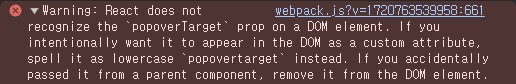
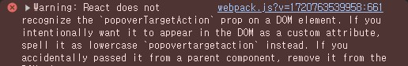
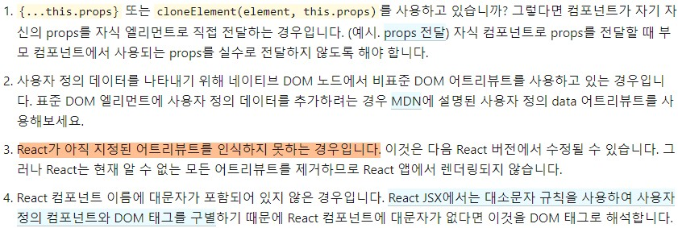
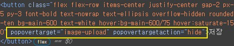

# Modal with Popover API

- 관련 문서
  - [MDN: Popover API](https://developer.mozilla.org/en-US/docs/Web/API/Popover_API)
  - [MDN: Using Popover_API](https://developer.mozilla.org/en-US/docs/Web/API/Popover_API/Using)
  - [예제들(MDN Popover API examples)](https://mdn.github.io/dom-examples/popover-api/)

## Popover API

Popover API는 페이지 콘텐츠 위에 팝오버 콘텐츠를 표시할 수 있게 하는데 사용할 수 있는 하는 메커니즘을 제공한다.

이 메커니즘은 모달만이 아니라 페이지 위 레이어에서 팝오버 콘텐츠를 보여주는 구조의 인터페이스 요소라면 모두 이 API를 활용하여 요소를 만들 수 있다. 개발자 도구(DevTools)에서 popover 요소가 show 상태일 때 요소에서 확인해보면 `#top-layer`에서 해당 요소가 reveal 된 것을 볼 수 있다.

[MDN 문서](https://developer.mozilla.org/en-US/docs/Web/API/Popover_API#concepts_and_usage)에서 개념에 대해 설명하는 부분을 빌려와 설명하자면 모달은 팝오버가 표시되는 동안 특정 작업이 수행되어 모달이 사라지는 등의 조건 전까지 나머지 페이지, 요소들과 상호작용할 수 없는 형태를 말하고, 모달이 아닌 것은 이러한 특징 없이 나머지 부분과 상호작용할 수 있는 드롭다운 메뉴, toast 알림, 툴팁과 같은 요소를 설명한다.

## Make modal component

이제 popover 속성을 이용하여 좀 더 쉽게 모달 컴포넌트를 만들어보려고 한다.

우선 컴포넌트가 반환하는 JSX Element에 `dialog` 태그와 `popover` 속성을 사용하여 모달 레이어를 보여줄 수 있도록 하고 children으로 전달받는 모달 콘텐츠를 `dialog`로 감싸 보여줄 수 있도록 만든다.

```tsx
function Modal({ children }: { children: ReactNode }) {
	return <dialog popover="manual">{children}</dialog>;
}
```

위에서 적은 설명처럼 이 popover 속성 자체가 다른 부분과 상호작용할 수 있는지를 결정하지 않기 때문에 모달이라는 요소의 특징을 구현해주기 위해 `dialog` 요소 안에서 백드롭 레이어를 위한 div와 모달 상자 내부에서 children을 보여주도록 div로 감싼다. 이 요소들을 클릭했을 때와 <kbd>esc</kbd> 이벤트를 구현하기 위해 `useRef`를 통해 `dialog` 요소를 저장하여 이벤트를 연결한다.

```tsx
function Modal({ children }: { children: ReactNode }) {
	const dialogRef = useRef<HTMLDialogElement>(null);

	useEffect(() => {
		const modalKeyClosehandler = (e: KeyboardEvent) => {
			if (e.key === "Escape") {
				dialogRef.current?.hidePopover();
			}
		};
		document.addEventListener("keydown", modalKeyClosehandler);

		return () => {
			document.removeEventListener("keydown", modalKeyClosehandler);
		};
	}, []);

	const hideDialog = () => {
		dialogRef.current?.hidePopover();
	};

	const stopPropagation: MouseEvent<HTMLDialogElement> = e => {
		e.stopPropagation();
	};
	return (
		<dialog ref={dialogRef} popover="manual">
			<div className="dialog-backdropLayer" onClick={hideDialog}>
				<div className="dialog-contentBox" onClick={stopPropagation}>
					{children}
				</div>
			</div>
		</dialog>
	);
}
```

마지막으로 모달 닫기 버튼을 모달 상자 내부에 추가하여 popover\* 속성을 이용하여 버튼을 통한 닫기 기능 추가한다.

```tsx
function Modal({ children }: { children: ReactNode }) {
	const dialogId = useId();
  ...
	return (
		<dialog ref={dialogRef} popover="manual" id={dialogId}>
			<div className="dialog-backdropLayer" onClick={hideDialog}>
				<div className="dialog-contentBox" onClick={stopPropagation}>
          <button
            popoverTarget={dialogId}
            popoverTargetAction="hide"
            className="dialog-closeBtn"
          ><CloseSvgIcon /></button>
					{children}
				</div>
			</div>
		</dialog>
	);
}
```

# Warning: React does not recognize the props

하지만 이대로 리액트 컴포넌트를 만들어 사용해보면 아래와 같은 경고 콘솔 로그를 마주하게 된다.

## console warning

오류 화면:




## Cause

원인 참고: https://ko.legacy.reactjs.org/warnings/unknown-prop.html



현재(2024-07) 기준 [Popover API가 최신 표준(2024-04)](https://developer.mozilla.org/en-US/docs/Web/API/Popover_API)이다보니 아무래도 React가 아직 어트리뷰트를 인식하지 못하는 것으로 보인다. 하지만 렌더링되지 않는다고 설명되어 있는 것에 반해 `next dev`로 로컬에서 확인해보면 해당 속성이 제대로 보이고 동작도 잘 하는 것을 확인할 수 있다.



## Result

결과적으로 현재(2024-07) 모달을 popover 속성을 이용하여 리팩토링하는 것은 취소하게 됐다. 로컬 테스트 시 동작은 하지만 빌드 후 배포 시 리액트상에서 어떤 문제가 발생할지 예측할 수 없으므로 일단은 리액트 업데이트를 기다려보려고 한다.
