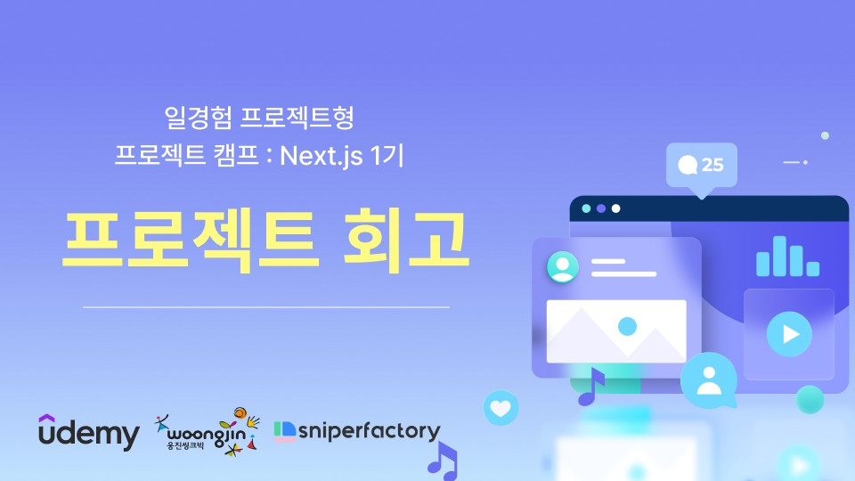

# 8주차

**이번 주 to-do**

- [x] Vercel을 통해 1차 테스트 배포
- [x] 1차 UI Test 후 이슈 수정 및 리팩토링
- [x] 반응형 추가 (~)
- [x] 페이지별로 필요한 API 정의 문서화
- [x] 기능 구현 (~)

## What we mainly did

### Vercel - build and deployment

[저번에](https://callmebyneon.github.io/2024-06-15/thenextjs-week-3/) 작성했던 next-auth 테스트 코드를 vercel로 배포해 보면서 라우트 되지 않는 라우트 그룹 아래의 page.tsx는 빌드 오류가 발생시켜 초기 빌드 시 예측하지 못하는 빌드 에러가 발생할 것을 예상하여 이번 주에는 1차 테스트 빌드를 진행해 봤다. 그리고 역시나 많은 빌드 에러를 마주하게 됐다.

### Trouble shooting

- 🔗 [마주했던 빌드 오류 Repository/Issue에 정리](https://github.com/woongteco/nextcamp-12t/issues?q=is%3Aissue+is%3Aclosed+label%3Alog)

1. Next.js Middleware에서의 세션 확인을 통한 접근 제한하기

  
(참고) 관련 패키지 버전

  <ul>
    <li>mongoose: "^8.5.0"</li>
    <li>next: "14.2.4"</li>
    <li>next-auth: "^5.0.0-beta.19"</li>
    <li>react: "^18"</li>
  </ul>

사실상 이번 테스트 배포에서 최종 보스 같은 오류였다. 이게 게임이었다면 가장 먼저 만난 녀석이 가장 최약체였겠지만.. 이 오류는 그렇지 않았다.

빌드 당시 마이페이지와 글 작성 페이지는 로그인한 사용자만 접근할 수 있도록 미들웨어에서 NextAuth를 사용한 리턴 오브젝트의 auth를 사용하여 세션을 확인하고 그 값에 따라 matcher로 접근을 제한하도록 하고 있었다.

정확히 어느 부분 때문에 오류가 나는지 찾을 수가 없어 헤매던 중 [미들웨어에서 getSession을 사용하여 에러가 발생할 수 있다는 글](https://velog.io/@sun1301/FDBS-How-to-deploy#2-dynamic-code-evaluation-e-g-eval-new-function-webassemblycompile-not-allowed-in-edge-runtime)을 발견했다. 이 글을 보고 auth 함수를 이용하여 session 확인 후 접근 제한하는 코드를 미들웨어에서 layout.tsx와 page.tsx로 옮겼더니 더 이상 같은 오류를 볼 수 없었다.

<figure>

<figcaption>빌드 문제로 변경했던 미들웨어 코드, `export { auth as getSession }`하여 사용한 점 참고</figcaption>
</figure>

이전 코드가 로컬에서 실행해 봤을 때야 잘 동작하는 것 같았지만 [Next.js 문서](https://nextjs.org/docs/app/building-your-application/authentication#session-management)를 보니 직접 auth 함수를 사용하지 않고 쿠키 기반으로 세션을 확인하는 방법을 소개하고 있었다.

하지만 auth 함수의 설명을 언뜻 읽어보면 미들웨어 함수에서 그냥 사용하면 되는 것처럼 느껴진다. [Next.js 문서](https://nextjs.org/docs/app/building-your-application/routing/middleware#runtime)에서는 미들웨어가 현재(v13.1.0 이후) Edge 런타임만 지원하고 Node.js 런타임을 사용할 수 없다고 설명하고 있다.

> Next.js 앱에서 NextAuth.js와 상호작용하는 보편적인 방법입니다. auth.ts에서 NextAuth.js를 초기화한 후 미들웨어, 서버 컴포넌트, 라우트 핸들러들(app/), Edge 또는 Node.js API 경로 (page/)에서 이 방법을 사용합니다.

음... 미들웨어의 기본 설명에 대해서도 다시 한 번 살펴본다.

> Middleware allows you to run code before a request is completed. Then, based on the incoming request, you can modify the response by rewriting, redirecting, modifying the request or response headers, or responding directly.  
> 미들웨어를 사용하면 요청이 완료되기 전에 코드를 실행할 수 있습니다. 그런 다음 들어오는 요청에 따라 요청 또는 응답 헤더를 다시 작성, 리디렉션, 수정하거나 직접 응답하여 응답을 수정할 수 있습니다.  
> 출처: https://nextjs.org/docs/app/building-your-application/routing/middleware

미들웨어는 결국 페이지 요청이 완료되기 전에 실행하기 위한 코드를 적게 되는데, 이 부분은 아직 Next와 Next의 미들웨어에 대한 이해가 확실하지 않다 보니 너무 두루뭉술하게만 해결하고 넘어가는 느낌이긴 하다. 더 공부가 필요해 보인다.

2. 리액트 코드 작성 시 주의가 필요한 부분들

- **Missing "key" prop**
  - [이전에 unique key prop에 대해 블로그 글을 작성](https://callmebyneon.github.io/2022-06-21/not-unique-key-in-react/)하기도 했지만, JSX에서 Array.map을 이용하여 Element 렌더링 시 key prop이 아예 존재하지 않을 때 빌드 시 오류가 발생했다. 물론 unique 한 key 값이 아닌 경우에 로컬 환경(`npm run dev`)에서 경고 콘솔을 표시하니 주의한다.
  - [참고한 내용](https://ko.legacy.reactjs.org/docs/lists-and-keys.html#keys)

- **Missing displayName in componnet definition**
  - `React.forwardRef` 사용 시 displayName을 따로 지정하지 않으면 리액트는 이름이 없는 컴포넌트로 해석하기 때문에 변수명과 별개로 `ModalPortal.displayName = "ModalPortal"`과같이 displayName을 지정해야 한다.
  - [참고한 내용](https://velog.io/@jellyjw/React%EC%97%90%EC%84%9C-forwardRef-%EC%82%AC%EC%9A%A9%ED%96%88%EC%9D%84-%EB%95%8C-displayName-error-%ED%95%B4%EA%B2%B0%ED%95%98%EA%B8%B0)

- **React Hook must be called not conditionally**
  - 리액트 훅은 훅이 사용된 컴포넌트가 렌더 될 때마다 항상 똑같이 실행되어야 하기 때문에 if 문 블록 안이나 if 문을 사용한 이후에 사용할 수 없다.
  - 이 경우에는 `useId`를 사용할 때 `const uniqueId = id || useId()`와 같이 id prop을 받지 않을 때 useId를 바로 이용하여 uniqueId에 값을 저장하도록 작성했던 코드가 문제였다. 이런 경우의 훅 사용도 로컬 환경(`npm run dev`) 실행에서는 문제가 없어 보였지만 빌드 과정에서 오류가 발생해 빌드가 중단되었다.
  - [참고한 내용](https://react.dev/reference/rules/rules-of-hooks)

3. ESLint와 TypeError, 경고들

main 브랜치에 머지 하기 전 나름대로 확인 후 dev 브랜치를 main에 머지 했지만 빌드 오류를 통해 이전에 발견하지 못했던 TypeError도 발견하고 ESLint로 인해 빌드에 실패한 경우도 마주쳤다.

ESLint 오류 같은 경우, ESLint의 권장되는 규칙 중 [no-unescaped-entities](https://github.com/jsx-eslint/eslint-plugin-react/blob/master/docs/rules/no-unescaped-entities.md)가 있었다. 이 규칙은 ESLint에서 따옴표(`""`) 혹은 less-than-sign/greater-than-sign(`<>`)와 같은 문자열은 html이나 jsx와 같은 마크업 문법과 혼동되기 쉬우니 [html entities](https://www.w3.org/wiki/Common_HTML_entities_used_for_typography) 사용(예: `<` → `&lt;`)을 권장한다. 물론 ESLint 설정에서 사용하지 않도록 수정할 수도 있겠지만 권장되는 내용대로 html entities로 변경해 주었다.

TypeError 역시 로컬 환경에서는 오류로 인식되지 않아 화면에 렌더링 되는 데에 지장을 주지 않았지만 빌드 과정에서 오류를 발생시켰다.

이러한 오류들 이외에도 경고 로그도 확인할 수 있었는데, 대표적으로는 `<Image>` 요소(Element)는 반드시 alt 속성을 가져야 하는데 가지고 있지 않아 발생한 경고였다. 이런 문제는 접근성 측면에서도 좋지 않기 때문에 고쳐주었다.

로컬 환경에서 확인하지 못했던 이유로 빌드 오류를 여러 번 마주하게 됐는데, 이후로 갑작스럽게 빌드 오류를 마주하지 않기 위해 1차 배포를 진행했다. 결국 배포에 성공하긴 했지만 이 정도의 고생을 또 하고 싶지는 않기 때문에 Vercel 배포로 자동으로 레포에 설치된 Vercel 깃허브 앱에서 main이 아닌 브랜치 업데이트 시 Preview 상태를 보여주는 점을 앞으로 좀 활용해 보려 한다.

### UI QA Issues

1차 QA에서는 실제 기능 중에는 로그인/회원가입 기능과 전체적인 구현도, 기본적인 화면 요소들의 동작 예상 가능성들을 먼저 볼 수밖에 없었다. 가장 큰 문제는 전체적인 레이아웃이나 리스트 그리드와 같은 기본적인 반응형도 극히 일부만 적용되어 있다는 점이었다. PC-first로 컴포넌트들을 개발하긴 했지만 헤더나 푸터, 사이드바 메뉴, 메인 검색창과 같은 부분은 반드시 반응형 스타일을 추가해야 최소한 어색하지 않아 보일듯하다.

<figure>
  
  <figcaption>기본적으로 필요한 컴포넌트 반응형 스타일들 진행도 (6 of 19 tasks)</figcaption>
</figure>

그 외에는 기능 개발을 많이 진행하여 배포한 것이 아니기 때문에 더미 데이터들을 따라 중구난방으로 통일되지 않고 있다. 이런 문제를 데이터 스키마를 확정하고 스키마에 따라 각 데이터 타입에 맞춰 컴포넌트들에서 상태를 보여주는 부분이 한 번 더 업데이트가 필요할 것으로 예상된다.

마지막으로는 각 화면 요소들이 필요한 동작들을 정확히 구현하는 일이 조금 더 남았고, 이후에 이 동작들을 API와 연결하여 제대로 동작하는지 확인하는 과정만이 남았다.

### APIs

일단 배포된 화면을 보면서 필요한 API들의 목록을 쭉 적어나갔다.

<figure>
  
  <figcaption>Github Project에 정리한 구현해야 할 API 목록 초안 일부</figcaption>
</figure>

전달받을 데이터 스키마나 URI, 쿼리 스트링들이나 더 필요한 API가 있을지는 더 팀원들과 이야기를 하며 작성 후 개발을 진행할 예정이다. 아마 개발하면서도 수정할 부분이 보이지 않을까 예상해본다 😂

---

## What we have done and have to do

|       | 목표                                                                                                   | 완료도     |
| ----- | ------------------------------------------------------------------------------------------------------ | ---------- |
| 1주차 | 기획안&프로토타입 보충, 개발환경 세팅                                                                  | ✅✅✅🔲🔲 |
| 2주차 | 과업 범위 정하기, 역할 분담, 마일스톤 추가, 공통 컴포넌트&라우트 정리, 페이지 마크업                   | ✅✅✅✅🔲 |
| 3주차 | 공통 컴포넌트 개발, 페이지 마크업&스타일링, 데이터 스키마 타입과 ERD 이해, 리팩토링 및 merge 충돌 해결 | ✅✅✅✅   |
| 4주차 | 공통 컴포넌트 개발 및 리팩토링, 반응형 추가, MongoDB 구성 및 연결(+Auth.js 적용), 기능 로직 구현       | ✅✅🔲🔲   |
| 5주차 | **1차 테스트 배포, UI 이슈 수정 및 리팩토링, 반응형 추가, API 정의 문서화, 기능 구현**                 | ✅✅✅✅🔲 |
| 6주차 | 데이터 스키마 정의, API 연결, 배포, QA/리팩토링                                                        |            |
| 7주차 | QA 마무리, 프로젝트 회고, 발표 준비&성과발표                                                           |            |

---

본 후기는 본 후기는 [유데미x스나이퍼팩토리] 프로젝트 캠프 : Next.js 1기 과정(B-log) 리뷰로 작성 되었습니다.

#유데미 #udemy #웅진씽크빅 #스나이퍼팩토리 #인사이드아웃 #미래내일일경험 #프로젝트캠프 #부트캠프 #Next.js #프론트엔드개발자양성과정 #개발자교육과정
