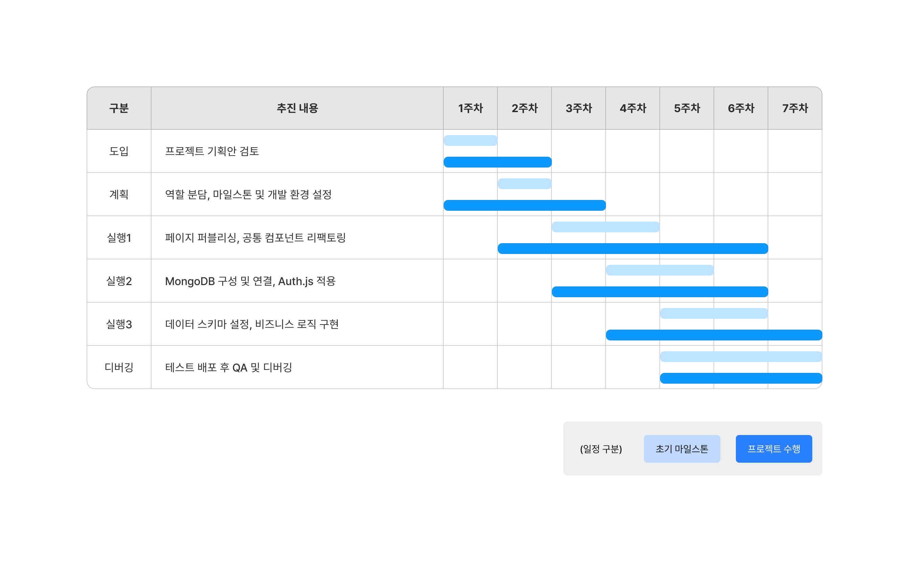

# 9주차

**이번 주 to-do**

- [x] 데이터 스키마 정의
- [x] 기능 개발 (w/ mongoose) (~)
- [x] 배포 (~)
- [x] QA & 버그 수정 (~)
- [x] 중간 점검 및 중간 발표

## What we mainly did

이번주는 기업별 팀들이 모여 중간 발표를 통해 프로젝트 결과에 대해 중간 점검을 하는 시간을 가졌다. 중간 발표를 준비하다보니 일주일이 다 지나가버렸다. 이왕 중간 점검을 진행한김에 결과보고서 초안을 미리 작성하며 목표로 했던 결과까지 얼마나 달성했을지 확인해 봤다.

### 프로젝트 결과 중간 점검

중간 발표 전, MongoDB에 회원가입/로그인을 제외한 데이터 CRUD 이전까지 진행한 상태였다. 때문에 어떻게 동작할지를 더미 데이터를 이용하여 동일하게 보여주기 위해 실제 데이터를 사용했을 때처럼 동작할 수 있도록 보수하고 이전 배포까지 발생했던 이슈를 이틀동안 최대한 해결했다.

중간 발표 이후, `loading.tsx`와 `<Suspense>`를 좀 더 적극적으로 활용하여 사용자가 보다 매끄러운 흐름을 느낄 수 있도록 해야겠다는 느낌을 받았다. 그리고 일단 필요한 기능들의 데이터 CRUD를 프로젝트 끝까지 마무리할 목표를 다시 새겼다.

### 수행 목표 달성 비교

결과보고서 형식을 훑어보니 프로젝트 수행 일정에 대한 내용이 있어 마지막으로 처음 세웠던 개발 목표와 수행 목표 달성 여부를 비교해봤다.



전체적으로 단계 내용별로 늦게 시작하지 않았지만 그만큼 빨리 끝내고 있지도 않은 상태다. 팀원들의 능력을 예측하지 못해 일어난 결과같아 아쉬운 마음이다. 그리고 그만큼 프로젝트 종료까지 완성을 꼭 해야겠다는 다짐을 하게된다.

### CRUD 테스트, 디버깅

Next.js 프로젝트에 api route.ts를 따로 추가하는 단계를 생략하고 좀 더 간단하게 form action 함수를 통해 직접 mongoose를 사용해 CRUD 과정을 테스트했다.

```tsx
// action.ts/profileAction
async function profileAction(userId: string, formData: FormData) {
	await connectDB();

	const profileCheck: ProfileSchema | null = await Profile.findOne({ userId });

	if (profileCheck) {
		const position_tag =
			formData.get("position_tag") || profileCheck.position_tag;
		const introduce = formData.get("introduce") || profileCheck.introduce;
		const my_category = formData.get("my_category") || profileCheck.my_category;
		const newProfile = await Profile.findOneAndUpdate(
			{ userId },
			{
				position_tag,
				introduce,
				my_category,
			},
		);

		console.log("newProfile:", newProfile);
		return newProfile;
	}

	const position_tag = formData.get("position_tag") || "";
	const introduce = formData.get("introduce") || "";
	const my_category: string[] = formData.get("my_category") || [];
	let profile;

	profile = new Profile({
		userId,
		position_tag,
		introduce,
		my_category,
	});

	const savedProfile = await profile.save();
	return savedProfile;
}

// FormEditProfile.tsx
export default async function FormEditProfile(props: FormEditProfileProps) {
	const { userId, profile } = props;

	async function save(formData: FormData) {
		"use server";
		try {
			await profileAction(userId, formData);
			handlerAlert("success", "프로필 정보가 저장되었습니다.");
		} catch (error: any) {
			handlerAlert("error", error.message);
		}
	}

	return (
		<form action={save}>
			<ProfileFormsAndPreview defaultValue={profile} />
			<Button type="submit" variation="solid">
				프로필 저장
			</Button>
		</form>
	);
}
```

- 🔗 참고
  - [블로그 글: velog.io/@chaeheetae/Client-Server-통신-예제](https://velog.io/@chaeheetae/Client-Server-%ED%86%B5%EC%8B%A0-%EC%98%88%EC%A0%9C)
  - 책: 레벨업 리액트 프로그래밍 with Next.js

---

## What we have done and have to do

|       | 목표                                                                                                   | 완료도     |
| ----- | ------------------------------------------------------------------------------------------------------ | ---------- |
| 1주차 | 기획안&프로토타입 보충, 개발환경 세팅                                                                  | ✅✅✅🔲🔲 |
| 2주차 | 과업 범위 정하기, 역할 분담, 마일스톤 추가, 공통 컴포넌트&라우트 정리, 페이지 마크업                   | ✅✅✅✅🔲 |
| 3주차 | 공통 컴포넌트 개발, 페이지 마크업&스타일링, 데이터 스키마 타입과 ERD 이해, 리팩토링 및 merge 충돌 해결 | ✅✅✅✅   |
| 4주차 | 공통 컴포넌트 개발 및 리팩토링, 반응형 추가, MongoDB 구성 및 연결(+Auth.js 적용), 기능 로직 구현       | ✅✅🔲🔲   |
| 5주차 | 1차 테스트 배포, UI 이슈 수정 및 리팩토링, 반응형 추가, API 정의 문서화, 기능 구현                     | ✅✅✅✅🔲 |
| 6주차 | **데이터 스키마 정의, 기능 개발, 배포, QA/리팩토링**                                                   | ✅✅✅🔲   |
| 7주차 | 기능 개발 및 QA 마무리, 프로젝트 회고                                                                  |            |

---

본 후기는 본 후기는 [유데미x스나이퍼팩토리] 프로젝트 캠프 : Next.js 1기 과정(B-log) 리뷰로 작성 되었습니다.

#유데미 #udemy #웅진씽크빅 #스나이퍼팩토리 #인사이드아웃 #미래내일일경험 #프로젝트캠프 #부트캠프 #Next.js #프론트엔드개발자양성과정 #개발자교육과정
