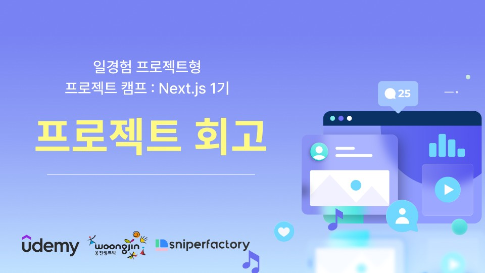
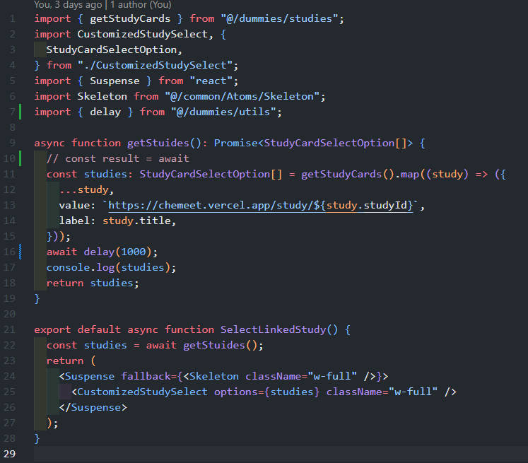
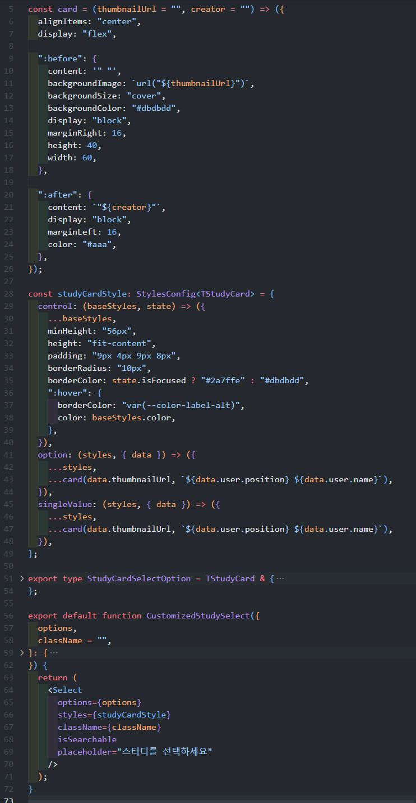
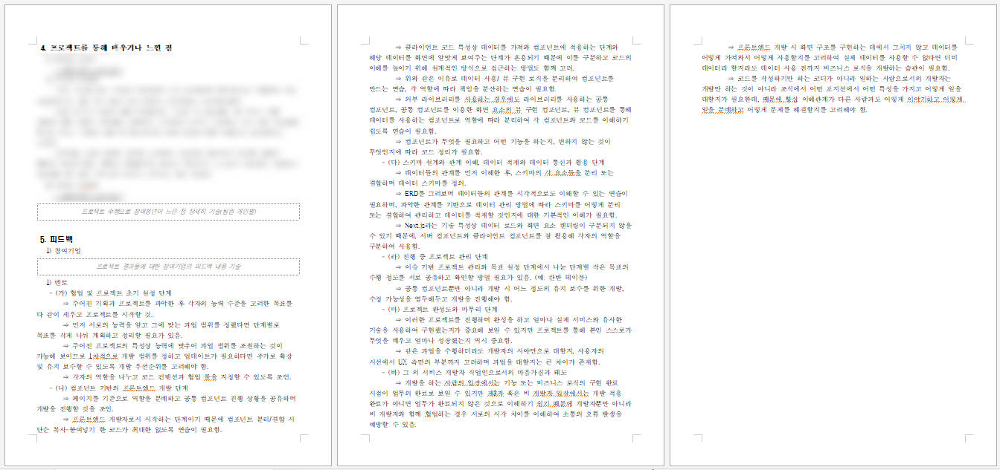
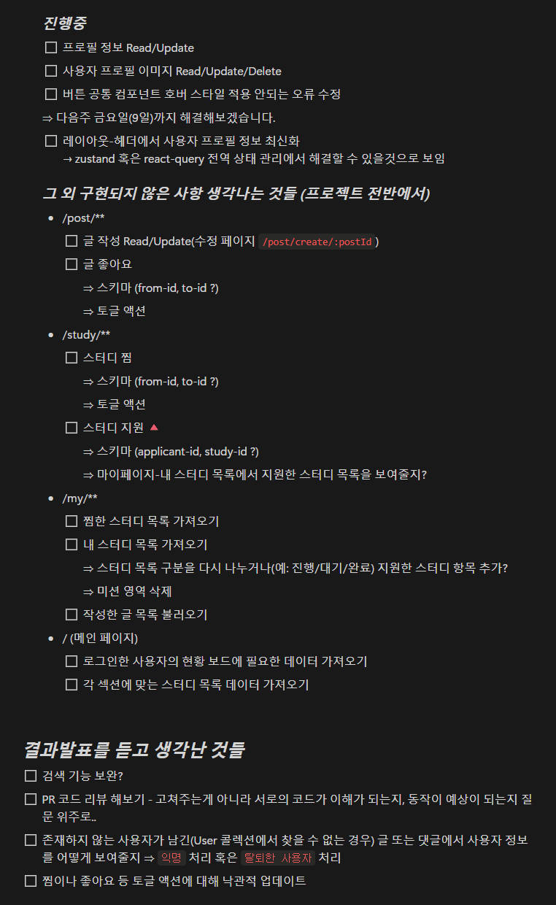

# 10주차

**이번 주 to-do**

- [x] 기능 개발 (w/ mongoose) (~)
- [x] QA & 버그 수정 (~)
- [x] 프로젝트 회고

## Result

### 케밋 프로젝트

이전에도 프로젝트에 대한 설명은 남겼던 것 같긴 하지만 다시 결과물에 대해 설명하자면, 케밋(CHEMEET)은 기존 유데미 큐레이션에서 확장된, 학습자에게 제공하 수 있는 강의에 대한 외부 SaaS형 추가 스터디 서비스로 기획되었다.

기획에 맞는 서비스 개발을 위해 기획과 프로토타입 디자인을 보완했다. 회원가입하여 사용자가 스터디를 개설하거나 참여 신청을 하고, 커뮤니티로서의 역할을 함께 수행하기 위한 커뮤니티 페이지 개발을 진행했다. 또한 사용자의 관심사에 따라 해당 카테고리의 스터디를 우선 추천해 줄 수 있도록 관심 카테고리 목록 등을 설정하고 활동 기록을 확인할 수 있는 페이지를 개발하여 제공할 수 있도록 하고 있다.

- 프로젝트 기간 : 2024.06.17 ~ 2024.08.01 (총 7주)
- 결과물
  - [깃허브 레포지토리](https://github.com/woongteco)
  - [데모 서비스 배포 주소](https://chemeet.vercel.app/)

## What we did this week

사실 이번 주로 프로젝트 기간은 끝났지만 우리 팀의 현재 상황을 보기엔 프론트엔드에서 더미 데이터로만 목록을 보여주고 필터링하고 있는 상황으로 데이터 CRUD가 제대로 동작하지 않는 상태라 완성이라고 하기엔 너무 기능 개발 부분에서 떨어질 수밖에 없는 상태이다.

때문에 팀원 모두가 완성은 해야 하지 않을까에 대해 합의가 되어 앞으로 4주간 더 추가로 개발하여 핵심 기능 개발까지 완료하려고 한다. 이 내용은 아래에서 더 이야기할 예정이니 일단 먼저 이번 주 진행한 내용에 대해 간단하게 정리하려고 한다.

### 주요 기능 보완

프로젝트 완료 후 제출해야 하는 결과 보고서를 미리미리 작성하다 보니 우리 팀이 기능적으로 너무 완료한 부분이 부족하다는 느낌을 지울 수 없었다. 화면을 퍼블리싱하고 컴포넌트를 리팩토링하고 데이터 연결 시도를 하는 과정이 생각보다 너무 늘어지면서 테스트 배포도 이미 진행했지만 기능적인 부분에서 돌아가는 것보다 안 되는 것들이 더 많았고 특히 Desktop-First로 진행한 프로젝트다 보니 모바일로 확인했을 때 어디에서도 완성했다고 말하기엔 부족해 보였다. 그래서 일단 주요 기능들 중 간단히 구현할 수 있는 부분부터 보완을 해나갔다.

**1. 첫 화면 검색창에서 스터디 검색 시 스터디 탐색 페이지로 연결**

가장 먼저 처음 서비스 메인에 접속했을 때 보이는 첫 화면 검색창에서 검색을 했을 때 정상적으로 스터디 탐색 페이지에서 검색어 쿼리와 목표 카테고리들에 맞는 결과를 보여줄 수 있도록 했다.

**2. 회원 가입 후 관심 카테고리 선택 단계 추가와 추천 스터디 가져오기 API 연결 준비**

그다음으로 메인 화면에서 보이는 것은 추천 스터디 목록이다. 이 추천 스터디 목록을 별도의 추천 알고리즘을 사용하지 않고 단순하게 구현하자면, 사용자 프로필에 저장된 관심 카테고리 데이터를 통해 해당 카테고리의 스터디 목록을 가져와 추천할 수 있다.

지금까지는 마이페이지에서 프로필을 수정을 통해서만 사용자가 자신의 관심 카테고리 정보를 저장하고 변경할 수 있었다. 해당 기능과 관심 카테고리를 설정하고 저장된 사용자의 관심 카테고리의 스터디를 우선 추천한다는 사실을 사용자가 더 잘 인지할 수 있도록 먼저 기획되었던 회원 가입 완료 후 관심 카테고리 선택 단계를 거칠 수 있도록 라우트를 추가해 아래와 같은 화면에서 관심 카테고리를 선택할 수 있도록 하였다.

<figure>
  
  <figcaption>이메일로 회원가입을 완료한 후 관심 카테고리를 선택하여 저장할 수 있는 화면. 전체 체크박스 영역을 form 태그로 감싸고 그룹별 카테고리를 선택적으로 렌더 하는 방식이 아닌 css 만으로 hidden/block 처리하여 form을 한 번에 핸들링할 수 있도록 했다.</figcaption>
</figure>

이렇게 저장한 관심 카테고리 정보를 이용하여 홈 화면에서 추천 스터디 목록을 가져올 때 (1) 세션 확인 후 (2) 로그인한 사용자가 (3) 비어있지 않은 관심 카테고리 데이터를 가지고 있을 때, 스터디 목록을 가져오며 해당 카테고리의 스터디 데이터를 우선하여 가져오도록 한다. 이 조건들과 데이터를 조건에 맞도록 가져오도록 하기 위해 어떻게 로직을 작성하고 mongoose API를 어떻게 사용할지에 대해 찾아야만 했다. 현재까지 스터디 목록들이 더미 데이터조차 DB에 적재 되어 있지 않기 때문에 우선 mongoose API 사용 방법을 찾아보며 더미 데이터를 가져오는 비동기 액션이 동작하도록 조치해놨다.

**3. 커뮤니티 글 작성 시 연관 스터디 링크 작성을 돕기 위한 셀렉트 박스 컴포넌트 추가**

커뮤니티 글을 작성할 때, 연관된 스터디 링크를 추가하기 위해 url text 값을 입력할 수 있는 input 컴포넌트가 form에 포함되어 있는 상태였다. 그저 글을 쓰다가 anchor tag로 링크를 연결하는 것이 아니라 동일 서비스 내 연관 스터디 상세 페이지로만 연결되는 항목이기 때문에 url에 오타가 생기거나, url이 아닌 값을 입력하면 존재하는 스터디 링크인지 혹은 유효한 url 형식인지 유효성 검사를 진행하며 확인해야 했다.

이러한 단계보다는 작성하는 과정에서 존재하는 스터디인지 확인하고 실제 url의 값을 사용자가 신경 쓰지 않고 연관 스터디를 검색하고 그 결과에서 스터디를 선택하여 실제 url이 존재하는지는 작성자가 신경 쓸 필요가 없게 하고 싶었다.

현재 프로젝트에서는 통일된 form input 요소를 만들며 react-select 라이브러리를 사용하여 Select 컴포넌트의 틀을 만들고 있기 때문에 react-select 문서에 있는 예시들을 기반으로 전체 스터디 목록 데이터를 가져와 option 형식에 맞게 url value와 label 속성을 추가하여 Select 컴포넌트에 전달하고 해당 Select 컴포넌트는 options로 전달받은 데이터를 가지고 option 목록에서 스터디 썸네일과 개설자를 함께 확인할 수 있도록 했다.

현재는 이미지와 같이 label 값으로 스터디의 제목 텍스트만을 갖기 때문에 스터디 제목으로만 검색할 수 있는 상태이다.

결과적으로는 기간 내 우리 팀은 프로젝트 완성을 하지는 못했다. 그도 그럴게 기능들도 구현되지 않은 서비스라니 아무리 배운다는 마음으로 진행했다고 해도 너무 완성도가 떨어지지 않나 생각이 든다. 프로젝트 초반에 예측하지 못했던 팀원의 이탈과(...) 사고와, 예상보다 이러한 서비스나 소프트웨어 개발 전반에 대한 이해가 낮았던 부분들이 프로젝트 진행을 더디게 만들었다고 생각한다. 개발 기술과 팀 작업 전반에 대해 경험들이 많지 않다 보니 어쩔 수 없는 결과라고 생각하지만 나를 포함한 팀원들 모두가 아쉬움이 남기 때문에 결국 팀 내부에서 자체적으로 연장하여 1차적으로 세웠던 서비스 기능 목표를 완성하기로 했다.

## What we have done and have to do

|       | 목표                                                                                                   | 완료도     |
| ----- | ------------------------------------------------------------------------------------------------------ | ---------- |
| 1주차 | 기획안&프로토타입 보충, 개발환경 세팅                                                                  | ✅✅✅🔲🔲 |
| 2주차 | 과업 범위 정하기, 역할 분담, 마일스톤 추가, 공통 컴포넌트&라우트 정리, 페이지 마크업                   | ✅✅✅✅🔲 |
| 3주차 | 공통 컴포넌트 개발, 페이지 마크업&스타일링, 데이터 스키마 타입과 ERD 이해, 리팩토링 및 merge 충돌 해결 | ✅✅✅✅   |
| 4주차 | 공통 컴포넌트 개발 및 리팩토링, 반응형 추가, MongoDB 구성 및 연결(+Auth.js 적용), 기능 로직 구현       | ✅✅🔲🔲   |
| 5주차 | 1차 테스트 배포, UI 이슈 수정 및 리팩토링, 반응형 추가, API 정의 문서화, 기능 구현                     | ✅✅✅✅🔲 |
| 6주차 | 데이터 스키마 정의, 기능 개발, 배포, QA/리팩토링                                                       | ✅✅✅🔲   |
| 7주차 | **기능 개발 및 QA, 프로젝트 회고**                                                                     | ✅✅🔲     |

---

# 성과 발표회 후기

성과 발표회는 마곡역 근처에 있는 서울창업허브 M+의 커뮤니티홀에서 발표를 진행했고, 오프라인으로 참석했다. 참여 기업당 2팀씩, 총 6팀의 발표를 각 팀 당 20분의 발표와 10분 이내의 질의응답 시간을 가졌다. 발표 앞뒤로 간단한 설명과 우수팀 및 우수 수료생 시상까지 진행하니 예정되어 있던 것보다 조금은 빨리 끝나서 5시 반쯤에 마무리되었다. (그래서 다행히 퇴근 시간 전의 널널한 지하철을 타고 집에 돌아왔다ㅎ)

사실 처음 성과 발표회 시간이 오후 1시부터 6시인 것을 보고는 왕복 3시간 이동 시간에 발표를 듣자고 5시간을 더 앉아있을 생각을 하니 심각한 집순이 특성상 가기 싫었던 것은 사실이다. 앉아서 발표를 듣다 보니 발표회 공간 내에서는 취식도 불가능해 1층 편의점에서 간식이나 좀 사 먹은 게 다였기 때문에 배도 고팠다. 그래도 다른 팀들의 발표 내용을 듣고 멘토님들이 하는 질문들을 듣다 보니 그 자체에서 공부가 더 되는 느낌이라 생각보다 알찬 시간이었다. 그리고 그 기억이 더 흐릿해지기 전에 후기로 감상을 적어보려고 한다.

아, 후기를 작성하면서 발표나 질문 내용을 하나하나 적을 생각은 애초에 없다. 내가 진행한 프로젝트 내용도 아니고... 사실 조심스럽다. 읽는다면 감상으로만 읽어주길 하는 바람이다.

## 발표팀들의 결과 발표

기본적으로 발표 자료에 포함시켜야 했던 내용이 어느 정도 정해져있었기 때문에 목차는 발표 팀들 모두 큰 차이는 없었지만 시연 과정이나 진행 과정과 결과물에 대해 설명하는 방법들이 조금씩 달라 흥미로웠다. 그리고 확실히 현업 경력이 있는 분들이 함께했던 팀들은 결과 지표 등에서 조금씩 차이가 느껴졌다.

참가자들의 학습이나 업무 경력들이 다양해서 사전직무 교육에서부터 팀 사이와 각 팀의 팀원들 사이의 프로젝트 이해도 차이들이 느껴지긴 했지만 그 차이가 서로에게서 배울 점을 만들기 때문에 꼭 나쁘게 느껴지지만은 않아서 신기했다. 이전까지는 너무 차이가 나는 팀원들끼리 업무 분장이나 수행 속도에서 삐걱거리는 기분을 더 많이 느껴서인지 몰라도 적어도 나에게 새로운 발견이었다.

그리고 발표 팀들은 너무 바빠도, 적어도 일주일에 한번은 회의를 했다는 공통점 아닌 공통점이 느껴졌다. 우리 팀은 아무리 문서랑 이슈를 정리해놔도 일주일에 한 번씩 진행했던 멘토링 날에만 서로의 코드나 문서를 확인했다는 점이 다시 한번 현재 프로젝트 상황을 이해하게 한다. 그리고 왜 더 적극적으로 진행 상황을 물어가며 조율하지 못했을까 반성하게 한다.

프로젝트 과정에서 코드 리뷰를 진행하고 실제 구글과 네이버 검색 콘솔에 등록한 팀도 있었는데, 역시나 1등이었다. 솔직히 만장일치 아니었을까? 자리에 앉아 발표를 듣던 사람들도 놀랐는데 멘토님들도 놀랄 수밖에 없었다고 생각한다. (아무리 실무 프로젝트 경험을 위해 진행했다지만... 이런 학습의 성격이 강한 프로젝트에서 누가 비즈니스 모델까지 생각해 올것이라 예상했을까) 이런 팀의 발표를 듣고 나니 우리 팀도 충분히 코드 리뷰(수정 사항을 서로 찾아주진 못하고 질문만 한다고 하더라도)를 통해 서로의 코드를 더 잘 이해하고 나아가 서비스 전체에 대한 이해도 높아질 수 있지 않을까 하는 생각이 들었다.

## 다른 팀들의 깃허브 코드들

그리고 발표 전날, 운영팀 노션의 팀 소개 테이블에 각 팀들의 배포 깃허브 주소를 입력받아 모든 팀들의 실제 프로젝트를 진행하고 배포하고 있는 레포지토리를 확인할 수 있었다. 레포지토리에서 코드만이 아니라 아키텍처에 따라 어떻게 레포지토리를 나눴는지, 이슈 대응이나 협업 시 어떻게 진행되었는지를 함께 볼 수 있어서 좋았다.

같은 기업 프로젝트를 수행한 팀들은 같은 프로젝트이기 때문에, 다른 프로젝트를 수행한 팀들도 Next.js와 MongoDB라는 공통적으로 배우고 활용하는 기술들이 있어 해결했던 문제 상황들, 해결 방법들이 레포지토리에 고스란히 남아있다는 점에서 레포지토리 자체가 공부할 수 있는 자료들이 되었다.

다른 팀들의 발표를 듣고 코드를 포함한 결과물을 보니 다른 수료생분들의 블로그 기록도 궁금해져서 찾아보기까지 했다. 다른 팀들의 결과물이다 보니 내가 멋대로 여기에 링크를 거는 것도 조심스러워 따로 남기진 않을 것이지만 적어도 나처럼 한창 프론트엔드 개발자로서 공부하고 있는 신입 혹은 주니어 레벨의 학습자라면 다른 팀들의 존재 자체가 결국 스스로에게 공부가 될 것이라고 말할 수 있겠다.

## 평가 과정 중의 질문에서 얻은 것들

비록 내가 받은 질문들은 아니었지만 평가를 진행해 주신 멘토 분들이 하는 질문들은 꼭 자유로운 면접장 같은 느낌이 들었다. 근데 '자유로운' 면접장이라는 건 내가 발표하고 받은 질문이 아니어서 붙힌 표현이라... 팀원들의 부상과 질병을 기뻐해선 안되겠지만 다시 한번 우리 팀이 발표할 상황이 아니라는 점이 다행이었다ㅎㅎ 동시에 나처럼 팀에서 혼자만 발표장에 와서 심지어 발표를 진행하고 질문에 대해 답까지 차분하게 완료하신 분이 계속 생각나는데 대단했다고 밖에 할 말이 없다.

그리고 면접 상황에서 듣게 될 법한 질문들이지만 좀 더 발표팀들의 어깨가 (개인적은 감상으로) 그나마 덜 무거워 보였던 것은 프로젝트 진행에 대한 팀 평가이기 때문에 면접 상황에서 흔하게 느껴지는 개발자 본인 역량에 대한 꼬리 질문들이 그렇게까지 이어지지 않았기 때문이다. 팀 평가이기 때문인지 확실히 팀 프로젝트 진행에 있어 해결한 개발 내·외부적 문제들에 대한 대응 과정을 묻는 질문이 많게 느껴졌다.

팀 중심의 질문이라도 결국 나 또한 팀 프로젝트를 진행한 것이기 때문에 질문만이 아니라 발표팀들이 질문에 답하는 내용들 역시 잘 메모해두었다. 다 적을 수는 없지만 가장 많이 나왔던 질문들을 크게 정리해 보자면 아래와 같이 목록을 만들 수 있겠다.

- 팀 협업 과정에서의 문제 해결
- 개발 과정에서의 기술적인 어려움들과 문제 해결
- 사용한 기술에 대한 설명과 사용 이유, 활용 방법, 효과에 대해
- 그 외 발표 내용에서 이어지는 좀 더 자세한 설명

## 우리 팀 자체 평가

발표와 평과 과정에서 멘토 분들이 해주시는 질문을 통해 우리 팀이 과연 잘 해왔던 것인가에 대한 평가도 스스로 내려볼 수 있었다.

중간발표가 끝나고서도 멘토님이 말씀하시는 충분히 잘했다고 하는 말을 사실 그대로 받아들이기에는 어려웠다. 물론 나 역시 현업 경력이 있다고는 하지만 다른 팀에 이미 스타트업에서 2-3년간 일한 경력이 있는 분들이 참여 중이라는 것을 알고 있었고 심지어 프론트엔드 관련 경력만이 아니라 모바일 기반이나 백엔드 개발 경험이 있다는 점들이 우리 팀의 상황을 긍정적으로 보기 어렵게 했다. 심지어 같은 기업 프로젝트를 진행하여 중간 점검 때 발표해 주었던 다른 팀들의 내용을 보니 우리 팀은 기능 개발 면에서 너무 부족해 보였다. 그래도 각 기업 프로젝트에서 발표팀으로 선정되어 결과를 공유하고 있는 내용을 듣고 나니 우리 팀에 대해서도 긍정적인 상황을 찾을 수 있게 되었다.

부족한 면은 이미 위에서 많이 이야기했으니 긍정적인 평가를 조금 더 해보자면,

1. 일단 깃허브 레포지토리에서 README에 프로젝트를 정리한 팀이 우리 팀을 제외하면 3팀 정도밖에 없다는 점이다. 총 13팀 중에 네 팀, 그중에 한 팀은 프로젝트 README가 아닌 Overview에서 볼 수 있는 조직(Organization) 소개 대문에만 프로젝트 설명을 해놓았다. 이렇게 나름 꼼꼼하게 기록해 놓은 점은 아무래도 잘 하고 있다는 느낌이 든다.
2. 특별히 완성도가 높은 몇몇의 팀들을 제외하고는 구현 수준에서는 현재 우리 팀 개발 상황과 비교했을 때 크게 차이가 난다는 느낌은 받지 못했다. 애초에 각각의 기획들이 요구하는 구현 능력들이 크게 차이 나지도 않았겠지만... 멘토님이 말해주었던 아슬아슬하게 발표팀이 되지 못했다고 생각한다는 부분이 어떤 의미인지 살짝 알 것 같기도 하다. (물론 완성도 측면 때문에 다른 팀들이 발표팀이 된 것이 여전히 다행이라고 생각한다)

너무 내가 진행한 프로젝트라 이 정도 밖에 긍정적으로 보지 못하는 것이 아닌가 하는 생각은 항상 하지만... 그래도 성과 발표가 좀 더 우리 팀의 프로젝트에 대해 나를 포함한 팀원들이 긍적적으로 바라보고 다시 의지를 잡기에 충분한 자극이 되었다.

그리고... 우수 수료생 셋 중에 내가 뽑히게 되었다! 나보다 더 열심히 프로젝트를 수행하고 적극적으로 교육에 참여한 사람들도 많다고 생각했기 때문에 정말 당황스럽고 집에 올 때까지도 어리둥절했지만(ㅎㅎㅎ) 어느 한 참여 기업들에 몰리지 않도록 균형을 고려한 느낌도 약간 들고, 미래의 나를 위해 성실하게 기록하고 개발했던 10주가 좋은 평가를 받은 것 같아 감사하다.

# 프로젝트 후기

## 프로젝트 진행에서 얻은 것

### 계획 회고 with KPT

프로젝트 초반에 세웠던 마일스톤이 진행하면 조금씩 바뀌기도 했지만 세워뒀던 계획을 기준으로 성취 여부와 KPT(Keep-Problem-Try)로 프로젝트 진행을 통해 무엇을 얻었고 무엇이 부족했는지 정리해 보려고 한다.

- (표시 기준)
  - 성취했으면 🟢
  - 성취하지 못했으면 🔴
  - 성취했다기에도 애매하고, 못했다기에도 애매하다면 🟡

  
<em>참고 템플릿</em>

- [계획 회고 템플릿 (feat. KPT 방식) in Notion](https://successful-gauge-e26.notion.site/feat-KPT-87abc0e465bf49a397b9d40ca52c2bc7)

🟢 Keep

- [협업] 이슈 기록, 위키 작성, README 관리와 같이 개발 내용 기록과 공유
- [설계] 서비스에 필요한 ERD 설계 및 스키마 구현
- [구현] Next.js 앱 라우트를 통한 라우터와 접근 권한 관리

🟢 Problem

- [협업] 팀원들 서로의 진행 상황을 파악하고 함께 프로젝트 전체 목표에 따른 단계별 태스크 관리 필요
- [설계] 전체 서비스 기능에 필요하지만 추가 구현이 필요한 스키마 존재 및 스키마 설계 내용 공유 부재
- [구현] 사용자 경험 상 로그인하지 않은 사용자의 경우 스터디/커뮤니티 글 작성 페이지에 아예 접근할 수 없는 것이 아니라 로그인 화면으로 redirect 하여 로그인 유도

🟢 Try

- [협업] 팀원 각자의 진행 상황과 서로의 질문을 함께 해결하는 시간 지속적, 주기적으로 갖기
- [설계] 기본 서비스 기능 구현을 위한 스키마 설계 및 공유
- [구현] Next.js의 intercepting route를 이용하여 사용자 경험을 고려한 서비스 기능 보완
- [구현] 미들웨어를 통한 쿠키 기반 접근 제한 구현

🔴 Keep

- [협업] 배포 버전 및 개발 과정에서 발생한 이슈 기록

🔴 Problem

- [협업] 이슈 기반 태스크 관리, PR 시 서로의 코드 확인과 리뷰 부재
- [구현] 동적 메타태그 설정으로 SEO 고려 부재
- [최적화] Lighthouse 등을 기반으로 성능 측정과 최적화 부재

🔴 Try

- [협업] 좀 더 적극적인 기능 정의, 테스트를 위한 테스트 케이스 혹은 경계 조건 공유 후 QA 진행과 결과 공유
- [구현] SEO를 고려한 정적·동적 메타태그 설정
- [최적화] Lighthouse 등을 기반으로 성능 측정과 최적화로 사용자 경험 개선 필요

🟡 Keep

- [구현] Desktop-First로 모바일 반응형 시도
- [구현] mongoose와 form submit을 통한 데이터 DRUD

🟡 Problem

- [구현] 관련 디자인과 프로토타입 부재로 모바일 반응형 계획 미정
- [구현] mongoose와 form submit을 통한 데이터 DRUD 과정에서 발생하는 불필요할 수 있는 클라이언트 컴포넌트 사용 발생

🟡 Try

- [구현] 1차 기능 구현 목표 완료 후 모바일 환경을 고려한 반응형 추가
- [구현] Next.js route.ts를 활용한 서버 form 컴포넌트에서의 form action을 통한 데이터 CRUD 구현

### 멘토링을 통해 얻은 것

결과 보고서에 프로젝트 기간 내내 멘토님에게 받았던 피드백을 정리했더니 A4 두 페이지를 거의 채웠다. 나도 현업 경력이 있지만 해보지 못했던 팀 프로젝트로 할 수 있는 협업을 해보고 싶었고 다른 팀원들은 실무가 아닌 팀 프로젝트 경험도 얼마 없다 보니 멘토님께 협업 초기 단계부터 개발자로서 취업을 하고 일을 하면서 직업인으로서의 일할 때 가져야 할 태도까지 정말 폭넓게 조언을 해주셨다. 심지어 마지막 주의 멘토링 내용은 앞의 멘토링 내용과 겹치는 부분들도 많아 추가하지도 않은 상태다. 다른 팀의 멘토님들도 마찬가지겠지만, 정말 적극적이고 정성스럽게 팀의 상황을 보고 가이드를 해주셨고 멘토님 덕분에 팀 프로젝트 초보인 세명이 이 정도까지 팀 프로젝트를 수행할 수 있었다고 생각한다.

생각해 보니 이전에 처음 개발 공부를 할 때도, 일을 하면서도 이렇게 멘토링을 받아본 적이 처음이다. 동시에 이렇게 누군가에게 도움을 받은 것이 대학교 입시 이후 너무 오랜만이다. 물론 이전에도 질문할 기회는 있었을 것이고 이번 멘토링에서도 질문을 많이 한 편은 아닌 것 같지만, 그리고 여전히 무엇을 질문해야 할지 정리가 잘 안되고 질문하는 것이 어렵지만, 좀 더 조언을 얻어볼 수 있다면 질문해야겠다고 생각하게 된다.

## 그 외 느낀점

이 부분은 혹시나 친구나 지인이 참여하고 싶어 한다면 말해주고 싶은 점들을 적어보려고 하는데, 혹시나 관계없다고 느낀다면 다음 마무리 부분(Longed for)으로 넘어가도 상관없다고 미리 말해주고 싶다.

사전 직무 교육 일정이 있고, 웹 개발에 필요한 기본적인 자바스크립트를 알려주기도 하지만 정말 이 프로그램을 통해 개발을 처음 배운다면 사실 좀 말리고 싶다. 코스 홍보 페이지와 면접 아닌 면접 같은 사전 온라인 미팅에서까지 계속 안내를 했지만 개발을 처음 접할수록 감도 오지 않을 것이기 때문에 더더욱 미리 말하고 싶다.

개발을 해본 경험이 있고 이미 사용해본 기술 스택을 사용하여 참여한다고 해도 참여자 간에 실력 차이가 나겠지만, 결국 본인의 능력을 얼만큼 정확도 높게 파악하고 계획할 수 있는지의 문제가 발생한다. 멘토님이 해 준 말을 빌려오자면, 신입일수록 본인의 능력을 낙관적으로 예측할 수밖에 없고 완료 수행의 기준이 외부에 설득되기 위해서는 단순 구현이 아닌 실행에 있어야 하기 때문에 이러한 신입 개발자의 경우 본인이 생각하는 기간의 3배를 잡아야 한다고 한다. 솔직한 마음으로는 3배도 촉박할 수 있다는 점 꼭 미리 알고 시작하길 바란다. 그리고 시작하기 전에 이러한 프로그램을 준비한다면 이론 공부만 하지 말고 유튜브같이 공개되어 있는 무료 클론 코딩 강의라도 끝까지 따라 해 봤으면 좋겠다. 결국 뭘 모를수록 쌓여 있는 데이터가 없기 때문에 직접 해 봐야만 자신의 능력을 좀 더 근사치로 예상할 수 있다. 이걸 예상할 수 있어야 교육 과정과 프로젝트 과정에서 공부에 치여 지칠 수 있을지 예상할 수 있을 것이라고 생각한다.

그리고 주의가 필요한 점이 있다면, 개인과 프로젝트 팀에게 지원금 지급이 이루어지는 지원 사업이다 보니 팀 운영비의 경우 시작 전엔 지출품의서와 계획서, 완료 후엔 지출 결과서와 증빙을 위한 보고서 작성이 필수인 점을 미리 알려주고 싶을 정도이다. 그리고 이러한 서류 작성 시간을 최대한 줄이고 이 시간을 포함하여 목표 계획을 짜야 한다는 점 역시 알려주고 싶다.

사실 고용노동부에서 사업이 나왔고 주관사와 운영사가 담당해서 진행되는 과정에서 서류 작성 내용이나 정도는 충분히 예상 가능한 범위였지만, 팀 운영비가 평균 팀원 수에 맞춰 지급될 뿐만 아니라 사용처가 정해져 있고 대부분 오프라인에서 만나야지만 사용할 수 있는 부분이다. 그런데 프로젝트 진행 중간에 사용 지침을 바꾸고 늦게 고지를 하는 만행의 시발점이 정확히 어디인지 파헤칠 수는 없었으나... 공식적으로 팀원 중 한 사람이 담당하여 서류를 작성하고 운영비 관리를 하는 상황에서 한창 프로젝트를 진행하던 중에 운영비 사용 항목 중에 지양을 하라고 내려오면 가뜩이나 팀원 모두가 다 다른 지역에 거주하고 있는 우리 팀 특성상 오프라인으로 얼굴 보기가 더 어려워 아쉬웠다. 우리 팀의 담당자도 사실 서류 작성이 어색해 보였는데, 개발 시간을 좀 더 확보하기 위해선 최대한 작성할 수 있는 부분들은 함께 작성하며 해결할 수밖에 없었다. 자연스럽게 서류 제출 기간이 오면 운영팀과 관련 일로 연락이 잦을수 밖에 없고 운영팀도 바빠 보였다. (점점 갈수록 하나하나 수정 요청이 아니라 자잘한 부분들은 수정해서 알려주더라ㅎ) 그리고 서류 작성에 시간이 오래 걸릴 것 같다는 이유로 우리 팀뿐만 아니라 다른 팀들도 프로젝트 진행 중에 비용 처리할 수 있는 부분을 자비로 사용하고 있었다. 물론 내가 듣기에도 운전 한 번 하고 서류 7장은 너무 많은 것 같았지만... 문단이 길어지니 일단 여기까지만 하겠다.

사실 이러한 서류 일을 아예 안 해볼 수는 없겠지만 팀 내에 해본 사람이 없다면 다른 팀들도 충분히 어렵고 개발할 시간도 모자란 상황에 시간을 많이 잡아먹을 수밖에 없겠다는 생각이 들었다. 실무에서도 회사 규모와 관계없이 비슷한 상황을 충분히 겪을 수 있을 것이다. 그리고 개인적으로 이러한 부분이 팀 내 개발 일정이 늘어졌던 이유에 한몫했다고 생각하는데, 퇴사하고 이런 프로그램에 오랜만에 참여하다 보니 충분히 고려하지 못해 일어난 문제였다.

## 앞으로의 계획 (Longed for)

기억이 휘발되기 전에 기록을 한 번에 남기려고 하니 회고도 하고 후기도 작성하고... 글이 많이 길어졌다. 마지막 주차 회고를 적으면서도 이미 언급했지만 팀원들끼리 이대로는 아쉬워서 8월 한 달 동안 주요 기능 개발과 배포까지 완료해 보기로 했다. 그리고 7주간 아쉬웠던 만큼 한 달 동안은 주중에 30분씩 데일리 스크럼을 진행하기로 했다.

주요 기능 개발 완료를 위해 진행 중이던 업무와 앞으로 해야 할 업무들, 다른 좋은 예시(팀)들을 보며 우리도 도입해 보면 좋을 만한 것들을 모으고 위 이미지는 노션에 정리한 해당 내용의 일부인데, 세세하게 적다 보니 할 일이 많게 느껴지기도 하지만 이번에야말로 목표 달성을 위한 단계별 계획을 잘 세우고 진행해야겠다는 생각이다.

---

본 후기는 본 후기는 [유데미x스나이퍼팩토리] 프로젝트 캠프 : Next.js 1기 과정(B-log) 리뷰로 작성 되었습니다.

#유데미 #udemy #웅진씽크빅 #스나이퍼팩토리 #인사이드아웃 #미래내일일경험 #프로젝트캠프 #부트캠프 #Next.js #프론트엔드개발자양성과정 #개발자교육과정
