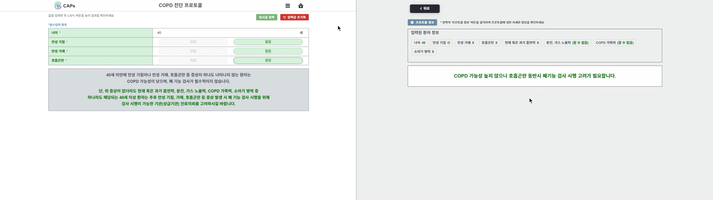

진료 의사 결정 지원 시스템(CDSS) 연구과제를 위한 실증 현황 모니터링 대시보드 화면 개발과, 만성질환자의 1·2차 병원 진료를 위한 의사 결정 지원 시스템(CDSS) 플랫폼 프론트엔드 개발 및 운영.

## 팀 프로젝트

팀원 : 프론트엔드 개발자 1인 (총 2인) + 백엔드 개발자 1인 (총 3인)

## 사용 기술

|         part         |               skills               |
| :------------------: | :--------------------------------: |
|      프론트엔드      | HTML, CSS, jQuery Ajax, JavaScript |
| 백엔드 API 유지 보수 |            C#, MySql, REST API            |
|    프로젝트 관리     |          Azure Git, Excel          |

## 주요 성과

- 재사용성을 고려한 반응형 웹 페이지 리뉴얼 개발 및 HTML class를 이용하여 CSS 요소별 컴포넌트화
    - 하나의 파일에 모두 작성되어 있던 기존의 데모 페이지를 각각의 html, css, js 파일로 분리
    - 레이아웃 영역과 자주 사용되는 요소들의 html 클래스명을 구분하여 각각의 스타일 작성 후 공통 스타일 적용 후 상세 스타일 적용
-	프로젝트 기간 중 일부 기간 API 송•수신 유지 보수 및 데모 서비스 운영
    - API 응답 결과 오류와 비즈니스 로직 수정으로 인하여 약 3개월간 API 응답 일부를 위한 컨트롤러 및 SQL 문, 그에 따른 뷰(HTML, jQuery Ajax, CSS) 유지•보수 진행 및 데모 서비스 변경 사항 반영
- 기존의 파일 공유 시스템에서 협업 시스템 개선을 통해 팀 백엔드 개발자와 작업 영역을 프로젝트 디렉토리 내에서 구분하여 개발 진행. 코드 공유 과정에서 걸리는 시간과 시행착오를 90% 이상 감소시킴
  (10분 이상 → 1분 미만)

---

<figure>
  
  <figcaption>데모 화면 예시</figcaption>
</figure>
