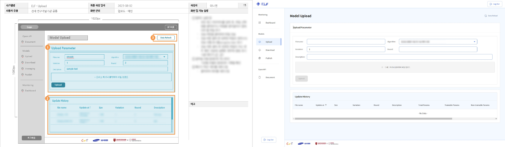

응급실에서 활용 가능한 모델 개발을 위해 React를 이용하여 연합 학습 플랫폼의 프론트엔드 개발 진행.

## 팀 프로젝트

팀원 : 프론트엔드 개발자 1인 + 백엔드 개발자 1인

## 사용 기술

|         part          |                     skills                     |
| :-------------------: | :--------------------------------------------: |
|      프론트엔드       |     React, RTK Query, React-Router v6, MUI     |
|   로컬 테스트 진행    | msw, Storybook (UI 테스트), Flask (API 테스트) |
| 프로젝트 설계 및 관리 |       Figma, PowerPoint, Excel, OneDrive       |
|   API 설계 및 통신    |                    REST API                    |

## 주요 성과

- 내부 요구사항 정의 후 기능별 화면 설계 진행 후 React를 이용한 연합 학습 과제 진행에 필요한 모니터링 및 연합 학습을 위한 웹 서비스 프론트엔드 개발
- Python Flask와 React 웹 애플리케이션에서의 파일 전송 관련 REST API 요청 테스트

---

<figure>
  
  <figcaption>설계 내용과 데모 화면 비교</figcaption>
</figure>
