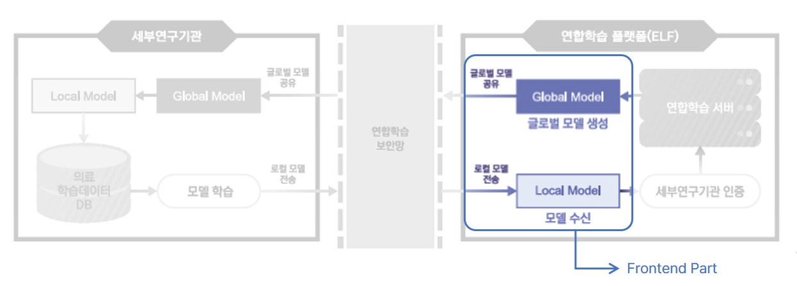
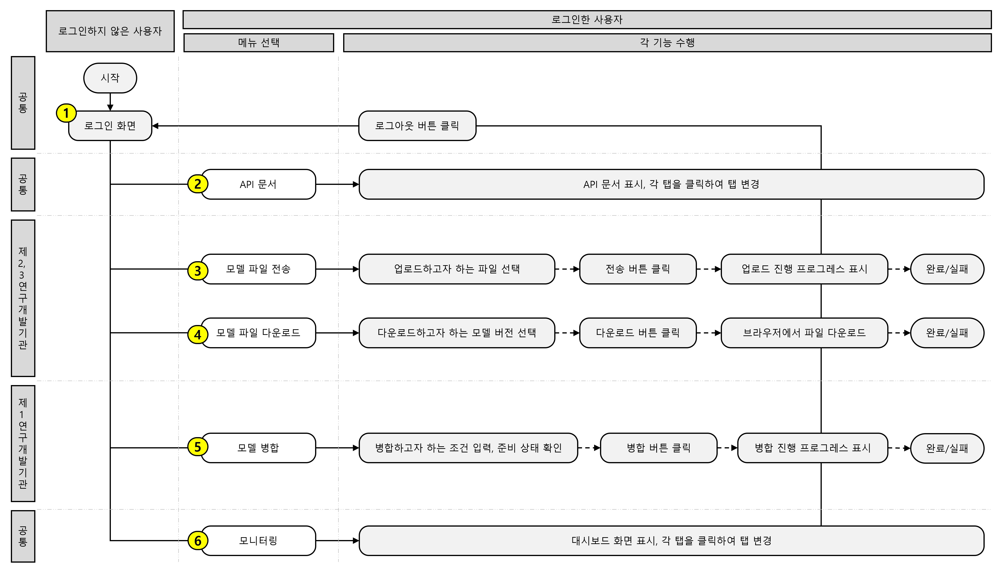
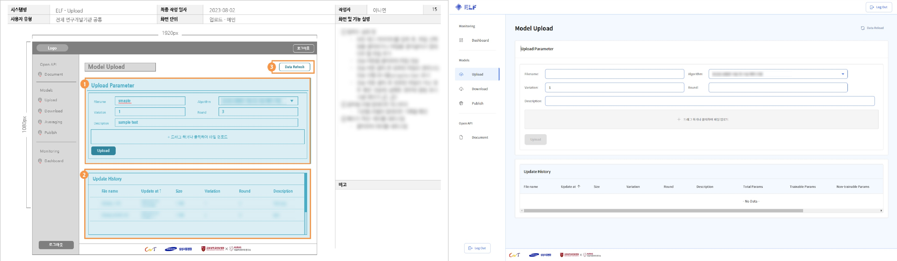

## 프로젝트 설명

응급실에서 활용 가능한 모델 개발을 위해 React를 이용하여 연합 학습 플랫폼의 프론트엔드 개발 진행.

- 팀원 : 프론트엔드 개발자 1인 + 백엔드 개발자 1인

<figure>
  
  <figcaption>참여 파트 - '연합학습 플랫폼(ELF)'의 프론트엔드 개발</figcaption>
</figure>

### 사용 기술 및 환경

|         part          |                     skills                     |
| :-------------------: | :--------------------------------------------: |
|      프론트엔드       |     React, RTK Query, React-Router v6, MUI     |
|   로컬 테스트 진행    | msw, Storybook (UI 테스트), Flask (API 테스트) |
|   API 설계 및 통신    |         REST API (XMLHttpRequest API)         |
| 프로젝트 설계 및 관리 |       Figma, PowerPoint, Excel, OneDrive       |

## 주요 개발 내용

<figure>
  
  <figcaption>사용자 흐름도 참고</figcaption>
</figure>

1. 과제 진행 간계별 내부 요구 사항 정의 후, React를 활용하여 사용자 인터페이스 구현
    - 초기 백엔드 개발자와 함께 요구 사항과 기능 리스트 정리. 이후 사용자 흐름도와 그에 따른 화면 설계서 작성
    - 과제 진행 단계에 따라 요구 사항 변경에 따른 문서 업데이트 및 요구 사항에 맞는 인터페이스와 기능 반영
2. Python Flask를 이용한 API 요청 테스트 수행 후 기능 구현
    - Flask와 React 웹 사이 파일 업로드 및 다운로드 과정 이해를 위한 로컬 테스트 진행
    - 테스트 선행 후 팀 내 백엔드 개발자와 관련 요청 API 정의
3. React Router와 RTK Query를 이용하여 사용자 접근 관리 및 상태 관리
    - 데이터 통신과 상태 관리를 위해 Redux 도입. RTK Query 캐싱 활용을 통해 실시간으로 적용되는 모델 목록 관리
4. Storybook을 통한 UI 테스트와 MUI를 이용한 컴포넌트 기반 UI 개발
    - CSS_in_JS 형식을 적용하여 styled 컴포넌트와 애플리케이션 로직을 함께 페이지 컴포넌트와 분리하여 관리
    - 화면 설계 내용 등의 이해도를 높이고 UI 컴포넌트별 테스트를 위해 Storybook, msw 활용. 컴포넌트 단위의 테스트와 MUI 테마 커스터마이징으로 컴포넌트 개발과 리팩토링 진행

<figure>
  
  <figcaption>설계 내용과 데모 화면 비교</figcaption>
</figure>
