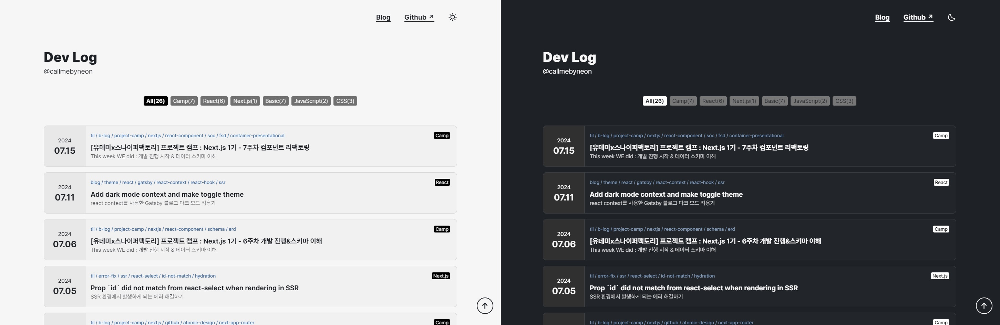

기존 velog에서 작성했던 블로그 글을 이전하고 포트폴리오 겸 프로젝트 내용 정리를 위한 github 페이지를
만들기 위해 Gatsby를 이용하여 React 컴포넌트와 GraphQL, Gatsby-Source-Filesystem 플러그인을 이용하여 정적 웹 사이트 생성 및 블로그 내용 배포. 이후 사용자 지정 테마에 따라 초기 접속 시 다크 모드 테마 활성화 여부와 테마 변경 토글 기능 추가.

## 개인 프로젝트

## 사용 기술

|         part          |                              skills                              |
| :-------------------: | :--------------------------------------------------------------: |
|  게시글 관리 및 빌드  | Gatsby SSR, Gatsby-Source-Filesystem, GraphQL, Markdown file(md) |
| 컴포넌트 및 상태 관리 |    React, React Context, Web Storage API(window.localStorage)    |

## 개발 내용

- Gatsby와 GraphQL을 이용하여 github 블로그 개발, gh-pages를 통해 배포 및 오류 해결
- React Context를 이용하여 prefers-color-scheme을 고려하여 초기의 다크/라이트 테마 적용 및 토글

## 트러블슈팅 기록

### gh-pages 배포 오류

- gh-pages 빌드 실패로 배포 오류 수정 후 배포 재시도
- \[**Trouble**\] 문법 충돌(Liquid syntax error)로 수정 후에도 동일한 파일, 라인에서의 에러로 빌드 실패
- \[**Resolve**\] main 브랜치에서 이미 빌드 되었던 문제 파일과 폴더 삭제 후 재배포 확인

- (관련 링크)
  - Github issue : https://github.com/callmebyneon/callmebyneon.github.io/issues/26

### twemoji svg 이미지 파싱 오류

- Twemoji 라이브러리를 이용하여 이모지 svg 이미지 파싱 오류
- \[**Trouble**\] 글 목록 아이템 호버 시 노출되는 twemoji svg 이미지가 보이지 않는 상황 확인
- \[**Resolve**\] 파싱 메서드 옵션에서 base url을 임시로 변경. 다른 방법을 이용하여 아이콘을 출력하도록 방안 탐구 필요

- (관련 링크)
  - Github issue : https://github.com/callmebyneon/callmebyneon.github.io/issues/27

---

<figure>
  
  <figcaption>테마에 따른 홈 화면 비교</figcaption>
</figure>
