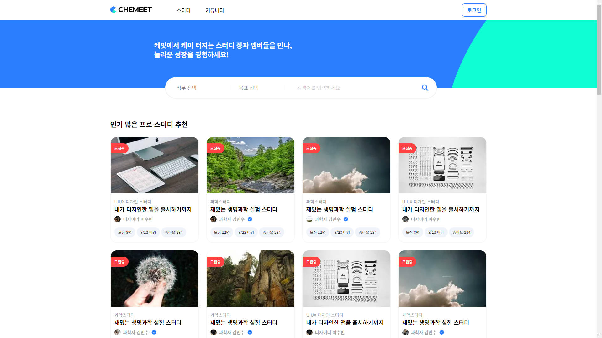
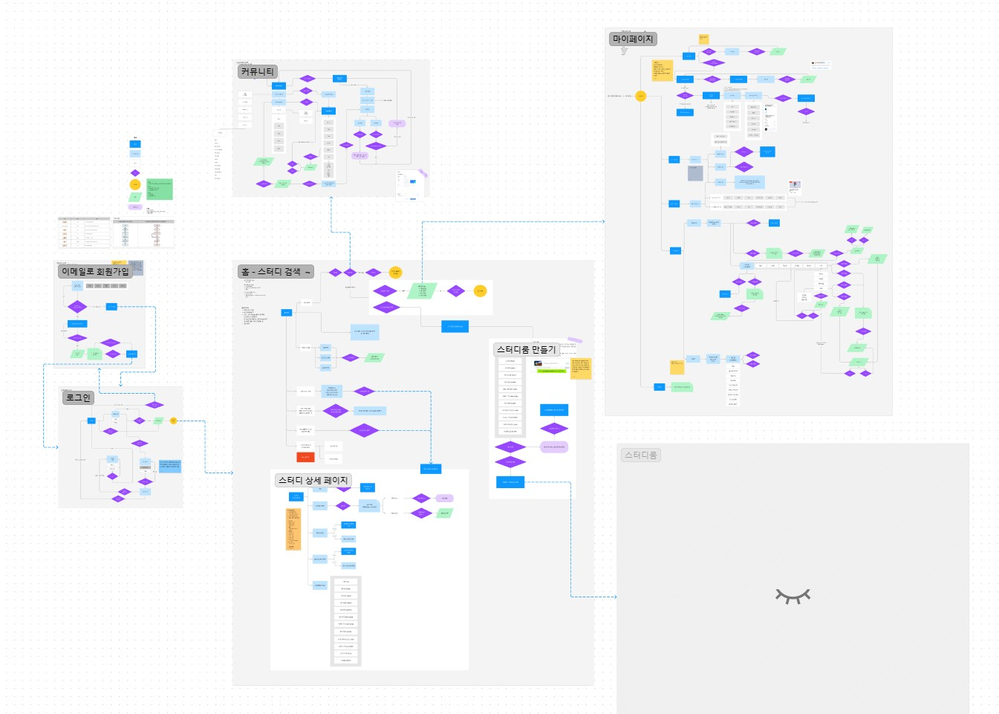

기존 유데미 큐레이션([https://udemy.wjtb.co.kr/](https://udemy.wjtb.co.kr/))에서 확장된, 학습자에게 제공할 수 있는 강의에 대한 외부 SaaS형 추가 스터디 서비스 개발. 서비스 기획안 내용을 바탕으로 Desktop-First로, Next.js를 이용하여 NoSQL로 풀스택 프로젝트 진행.

## 팀 프로젝트

인원 : 개발자 3인  
→ 프론트엔드 개발 혹은 개발 전향을 준비 중이던 개발자 3인, 3주간 사전 직무 교육 완수 후 7주간 프로젝트 진행

## 사용 기술

|         part          |                     skills                      |
| :-------------------: | :---------------------------------------------: |
|      프론트엔드       |      Next.js, React, Tailwind, CSS Module       |
| 백엔드 및 사용자 관리 |     MongoDB(&mongoose), Auth.js(Next-Auth)      |
|     기획 및 설계      |                 Figma, draw.io                  |
|     프로젝트 관리     |             Github Project, Notion              |
| 배포 & 빌드 미리보기  |         Vercel, Vercel Github App(bot)          |
|      실시간 소통      | Discord, Slack, Kakao talk chat, Zep, Jitsi ... |

## 핵심 기능

- 회원가입/로그인 및 소셜 로그인(Kakao, Google +)
- 로그인 세션에 따른 라우트 접근
- 글, 댓글 CRUD (Create, Read, Update, Delete)
- 회원 정보 RU (Read, Update)
- 댓글 작성시 사용자 알림

## 미구현 기능

- 스터디 찜

## 진행 내용 및 역할

- [기획안 보완] 팀원들과 사용자 흐름도 작성, 프로토타입 정리
- [공통 컴포넌트 개발] 아토믹 디자인을 기반으로 공통 컴포넌트 분류 및 전체 공통 컴포넌트 중 94% 이상 개발 (32/34)
- [페이지 마크업&스타일링] 메인 화면, 커뮤니티, 마이페이지 화면 개발 및 컴포넌트 리팩토링
- [API 구현 및 연동] mongoose, next.js route.tsx와 action 함수를 이용하여 커뮤니티, 마이페이지에서의 사용자 정보 관련 CRUD 기능 개발
- [프로젝트 관리] 개발 마일스톤 및 To-do 점검, 프로토타입 내용 보강, 컨벤션 문서(Wiki) 작성
- [배포 관리] v0.1(API 연결 전)부터 0.3.1까지, Vercel 배포 및 빌드 에러 해결, main 브랜치 관리
  -	Vercel GitHub App을 통해 확인할 수 있는 Deployments 상태 및 Vercel 로그 확인 후, 빌드 에러 해결 후 배포 확인
  - Releases 버전별 태그 추가 후 변경 히스토리 기록 추가

## 주요 트러블슈팅 기록

### react-select 사용시 id not match 오류 발생

- react-select 라이브러리 사용 시 리렌더 이후 고유한 id 값을 잃지 않도록 고유 id 값을 필수로 전달
- \[**Trouble**\] Warning: Prop `id` did not match. 오류 발생
- \[**Resolve**\] Next.js 하이드레이션으로 컴포넌트 리렌더 이후 다시 전달되는 id값이 고정되도록 react-select 컴포넌트를 사용하는 공통 컴포넌트에서 `useId()`를 이용하여 고유 id가 항상 전달되도록 추가

- (관련 링크)
  - Github issue : https://github.com/woongteco/nextcamp-12t/issues/46
  - Post : https://callmebyneon.github.io/2024-07-05/not-match-react-select-id-in-ssr/

### Build Error: Next.js 미들웨어에서 직접 세션 확인 코드 삭제

- 로그인 세션에 따라 페이지 접근 권한을 구별하기 위해서는 미들웨어 함수에서 직접 세션 체크 함수를 사용하지 않고 라우트 내 레이아웃이나 페이지 컴포넌트에서 세션을 체크한 후 로그인 세션이 없는 경우 NotFound 페이지 표시하도록 수정하여 빌드 오류 제거
- \[**Trouble**\] Vercel 배포 시 Next.js의 미들웨어에서 세션 체크를 하는 경우 `Dynamic Code Evaluation not allowd in Edge Runtime` 에러로 빌드 실패
- \[**Resolve**\] 특정 페이지에서 로그인 세션이 있어야만 접근할 수 있도록 미들웨어에서 NextAuth.js Initialize로 반환된 auth(as getSession) 함수를 사용하도록 코드 수정. 혹은 쿠키나 서버 세션 등을 통해 로그인 세션 확인 후 접근 제한 구현 필요 (v0.3.1 수정)

- (관련 링크)
  - Github issue : https://github.com/woongteco/nextcamp-12t/issues/85
  - Post : https://callmebyneon.github.io/2024-07-19/thenextjs-week-8/#trouble-shooting

---

<a href="https://github.com/woongteco/nextcamp-12t">
  <figure>
    
    <figcaption>로그인하지 않은 메인 화면 미리보기 (이미지를 클릭하면 팀 레포지토리 이동합니다)</figcaption>
  </figure>
</a>

<figure>
  
  <figcaption>1차 개발을 위한 주요 기능에 대한 사용자 흐름도</figcaption>
</figure>
