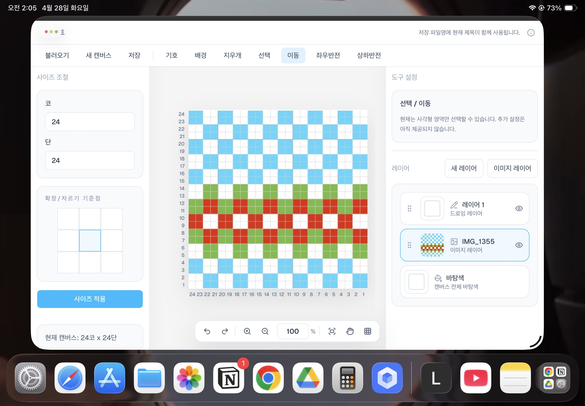
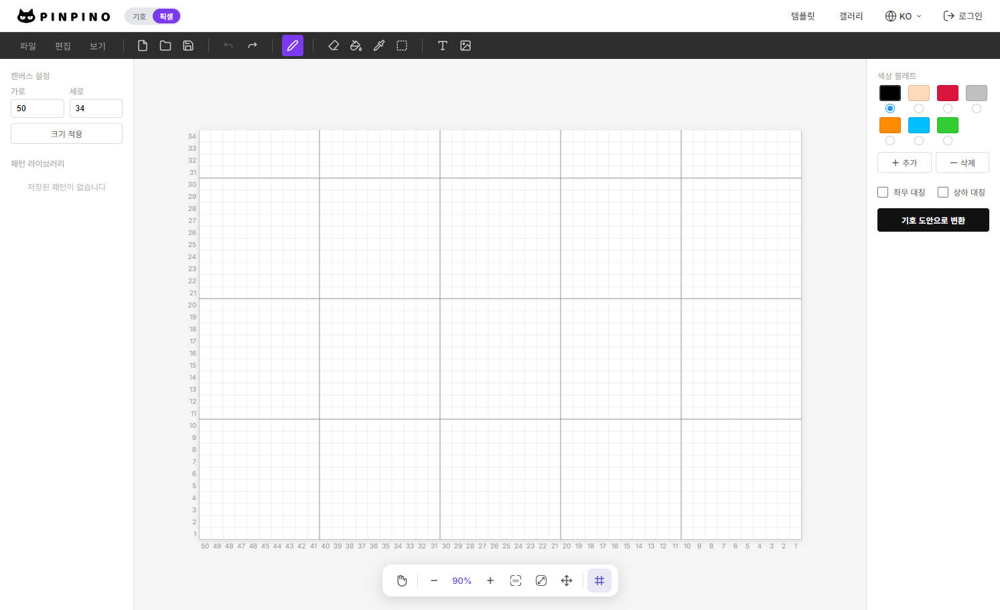

# Light Knitting Chart(a.k.a. LKC)

## 프로젝트 개요

### 목적

Claude Code나 Codex를 활용한 바이브 코딩에 대해 사용해보면서 공부하기 위함과, 취미 생활인 뜨개를 하다가 대바늘 차트를 마음껏 그릴만한 도구가 마땅하지 않아서 프로젝트를 시작.

### 조건 설정

이전부터 드로잉 툴을 스스로 만들어보고 싶기도 했고, 기존의 니팅 차트를 그리는 앱들은 기능은 다양하고 좋지만 조금만 써도 유료 결제해야하는게 부담이었고, 이미지를 배색 차트(도트 이미지)로 만들어주는 컨버터도 딱히 만족스럽진 않아서, 다음과 같은 조건을 걸었다.

1. 심화 기능이 많지 않더라도 가볍고 무료로 사용할 수 있는 드로잉 툴
2. 최대한 가볍게 사용할 수 있도록 무료로 운영, 보기에 좋아보이는(=비싸보이는 혹은 무거워보이는) 다양한 기능들 대신 기본적으로 대바늘(knitting)차트를 찍을 수 있는 기본 기능에 충실하기로 함
3. -> 그러기 위해 운영 비용도 최소한으로, 접속 시에도 무겁지 않은 드로잉 툴이 필요
4. -> 로컬 환경에서도 충분히 사용할 수 있는 툴 + 데이터를 유지하는 방법으로는 이미지로 저장하고 이미지를 불러와서 레이어 분리를 해두고 보면서 차트를 찍을 수 있도록 해서 별도의 DB 없이 사용 (로그인 필요없음, 조금 번거롭더라도 최대한으로 가벼운 툴을 만들고 싶음)
5. 당연히 개인적인 욕구로부터 시작했기 때문에 모두와 함께 쓸 수 있는 앱보다 혼자라도 가볍게 사용해볼만한 드로잉 툴

## 요구되는 기능 정리

아래 초기 기능 목록에 따라 사용자 흐름을 만들었을 때, (1)어색하거나, (2)두루뭉술하게 어떤 기능인지 정하지 않았거나, (3)지금 당장 필요하지 않은 기능들을 NotebookLM으로 함께 정리.

### 핵심 기능

- 캔버스
  - 코/단 입력 기반 캔버스 생성/조절
- 툴바
  - 파일 : 이미지 저장/불러오기
  - 그리기 작업 : 기호 또는 배경색 그리기/지우기
  - 조정 : 히스토리 이동(undo, redo), 캔버스 줌 인/아웃 
- 패널
  - 도구 설정 : 툴바에서 그리기 작업 도구 선택 시 각 도구에 맞는 설정 창 표시
  - 레이어 : 레이어를 분리하여 관리, 이미지 불러오기 시 이미지 레이어로 따로 불러와 불투명도와 사이즈 등 드로잉 레이어와 별개로 조절 가능

### 프로젝트 목표 설정

1. 로그인 없이 즉시 편집 화면에 진입
1. 코/단 단위로 캔버스 생성
1. 태블릿 중심 사용성 제공
1. 그리드 기반 편집과 레이어 편집 지원
1. 뜨개 기호 및 컬러 차트를 도트 형태로 작성
1. 참조 이미지와 드로잉 레이어를 함께 관리
1. 작업 내용을 자동 보존하고, 원하는 시점에 이미지로 저장
1. 멀티셀 심볼, 선택/이동/복제까지 가능한 도메인 특화 편집기화

<figure>

<figcaption>LKC의 v0.1.1 화면</figcaption>
</figure>

## 과정 기록

### 주요 이슈와 해결 방안

1.  Window 개발 환경에서 WSL 사용 시, 개발 서버 실행으로 와이파이 네트워크를 통해 다른 기기에서 접속 불가능한 경우 발생
  - \[**Steps**\] `http://<내-PC-LAN-IP>:3000`로 접속하여 먼저 확인 후, 네트워킹 모드를 Mirrored로 설정하고 다시 개발 서버를 실행, 그래도 안된다면  `wsl hostname -I` 확인 후 `portproxy`와 방화벽 규칙을 추가하는 단계로 시도 필요. (아래 자료 참고)
  - \[**Resolve**\] WSL-2 기준, `npm run dev`를 실행했을 때 보여주는 WSL 주소가 아닌 `http://<내-PC-LAN-IP>:3000`로 접속해서 해결
  - 관련 참고 내용:
    - [Accessing network applications with WSL | <icrosoft Learn](https://learn.microsoft.com/en-us/windows/wsl/networking)
    - [WSL-2: Which ports are automatically forwarded | stackoverflow](https://stackoverflow.com/questions/64513964/wsl-2-which-ports-are-automatically-forwarded)
2. 기호 데이터 정제 & 기호 브러쉬로 캔버스에 기호 그리기 개선
  - \[**Trouble**\] 
    - 필수 기능들을 구현하면서 예시로 하드코딩한 기호는 모두 하나의 셀(1x1 칸)에서만 보이는 모두 동일한 크기의 기호였지만, 기호 브러쉬로 기호를 그릴 때는 수집한 데이터를 바탕으로 미리보기 기호를 svg로 보여주고 캔버스에 그린 기호를 표시해야할 필요 -> 그릴 수 있는 기호 레지스트리 구조와 기호 배치부터 수정하여 기능 고도화
  - \[**Resolve**\]
    - 개발 진행 방향이 맞는지 검증하기 위해 중간에 지난 개발 내용에 따른 마일스톤과 설계 내용 재작성
      - 기본 기호 이미지 목록 간소화 (169 -> 84)
      - 간소화된 이미지 목록을 이용하여 node.js 기반에서 potrace 라이브러리를 이용하여 백터화 후 path data를 포함하여 레지스트리 JSON으로 저장하여 기본 데이터 정제 테스트
      - 플랜 모드 사용으로 수정 단계별 수정 플랜 확인 후 코드 수정 반복
      - 추가로 필요한 기호 이미지, JSON 데이터 추가 (+11 = 95)
    - 추가적으로 고려해야 할 경계 케이스에서 어떻게 기능을 구현할 것인지 정책 설정 후 반영하여 코드 수정: 대표적으로,
      - 캔버스 범위를 벗어난 기호 그리기/지우기 관련
      - 기호가 겹쳐질 때
      - 이동할 때

## 핵심 기능 개발 결과

### 개발 단계별 마일스톤 요약

| 기획 최상위 마일스톤 |  세부 단계와 구현 목표 | 정책 수정/구체화 |
| -------- | -------- | -------- |
| 1. 로그인 없이 차트 편집기 뼈대 구축   |  1-1. 단일 페이지(최상위 page.tsx)에서 편집기 진입  |    |
| 2. 캔버스 생성, 표시, 저장까지 되는 기본 편집기 완성 |  2-1. 기본 캔버스 표시 - 캔버스 렌더링   |   |
|      |  2-2. 픽셀 편집기화 - 픽셀 그리드를 코/단 기준 셀과 각 셀에 대한 상태값 관리  |    |
| 3. 태블릿 중심 인터랙션과 패널 UI 구조 확립    | 3-1. 태블릿 기본 사용성 - 터치+마우스 인터랙션 대응   |  파일명 정책 일관화  |
|      |  3-2. 태블릿 중심 - portrait/landscape 화면 방향 기반 반응형 구현 |   |
|      |  3-3. 사이즈 설정 패널 - 캔버스 리사이즈 시 단순 재생성이 아니라 기존 작업 맥락 유지   |  리사이즈를 도메인 동작으로 취급 |
| 4. 레이어 기반 편집기 구조 도입        |  4-1. 레이어 시스템 도입 - 요구사항에 따라 독립된 편집 단위 취급  | 캔버스 단일 레벨에서 스택 편집기로 확장 |
|      |  4-2. 패널 안정화 - 사용성 안정화를 위한 시야 밖 배치 방지, 터치 안정성 고도화 |   |
| 5. 툴바, 도구 상태, 히스토리, 저장 정책 정리 |  5-1. 툴바와 도구 상태 관리 - 별도의 스토어에서 독립적으로 관리  |    |
|      |  5-2. 이미지로 저장 정책 정리  | 자동 복원과 파일 저장의 책임 분리, effect 과잉 실행 방지 |
| 6. 뜨개 기호 시스템과 심볼 브러시 구조 확장  | 6-1. 심볼 브러쉬 레지스트리 저장 | _마일스톤 재점검 후 도메인 모델과 동작 규칙 관련 문서 수준 정리 추가_ |
| 7. 선택/이동/병합 기능 구현 | 7-1. 선택, 이동 툴 고도화 + 반전 기능 추가 | 캔버스 컨텍스트 메뉴를 통한 반전 기능 통일 |
|  | 7-2. 레이어 기반 차트 편집 기능 고도화  | 바탕색 캔버스 추가, 선택 레이어 기준 편집 기능 작동 |
| 8. 사용성 개선 및 배포/접속/운영 안정성 정리  | 8-1.      |  코/단 최대값, 등 정책 수정 |

## 버전

v0.1.x:

- `pathData` 기반 preview/canvas 공통 렌더링
- 뜨개 기호 레지스트리 스키마 확정
- 선택, 이동 툴 고도화
- 이미지 레이어 정렬 및 참조 이미지 편집 개선

v0.2.x(계획):

- 안정적인 뜨개 기호 자산 관리
- 완성도 높은 레이어 기반 차트 편집
- 태블릿 중심+ 사용성 지속적으로 개선

## 자료 조사 참고

### 벤치마킹 사례

<figure>

<figcaption>가장 많이 참고하게 된 pinpino의 픽셀 차트 그리기 툴 화면 구성 (컬러 배색만 그려볼 수 있다)</figcaption>
</figure>

- [pinpino(코바늘 도안 그리기 툴)](https://pinpino.com/landing.php) (=> PC 최적화, 구조는 `https://pinpino.com/pixel/`(위 이미지)에 가까울듯)
- 도트를 찍어 컬러 배색을 해볼 수 있는 서비스들 (=> 뼈대)
- 드로잉 툴(프로크리에이트, 포토샵, 니팅 차트 앱 => 툴 구조)
- [니티치 스튜디오(뜨개 기록 앱)](https://studio.knitich.com/) (=> 프로젝트 관리+이미지 기반 배색 차트 생성+a)

### 참고 데이터 출처

- [대바늘 차트도안 만들기 EXCEL 파일 by moony_knit | 도아니티](https://www.doanity.com/products/cm3kae5bq0007qdaaafj2r0ks)
- SEVY 뜨개 백과사전
  - [왼코 늘리기](https://sevy.co.kr/storybook/dict_detail.html?view=detail&board_no=5&content_no=92)
  - [오른코 늘리기](https://sevy.co.kr/storybook/dict_detail.html?view=detail&board_no=5&content_no=91)
- [기초영상 대바늘 chapter25/실을 끌어올려 패턴을 만들어주는 기법_ 끌어올리기](https://www.youtube.com/watch?v=N96PruFknZk)
